# 器械图鉴 / Equipment Guide

本页列出仓库收录的常见健身器械/工具,附带说明与对应动作。

This page lists the common gym equipment and tools included in this repo, with descriptions and related exercises.

> 💡 交互式图鉴与搜索请访问 Pages 站: <https://gengyueworks.github.io/gym-exercise-guide/>
>
> For the interactive equipment guide with search, visit the Pages site: <https://gengyueworks.github.io/gym-exercise-guide/>

---

## 腿举机 / Leg Press Machine

**部位 / Body part:** 腿  
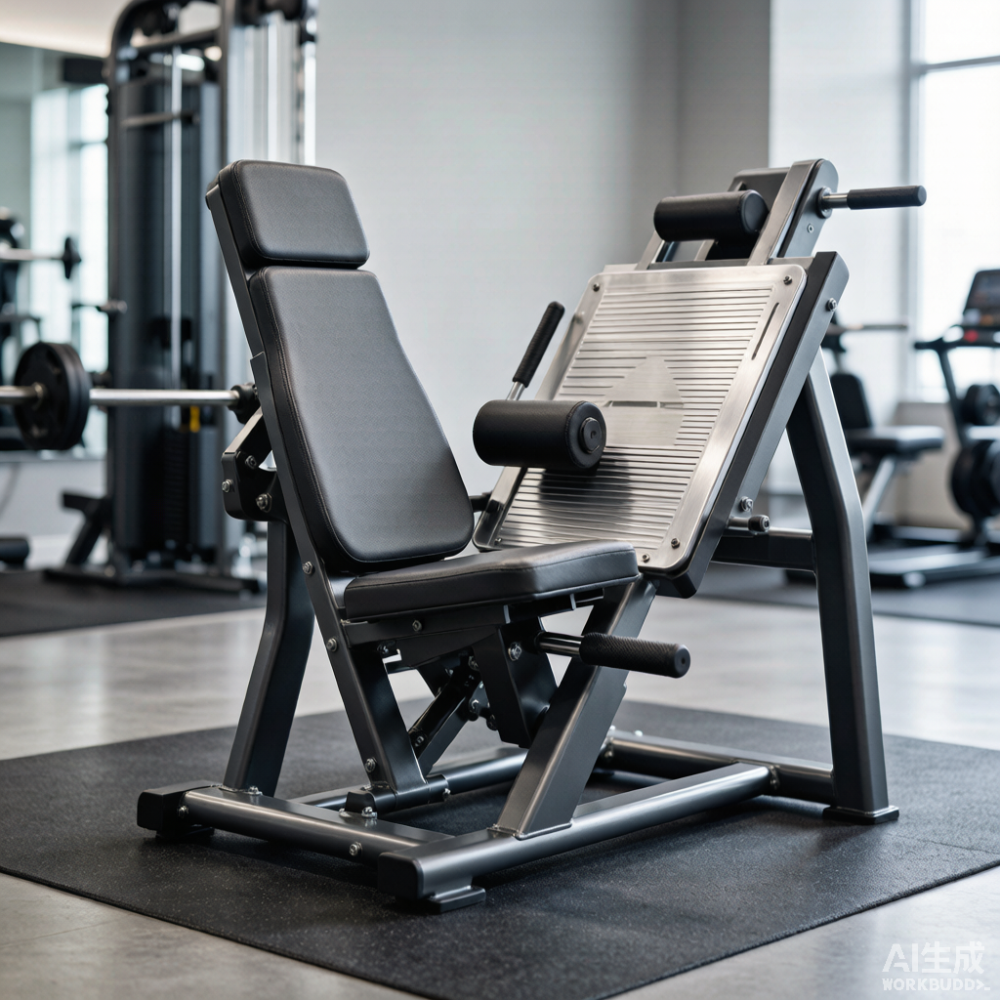

坐姿蹬伸双腿，主要练股四头肌，也带到大腿后侧与臀部。

**示例动作 / Example exercises:**
- [腿举（倒蹬）器械器械提踵 / Calf Press On The Leg Press Machine](exercises/legs/Calf_Press_On_The_Leg_Press_Machine.md)
- [倒蹬机腿举 / Leg Press](exercises/legs/Leg_Press.md)
- [窄距站距腿举（倒蹬） / Narrow Stance Leg Press](exercises/legs/Narrow_Stance_Leg_Press.md)
- [史密斯机腿举（倒蹬） / Smith Machine Leg Press](exercises/legs/Smith_Machine_Leg_Press.md)

---

## 腿屈伸机 / Leg Extension Machine

**部位 / Body part:** 腿  
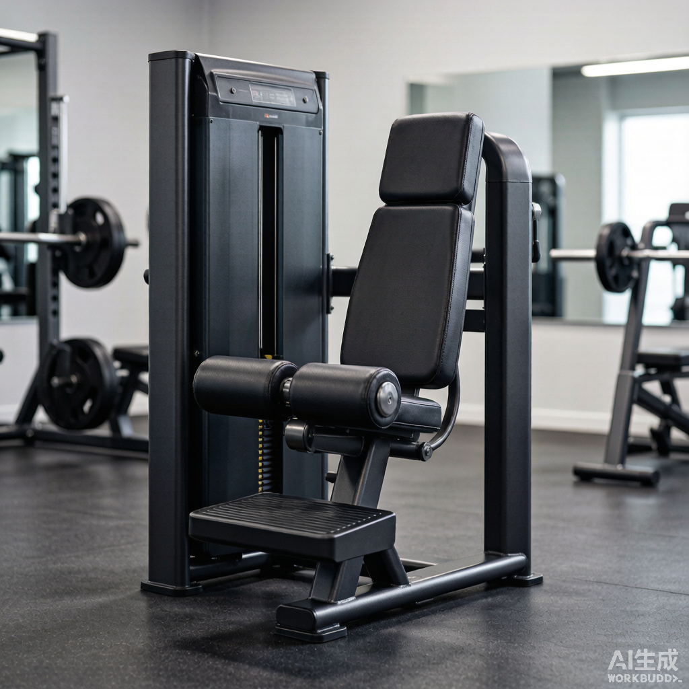

坐姿向前踢小腿，孤立刺激股四头肌。

**示例动作 / Example exercises:**
- [坐姿腿屈伸 / Leg Extensions](exercises/legs/Leg_Extensions.md)
- [单腿坐姿腿屈伸 / Single-Leg Leg Extension](exercises/legs/Single-Leg_Leg_Extension.md)

---

## 腿弯举机 / Leg Curl Machine

**部位 / Body part:** 腿  
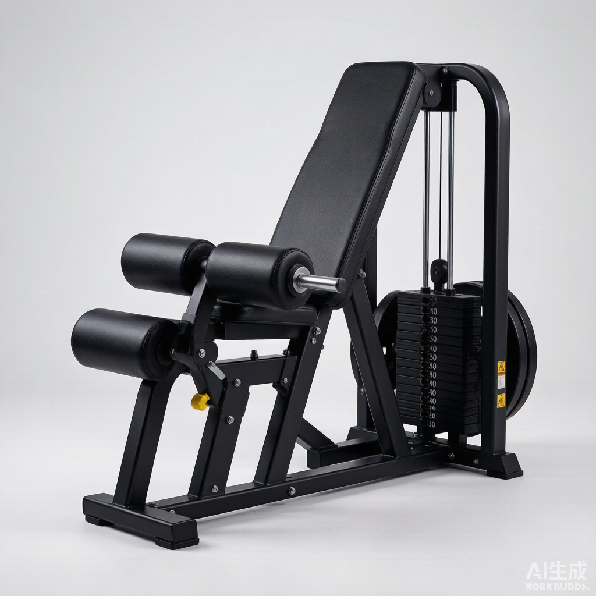

俯卧或坐姿弯小腿，练腘绳肌（大腿后侧）。

**示例动作 / Example exercises:**
- [球腿弯举 / Ball Leg Curl](exercises/legs/Ball_Leg_Curl.md)
- [俯卧腿弯举 / Lying Leg Curls](exercises/legs/Lying_Leg_Curls.md)
- [坐姿腿弯举 / Seated Leg Curl](exercises/legs/Seated_Leg_Curl.md)
- [站姿腿弯举 / Standing Leg Curl](exercises/legs/Standing_Leg_Curl.md)

---

## 髋内收外展机 / Hip Adductor/Abductor Machine

**部位 / Body part:** 腿  
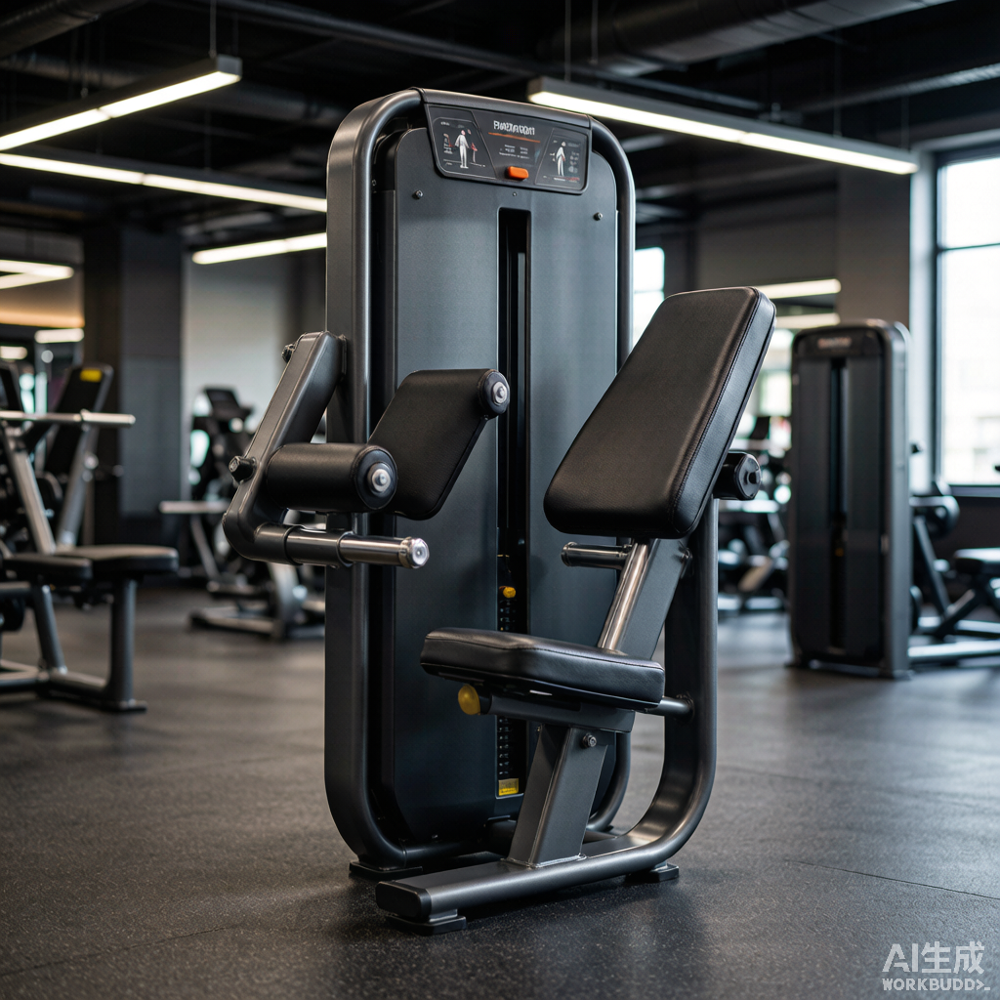

夹/开双腿，练大腿内侧（内收）与外侧（臀中肌）。

**示例动作 / Example exercises:**
- [内收肌拉伸 / Adductor](exercises/legs/Adductor.md)
- [内收肌腹股沟/内收肌拉伸 / Adductor/Groin](exercises/legs/Adductor_Groin.md)
- [大腿外展肌 / Thigh Abductor](exercises/legs/Thigh_Abductor.md)
- [大腿内收肌 / Thigh Adductor](exercises/legs/Thigh_Adductor.md)

---

## 提踵机 / Calf Raise Machine

**部位 / Body part:** 小腿  
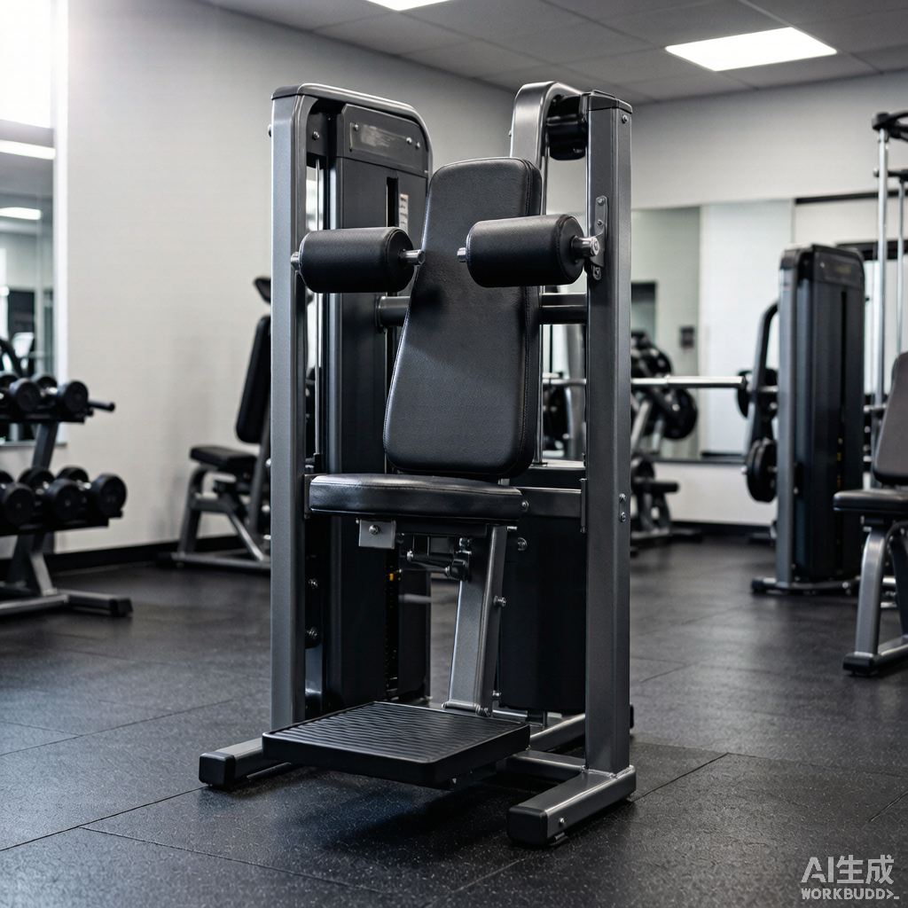

踮脚尖练小腿腓肠肌与比目鱼肌。

**示例动作 / Example exercises:**
- [腹肌卷腹器械 / Ab Crunch Machine](exercises/core/Ab_Crunch_Machine.md)
- [杠铃坐姿提踵 / Barbell Seated Calf Raise](exercises/legs/Barbell_Seated_Calf_Raise.md)
- [骑行固定式 / Bicycling, Stationary](exercises/full-body/Bicycling_Stationary.md)
- [蝴蝶机夹胸 / Butterfly](exercises/chest/Butterfly.md)
- [提踵机耸肩 / Calf-Machine Shoulder Shrug](exercises/back/Calf-Machine_Shoulder_Shrug.md)
- [器械提踵 / Calf Press](exercises/legs/Calf_Press.md)

---

## 坐姿推胸机 / Chest Press Machine

**部位 / Body part:** 胸  
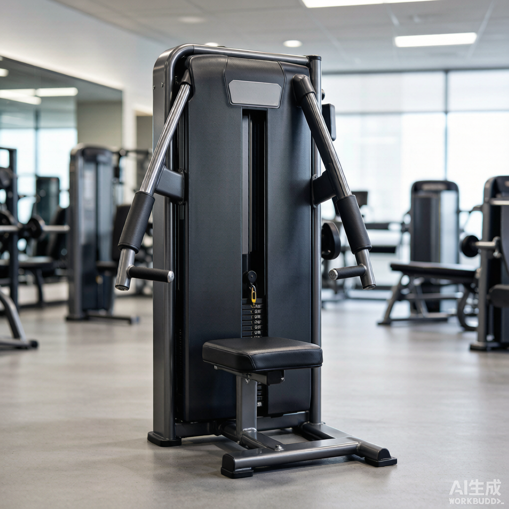

坐姿向前推，固定轨迹练胸大肌，新手友好。

**示例动作 / Example exercises:**
- [腹肌卷腹器械 / Ab Crunch Machine](exercises/core/Ab_Crunch_Machine.md)
- [骑行固定式 / Bicycling, Stationary](exercises/full-body/Bicycling_Stationary.md)
- [蝴蝶机夹胸 / Butterfly](exercises/chest/Butterfly.md)
- [绳索胸推 / Cable Chest Press](exercises/chest/Cable_Chest_Press.md)
- [提踵机耸肩 / Calf-Machine Shoulder Shrug](exercises/back/Calf-Machine_Shoulder_Shrug.md)
- [器械提踵 / Calf Press](exercises/legs/Calf_Press.md)

---

## 蝴蝶机/夹胸机 / Pec Deck / Chest Fly Machine

**部位 / Body part:** 胸  
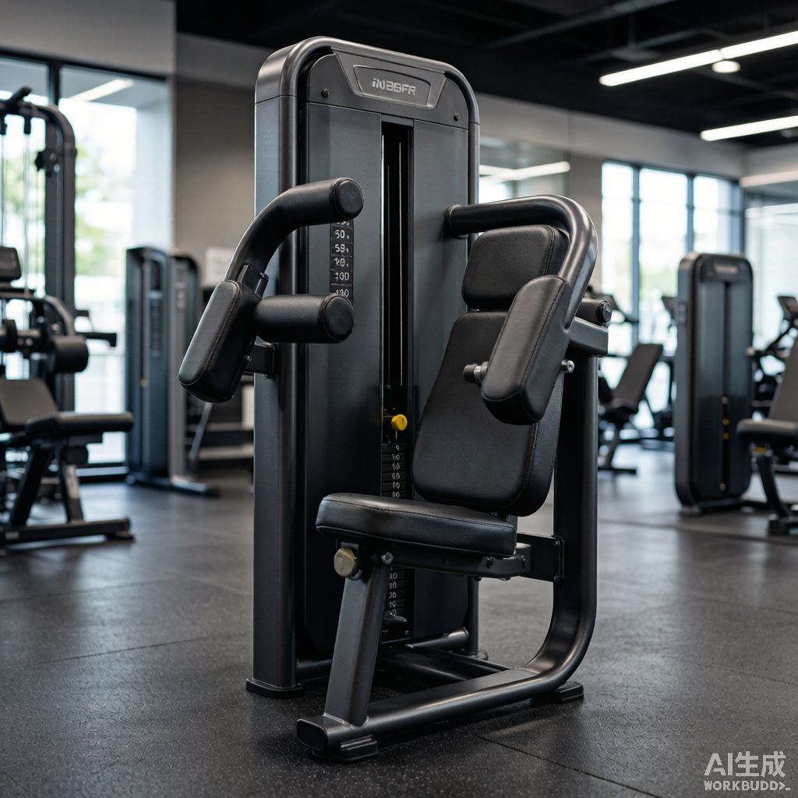

双臂向内夹，孤立刺激胸大肌中缝。

**示例动作 / Example exercises:**
- [腹肌卷腹器械 / Ab Crunch Machine](exercises/core/Ab_Crunch_Machine.md)
- [背飞鸟（弹力带） / Back Flyes - With Bands](exercises/shoulders/Back_Flyes_-_With_Bands.md)
- [骑行固定式 / Bicycling, Stationary](exercises/full-body/Bicycling_Stationary.md)
- [自重飞鸟 / Bodyweight Flyes](exercises/chest/Bodyweight_Flyes.md)
- [蝴蝶机夹胸 / Butterfly](exercises/chest/Butterfly.md)
- [绳索三角肌后束飞鸟 / Cable Rear Delt Fly](exercises/shoulders/Cable_Rear_Delt_Fly.md)

---

## 高位下拉机 / Lat Pulldown Machine

**部位 / Body part:** 背  
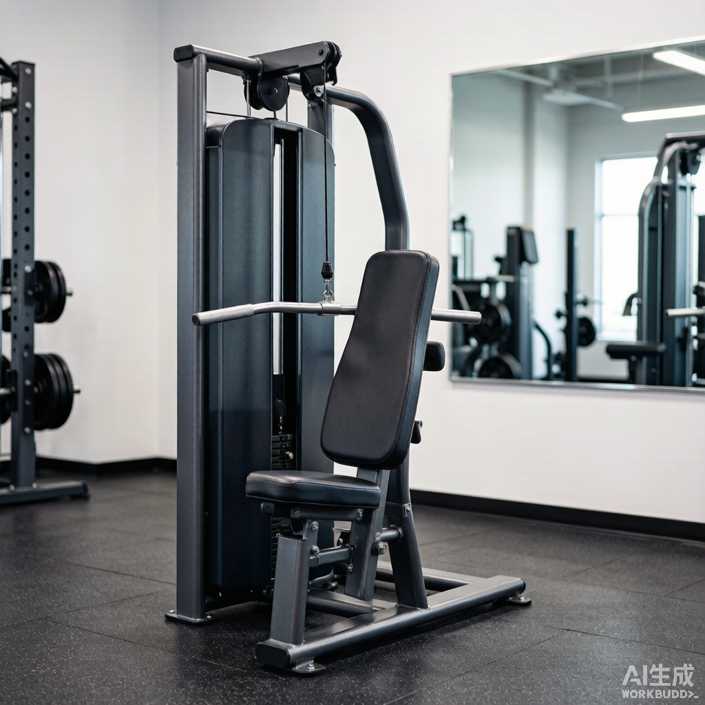

下拉横杆到锁骨，练背阔肌（背的宽度）。

**示例动作 / Example exercises:**
- [窄握高位下拉 / Close-Grip Front Lat Pulldown](exercises/back/Close-Grip_Front_Lat_Pulldown.md)
- [全程幅度动作高位下拉 / Full Range-Of-Motion Lat Pulldown](exercises/back/Full_Range-Of-Motion_Lat_Pulldown.md)
- [单臂高位下拉 / One Arm Lat Pulldown](exercises/back/One_Arm_Lat_Pulldown.md)
- [洛基引体向上下拉 / Rocky Pull-Ups/Pulldowns](exercises/back/Rocky_Pull-Ups_Pulldowns.md)
- [绳索直臂下拉 / Rope Straight-Arm Pulldown](exercises/back/Rope_Straight-Arm_Pulldown.md)
- [直臂下拉 / Straight-Arm Pulldown](exercises/back/Straight-Arm_Pulldown.md)

---

## 坐姿划船机 / Seated Row Machine

**部位 / Body part:** 背  
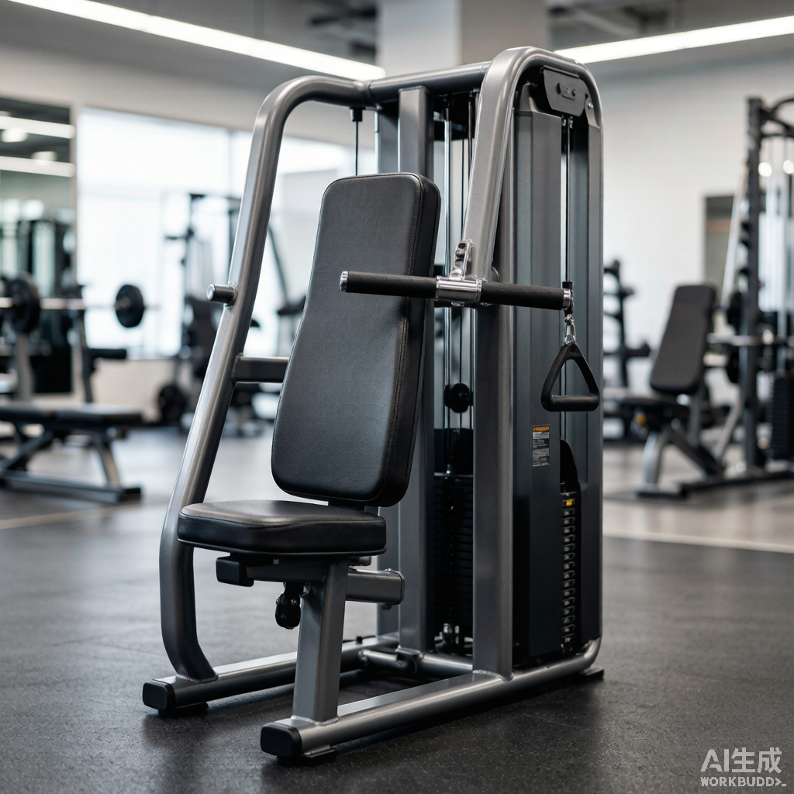

向腹部拉握把，练背阔肌与中下斜方（背的厚度）。

**示例动作 / Example exercises:**
- [腹肌卷腹器械 / Ab Crunch Machine](exercises/core/Ab_Crunch_Machine.md)
- [骑行固定式 / Bicycling, Stationary](exercises/full-body/Bicycling_Stationary.md)
- [蝴蝶机夹胸 / Butterfly](exercises/chest/Butterfly.md)
- [提踵机耸肩 / Calf-Machine Shoulder Shrug](exercises/back/Calf-Machine_Shoulder_Shrug.md)
- [器械提踵 / Calf Press](exercises/legs/Calf_Press.md)
- [腿举（倒蹬）器械器械提踵 / Calf Press On The Leg Press Machine](exercises/legs/Calf_Press_On_The_Leg_Press_Machine.md)

---

## 史密斯机 / Smith Machine

**部位 / Body part:** 全身  
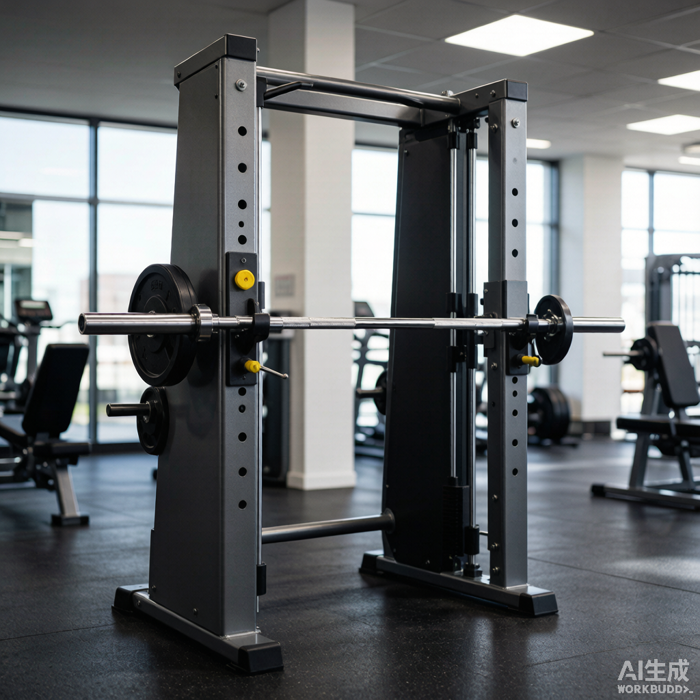

固定轨迹杠铃，练深蹲/卧推/肩推等复合动作，安全可控。

**示例动作 / Example exercises:**
- [下斜史密斯机推举 / Decline Smith Press](exercises/chest/Decline_Smith_Press.md)
- [史密斯机上斜肩上举 / Smith Incline Shoulder Raise](exercises/shoulders/Smith_Incline_Shoulder_Raise.md)
- [史密斯机背后耸肩 / Smith Machine Behind the Back Shrug](exercises/back/Smith_Machine_Behind_the_Back_Shrug.md)
- [史密斯机卧推 / Smith Machine Bench Press](exercises/chest/Smith_Machine_Bench_Press.md)
- [史密斯机俯身划船 / Smith Machine Bent Over Row](exercises/back/Smith_Machine_Bent_Over_Row.md)
- [史密斯机提踵 / Smith Machine Calf Raise](exercises/legs/Smith_Machine_Calf_Raise.md)

---

## 肩上推举机 / Shoulder Press Machine

**部位 / Body part:** 肩  
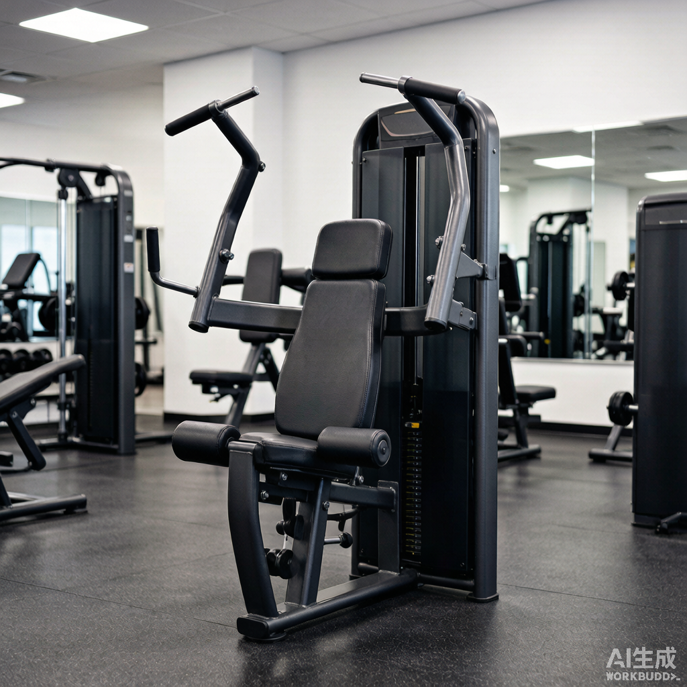

坐姿向上推，练三角肌前束与中束。

**示例动作 / Example exercises:**
- [腹肌卷腹器械 / Ab Crunch Machine](exercises/core/Ab_Crunch_Machine.md)
- [交替绳索肩推 / Alternating Cable Shoulder Press](exercises/shoulders/Alternating_Cable_Shoulder_Press.md)
- [杠铃肩推 / Barbell Shoulder Press](exercises/shoulders/Barbell_Shoulder_Press.md)
- [骑行固定式 / Bicycling, Stationary](exercises/full-body/Bicycling_Stationary.md)
- [蝴蝶机夹胸 / Butterfly](exercises/chest/Butterfly.md)
- [绳索肩推 / Cable Shoulder Press](exercises/shoulders/Cable_Shoulder_Press.md)

---

## 侧平举机 / Lateral Raise Machine

**部位 / Body part:** 肩  
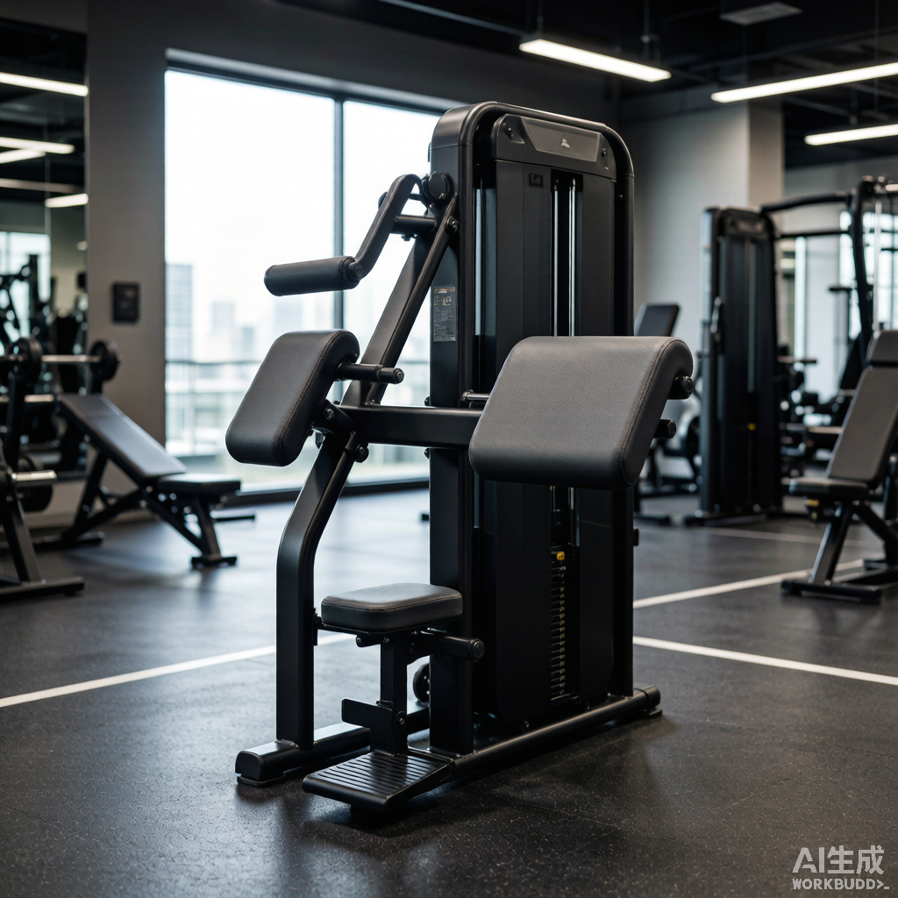

侧平举孤立刺激三角肌中束（肩宽）。

**示例动作 / Example exercises:**
- [腹肌卷腹器械 / Ab Crunch Machine](exercises/core/Ab_Crunch_Machine.md)
- [骑行固定式 / Bicycling, Stationary](exercises/full-body/Bicycling_Stationary.md)
- [蝴蝶机夹胸 / Butterfly](exercises/chest/Butterfly.md)
- [绳索坐姿侧平举 / Cable Seated Lateral Raise](exercises/shoulders/Cable_Seated_Lateral_Raise.md)
- [提踵机耸肩 / Calf-Machine Shoulder Shrug](exercises/back/Calf-Machine_Shoulder_Shrug.md)
- [器械提踵 / Calf Press](exercises/legs/Calf_Press.md)

---

## 龙门架/绳索机 / Cable Machine / Crossover

**部位 / Body part:** 全身  
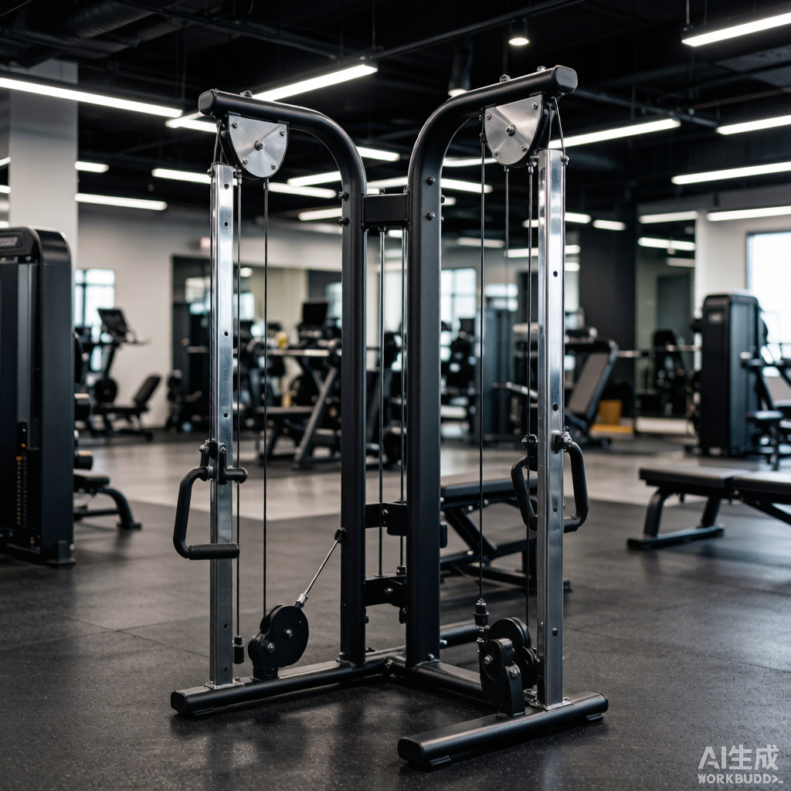

可调滑轮练几乎全身：夹胸、下压、面拉、卷腹……

**示例动作 / Example exercises:**
- [交替绳索肩推 / Alternating Cable Shoulder Press](exercises/shoulders/Alternating_Cable_Shoulder_Press.md)
- [俯身低位滑轮侧平举 / Bent Over Low-Pulley Side Lateral](exercises/shoulders/Bent_Over_Low-Pulley_Side_Lateral.md)
- [波速球绳索卷腹（体侧屈） / Bosu Ball Cable Crunch With Side Bends](exercises/core/Bosu_Ball_Cable_Crunch_With_Side_Bends.md)
- [绳索胸推 / Cable Chest Press](exercises/chest/Cable_Chest_Press.md)
- [绳索夹胸 / Cable Crossover](exercises/chest/Cable_Crossover.md)
- [绳索卷腹 / Cable Crunch](exercises/core/Cable_Crunch.md)

---

## 三头下压绳 / Triceps Pushdown

**部位 / Body part:** 手臂  
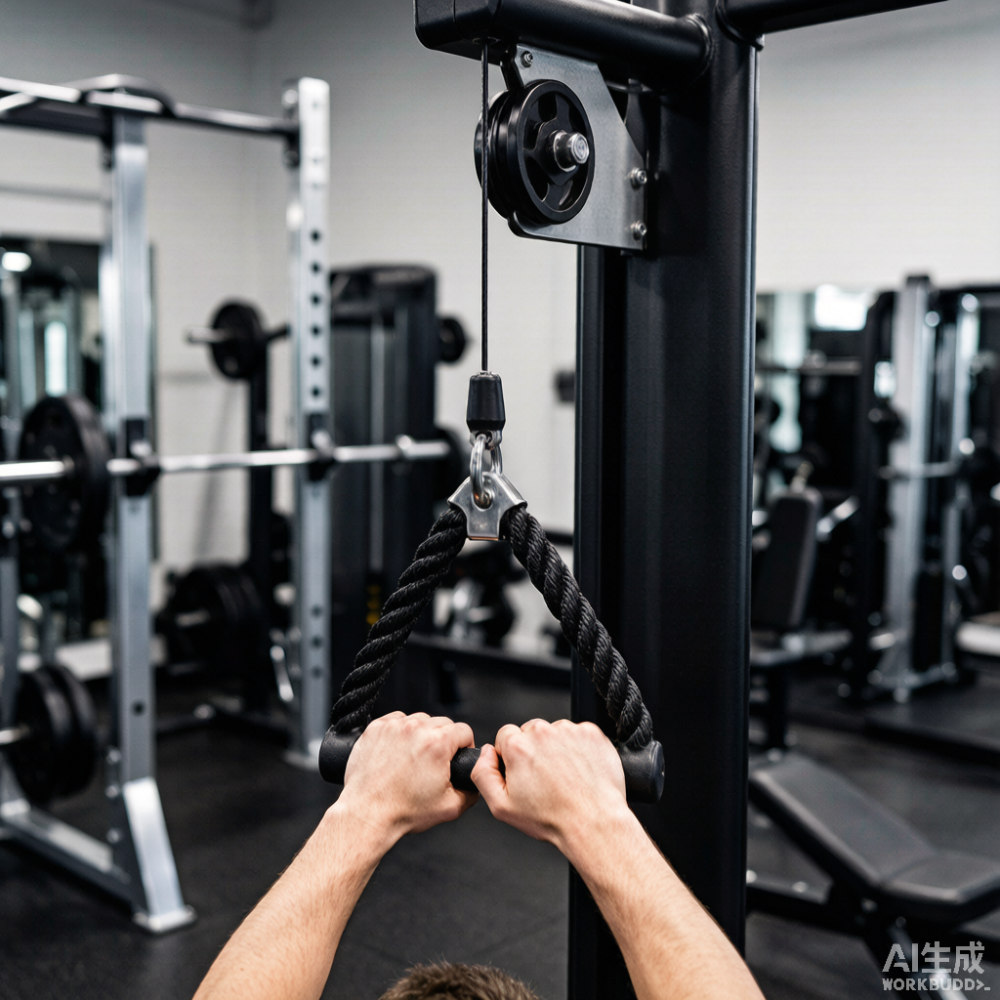

绳索下压练肱三头肌（手臂后侧）。

**示例动作 / Example exercises:**
- [交替绳索肩推 / Alternating Cable Shoulder Press](exercises/shoulders/Alternating_Cable_Shoulder_Press.md)
- [俯身低位滑轮侧平举 / Bent Over Low-Pulley Side Lateral](exercises/shoulders/Bent_Over_Low-Pulley_Side_Lateral.md)
- [波速球绳索卷腹（体侧屈） / Bosu Ball Cable Crunch With Side Bends](exercises/core/Bosu_Ball_Cable_Crunch_With_Side_Bends.md)
- [绳索胸推 / Cable Chest Press](exercises/chest/Cable_Chest_Press.md)
- [绳索夹胸 / Cable Crossover](exercises/chest/Cable_Crossover.md)
- [绳索卷腹 / Cable Crunch](exercises/core/Cable_Crunch.md)

---

## 牧师凳弯举机 / Preacher Curl Machine

**部位 / Body part:** 手臂  
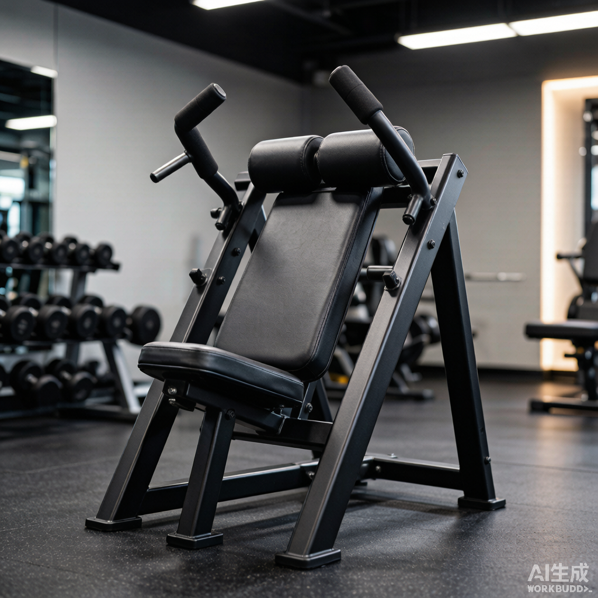

固定大臂弯举，孤立练肱二头肌。

**示例动作 / Example exercises:**
- [腹肌卷腹器械 / Ab Crunch Machine](exercises/core/Ab_Crunch_Machine.md)
- [骑行固定式 / Bicycling, Stationary](exercises/full-body/Bicycling_Stationary.md)
- [蝴蝶机夹胸 / Butterfly](exercises/chest/Butterfly.md)
- [绳索牧师凳弯举 / Cable Preacher Curl](exercises/arms/Cable_Preacher_Curl.md)
- [提踵机耸肩 / Calf-Machine Shoulder Shrug](exercises/back/Calf-Machine_Shoulder_Shrug.md)
- [器械提踵 / Calf Press](exercises/legs/Calf_Press.md)

---

## 罗马椅 / Roman Chair

**部位 / Body part:** 核心  
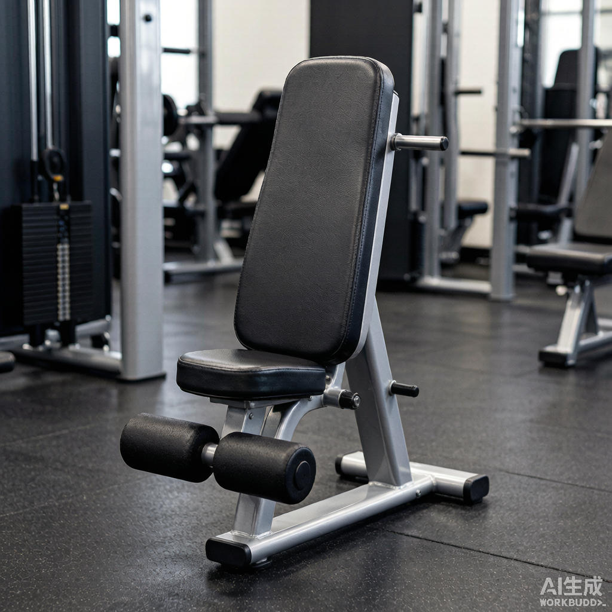

俯身练下背竖脊肌与臀；反身可练腹。

**示例动作 / Example exercises:**
- [山羊挺身（背伸展） / Hyperextensions (Back Extensions)](exercises/back/Hyperextensions_Back_Extensions.md)

---

## 卷腹机 / Ab Crunch Machine

**部位 / Body part:** 核心  
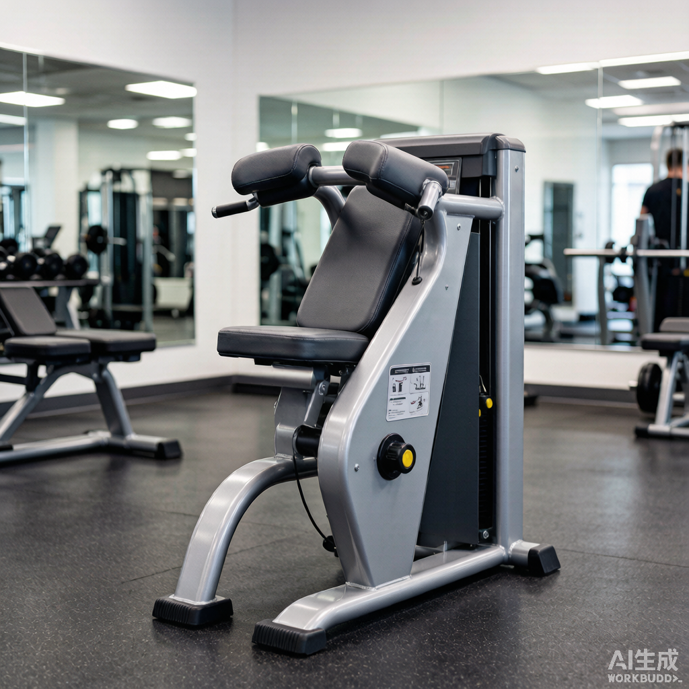

固定轨迹卷腹，孤立练腹直肌。

**示例动作 / Example exercises:**
- [腹肌卷腹器械 / Ab Crunch Machine](exercises/core/Ab_Crunch_Machine.md)
- [骑行固定式 / Bicycling, Stationary](exercises/full-body/Bicycling_Stationary.md)
- [波速球绳索卷腹（体侧屈） / Bosu Ball Cable Crunch With Side Bends](exercises/core/Bosu_Ball_Cable_Crunch_With_Side_Bends.md)
- [蝴蝶机夹胸 / Butterfly](exercises/chest/Butterfly.md)
- [绳索卷腹 / Cable Crunch](exercises/core/Cable_Crunch.md)
- [绳索反向卷腹 / Cable Reverse Crunch](exercises/core/Cable_Reverse_Crunch.md)

---

## 健腹轮 / Ab Wheel

**部位 / Body part:** 核心  
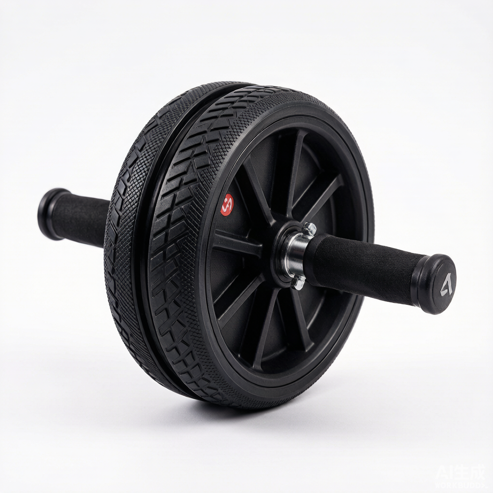

滚动练腹直肌与深层核心，难度高。

**示例动作 / Example exercises:**
- [腹肌滚轮 / Ab Roller](exercises/core/Ab_Roller.md)
- [杠铃腹肌滚轮 / Barbell Ab Rollout](exercises/core/Barbell_Ab_Rollout.md)
- [杠铃腹肌滚轮（膝） / Barbell Ab Rollout - On Knees](exercises/core/Barbell_Ab_Rollout_-_On_Knees.md)
- [杠铃滚轮卧凳 / Barbell Rollout from Bench](exercises/core/Barbell_Rollout_from_Bench.md)
- [柯南巨轮 / Conan's Wheel](exercises/full-body/Conans_Wheel.md)
- [腕滚轮 / Wrist Roller](exercises/arms/Wrist_Roller.md)

---

## 杠铃 / Barbell

**部位 / Body part:** 全身  
最基础的自由重量，练深蹲/硬拉/卧推/推举等全身复合动作。

**示例动作 / Example exercises:**
- [抗重力推举 / Anti-Gravity Press](exercises/shoulders/Anti-Gravity_Press.md)
- [杠铃腹肌滚轮 / Barbell Ab Rollout](exercises/core/Barbell_Ab_Rollout.md)
- [杠铃腹肌滚轮（膝） / Barbell Ab Rollout - On Knees](exercises/core/Barbell_Ab_Rollout_-_On_Knees.md)
- [杠铃平板卧推（中握距） / Barbell Bench Press - Medium Grip](exercises/chest/Barbell_Bench_Press_-_Medium_Grip.md)
- [杠铃弯举 / Barbell Curl](exercises/arms/Barbell_Curl.md)
- [杠铃弯举仰卧抵住上斜 / Barbell Curls Lying Against An Incline](exercises/arms/Barbell_Curls_Lying_Against_An_Incline.md)

---

## 哑铃 / Dumbbell

**部位 / Body part:** 全身  
灵活的自由重量，可练全身，左右不平衡也能纠正。

**示例动作 / Example exercises:**
- [交替锤式弯举 / Alternate Hammer Curl](exercises/arms/Alternate_Hammer_Curl.md)
- [交替上斜哑铃弯举 / Alternate Incline Dumbbell Curl](exercises/arms/Alternate_Incline_Dumbbell_Curl.md)
- [交替三角肌上举 / Alternating Deltoid Raise](exercises/shoulders/Alternating_Deltoid_Raise.md)
- [阿诺德推举 / Arnold Dumbbell Press](exercises/shoulders/Arnold_Dumbbell_Press.md)
- [绕环飞鸟 / Around The Worlds](exercises/chest/Around_The_Worlds.md)
- [俯身手臂哑铃直臂下拉（卧姿上拉） / Bent-Arm Dumbbell Pullover](exercises/chest/Bent-Arm_Dumbbell_Pullover.md)

---

## 壶铃 / Kettlebell

**部位 / Body part:** 全身  
摆荡/抓举等爆发动作，兼顾力量与心肺。

**示例动作 / Example exercises:**
- [进阶壶铃风车式 / Advanced Kettlebell Windmill](exercises/core/Advanced_Kettlebell_Windmill.md)
- [交替地面推举 / Alternating Floor Press](exercises/chest/Alternating_Floor_Press.md)
- [交替悬垂翻 / Alternating Hang Clean](exercises/legs/Alternating_Hang_Clean.md)
- [交替壶铃推举 / Alternating Kettlebell Press](exercises/shoulders/Alternating_Kettlebell_Press.md)
- [交替壶铃划船 / Alternating Kettlebell Row](exercises/back/Alternating_Kettlebell_Row.md)
- [交替平板划船 / Alternating Renegade Row](exercises/back/Alternating_Renegade_Row.md)

---

## 弹力带 / Resistance Bands

**部位 / Body part:** 全身  
便携阻力训练，适合热身、康复与居家。

**示例动作 / Example exercises:**
- [背飞鸟（弹力带） / Back Flyes - With Bands](exercises/shoulders/Back_Flyes_-_With_Bands.md)
- [弹力带早安式体前屈 / Band Good Morning](exercises/legs/Band_Good_Morning.md)
- [弹力带早安式体前屈（拉） / Band Good Morning (Pull Through)](exercises/legs/Band_Good_Morning_Pull_Through.md)
- [弹力带髋内收 / Band Hip Adductions](exercises/legs/Band_Hip_Adductions.md)
- [弹力带拉分立 / Band Pull Apart](exercises/shoulders/Band_Pull_Apart.md)
- [弹力带碎颅式臂屈伸 / Band Skull Crusher](exercises/arms/Band_Skull_Crusher.md)

---

## 徒手 / Bodyweight

**部位 / Body part:** 全身  
靠自身体重训练，俯卧撑/引体/深蹲皆属此类。

**示例动作 / Example exercises:**
- [34仰卧起坐 / 3/4 Sit-Up](exercises/core/3_4_Sit-Up.md)
- [90腘绳肌拉伸 / 90/90 Hamstring](exercises/legs/90_90_Hamstring.md)
- [徒手单车 / Air Bike](exercises/core/Air_Bike.md)
- [四足跪姿股四头肌拉伸 / All Fours Quad Stretch](exercises/legs/All_Fours_Quad_Stretch.md)
- [交替仰卧触踵 / Alternate Heel Touchers](exercises/core/Alternate_Heel_Touchers.md)
- [凳上反屈伸 / Bench Dips](exercises/arms/Bench_Dips.md)

---
