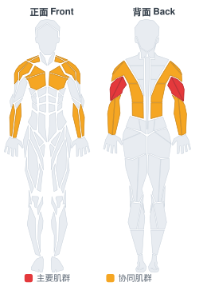

# 板推举

**Board Press**

> 部位：手臂　|　器械：杠铃　|　难度：⭐⭐ 进阶　|　类型：力量举 · 复合动作 · 推

## 目标肌群

- **主要**：肱三头肌
- **协同**：胸大肌、前臂、背阔肌、三角肌

## 肌肉激活示意

🔴 主要肌群　🟠 协同肌群（红/橙块即发力部位，鼠标悬停看名称）

## 动作示意图

| 起始位 | 结束位 |
|:---:|:---:|
|  |  |

## 动作要点

1. 躺上卧凳，双脚踩实地面，肩胛骨向后向下收紧「锁」在凳面上，腰部保留自然生理弯曲。
2. 双手握住杠铃，握距略宽于肩，手腕保持中立、不要后折。
3. 吸气，控制杠铃沿弧线下降到胸部中下沿，肘部与躯干约呈 45–75 度，不要完全外展成一字。
4. 呼气推起，肩胛全程保持收紧，顶端手肘不锁死，保持肱三头肌持续张力。
5. 按计划完成组次，下放时始终「控制着放」，不要靠胸口反弹。

## 常见错误

- ❌ 肩胛松开、肩膀前引 → 力量泄掉，还容易伤肩
- ❌ 手肘完全外展成 90 度 → 肩关节压力剧增
- ❌ 用胸口弹起杠铃 → 借力且有伤肋骨风险
- ✅ 肩胛收紧、肘部内收、全程控制离心

## 训练建议

3–5 组 × 1–5 次，组间休息 3–5 分钟；大重量务必有人保护。

<b>英文原始步骤 / Original Instructions</b>（点击展开）

1. Begin by lying on the bench, getting your head beyond the bar if possible. One to five boards, made out of 2x6's, can be screwed together and held in place by a training partner, bands, or just tucked under your shirt.
2. Tuck your feet underneath you and arch your back. Using the bar to help support your weight, lift your shoulder off the bench and retract them, squeezing the shoulder blades together. Use your feet to drive your traps into the bench. Maintain this tight body position throughout the movement.
3. You can take a standard bench grip, or shoulder width to focus on the triceps. Pull the bar out of the rack without protracting your shoulders. The bar, wrist, and elbow should stay in line at all times. Focus on squeezing the bar and trying to pull it apart.
4. Lower the bar to the boards, and then drive the bar up with as much force as possible. The elbows should be tucked in until lockout.

---

[← 返回手臂部位索引](README.md)　|　[返回首页](../../README.md)

数据与图片来源：[yuhonas/free-exercise-db](https://github.com/yuhonas/free-exercise-db)（The Unlicense，公有领域）　·　中文名称、动作要点与内容组织：Yue（gengyueworks）