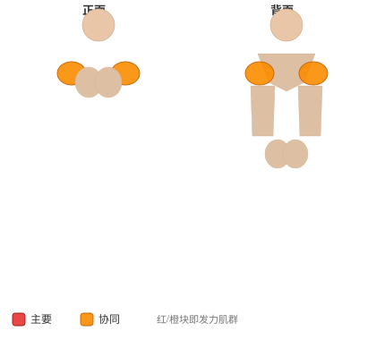

# 底部向上翻站悬垂

**Bottoms-Up Clean From The Hang Position**

> 部位：手臂　|　器械：壶铃　|　难度：⭐⭐ 进阶　|　类型：力量训练 · 复合动作 · 拉

## 目标肌群

- **主要**：前臂
- **协同**：肱二头肌、三角肌

## 肌肉激活示意

🔴 主要肌群　🟠 协同肌群（红/橙块即发力部位，鼠标悬停看名称）

## 动作示意图

| 起始位 | 结束位 |
|:---:|:---:|
|  |  |

## 动作要点

1. 这是技术性极高的举重动作，强烈建议先在教练指导下用空杆学习动作模式。
2. 起始姿势：杠贴小腿，挺胸收肩胛，背部中立，核心绷紧。
3. 第一发力：用腿把杠「推离」地面，保持背角不变，杠贴腿上行。
4. 第二发力：过膝后爆发式伸髋伸膝、耸肩提肘，把杠加速向上。
5. 接杠：迅速下潜到接杠位置稳住，站起完成，然后有控制地放下杠铃。

## 常见错误

- ❌ 用手臂拉杠 → 手臂只负责传导，发力靠髋腿
- ❌ 杠远离身体走弧线 → 力臂变大，几乎必失败
- ❌ 未掌握技术就上大重量 → 受伤风险极高
- ✅ 空杆练技术、杠贴身走、髋腿主导发力

## 训练建议

3–5 组 × 6–12 次，组间休息 90–150 秒；先把动作做标准再加重量。

<b>英文原始步骤 / Original Instructions</b>（点击展开）

1. Initiate the exercise by standing upright with a kettlebell in one hand.
2. Swing the kettlebell back forcefully and then reverse the motion forcefully. Crush the kettlebell handle as hard as possible and raise the kettlebell to your shoulder.

---

[← 返回手臂部位索引](README.md)　|　[返回首页](../../README.md)

数据与图片来源：[yuhonas/free-exercise-db](https://github.com/yuhonas/free-exercise-db)（The Unlicense，公有领域）　·　中文名称、动作要点与内容组织：Yue（gengyueworks）