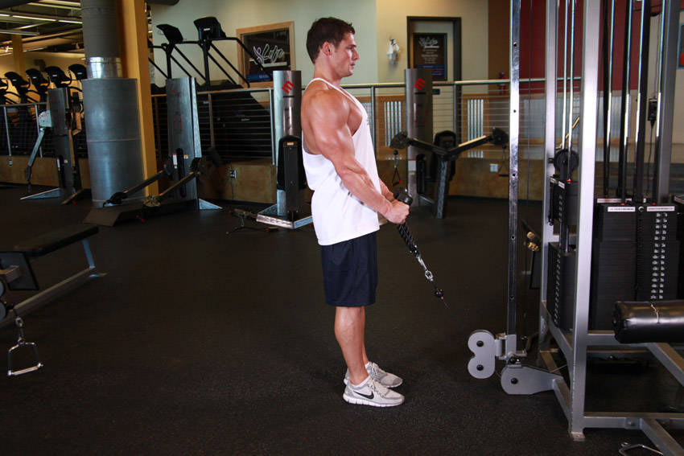

# 绳索锤式弯举（绳索把手）

**Cable Hammer Curls - Rope Attachment**

> 部位：手臂　|　器械：绳索　|　难度：⭐ 新手　|　类型：力量训练 · 孤立动作 · 拉

## 目标肌群

- **主要**：肱二头肌
- **协同**：—

## 动作示意图

| 起始位 | 结束位 |
|:---:|:---:|
|  |  |

## 动作要点

1. 握住绳索，大臂夹紧躯干两侧，手肘固定成一个「铰链」。
2. 呼气弯举，只有小臂在动，大臂全程不要前后摆。
3. 举到肱二头肌完全收缩的位置，顶峰主动挤压一秒。
4. 吸气用 2–3 秒缓慢下放，直到手臂接近伸直但保留张力。
5. 全程手腕保持中立，不要靠手腕「勾」重量上来。

## 常见错误

- ❌ 大臂前后摆动、身体后仰借力 → 重量太大
- ❌ 下放时直接松掉 → 丢掉最有价值的离心
- ❌ 手腕过度弯曲 → 前臂代偿、腕关节疼
- ✅ 固定大臂、顶峰挤压、慢速离心

## 训练建议

3–4 组 × 10–15 次，组间休息 45–75 秒；小重量找目标肌群的收缩感。

<b>英文原始步骤 / Original Instructions</b>（点击展开）

1. Attach a rope attachment to a low pulley and stand facing the machine about 12 inches away from it.
2. Grasp the rope with a neutral (palms-in) grip and stand straight up keeping the natural arch of the back and your torso stationary.
3. Put your elbows in by your side and keep them there stationary during the entire movement. Tip: Only the forearms should move; not your upper arms. This will be your starting position.
4. Using your biceps, pull your arms up as you exhale until your biceps touch your forearms. Tip: Remember to keep the elbows in and your upper arms stationary.
5. After a 1 second contraction where you squeeze your biceps, slowly start to bring the weight back to the original position.
6. Repeat for the recommended amount of repetitions.

---

[← 返回手臂部位索引](README.md)　|　[返回首页](../../README.md)

数据与图片来源：[yuhonas/free-exercise-db](https://github.com/yuhonas/free-exercise-db)（The Unlicense，公有领域）　·　中文名称、动作要点与内容组织：Yue（gengyueworks）
