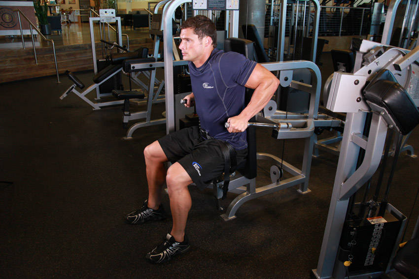

# 臂屈伸器械

**Dip Machine**

> 部位：手臂　|　器械：固定器械　|　难度：⭐ 新手　|　类型：力量训练 · 复合动作 · 推

## 目标肌群

- **主要**：肱三头肌
- **协同**：胸大肌、三角肌

## 动作示意图

| 起始位 | 结束位 |
|:---:|:---:|
|  |  |

## 动作要点

1. 双手撑住双杠/凳面，手臂撑直，肩膀主动下沉远离耳朵。
2. 身体略前倾练胸、保持竖直练三头，按目标选择躯干角度。
3. 吸气屈肘下降，降到大臂与地面平行即可，不要过深。
4. 呼气撑起，顶端保持肩胛稳定，手肘不锁死。
5. 新手可先用弹力带或辅助器减重，把动作轨迹练稳再加难度。

## 常见错误

- ❌ 耸肩、肩膀顶到耳朵 → 肩锁关节压力大
- ❌ 下得过深 → 肩关节前侧拉伤高发
- ❌ 靠晃动惯性上下 → 目标肌群不受力
- ✅ 沉肩、控制深度、匀速起落

## 训练建议

3–5 组 × 6–12 次，组间休息 90–150 秒；先把动作做标准再加重量。

<b>英文原始步骤 / Original Instructions</b>（点击展开）

1. Sit securely in a dip machine, select the weight and firmly grasp the handles.
2. Now keep your elbows in at your sides in order to place emphasis on the triceps. The elbows should be bent at a 90 degree angle.
3. As you contract the triceps, extend your arms downwards as you exhale. Tip: At the bottom of the movement, focus on keeping a little bend in your arms to keep tension on the triceps muscle.
4. Now slowly let your arms come back up to the starting position as you inhale.
5. Repeat for the recommended amount of repetitions.

---

[← 返回手臂部位索引](README.md)　|　[返回首页](../../README.md)

数据与图片来源：[yuhonas/free-exercise-db](https://github.com/yuhonas/free-exercise-db)（The Unlicense，公有领域）　·　中文名称、动作要点与内容组织：Yue（gengyueworks）
