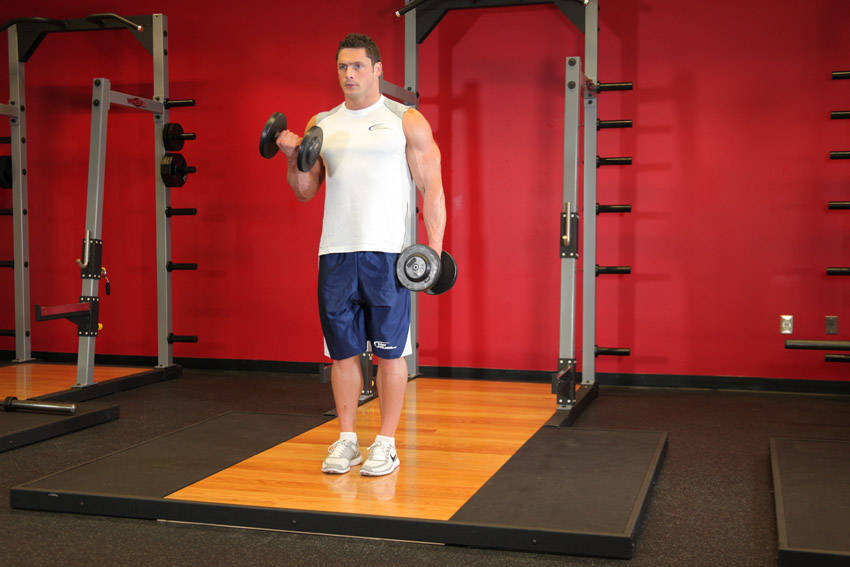
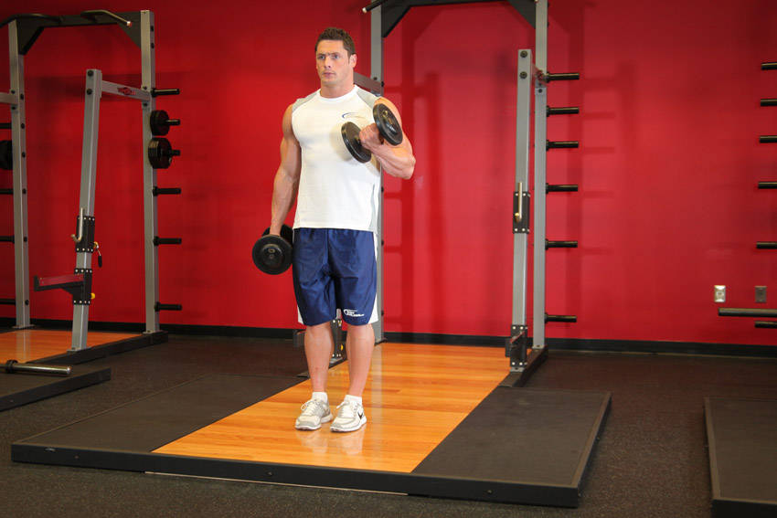

# 哑铃交替肱二头肌弯举

**Dumbbell Alternate Bicep Curl**

> 部位：手臂　|　器械：哑铃　|　难度：⭐ 新手　|　类型：力量训练 · 孤立动作 · 拉

## 目标肌群

- **主要**：肱二头肌
- **协同**：前臂

## 动作示意图

| 起始位 | 结束位 |
|:---:|:---:|
|  |  |

## 动作要点

1. 握住哑铃，大臂夹紧躯干两侧，手肘固定成一个「铰链」。
2. 呼气弯举，只有小臂在动，大臂全程不要前后摆。
3. 举到肱二头肌完全收缩的位置，顶峰主动挤压一秒。
4. 吸气用 2–3 秒缓慢下放，直到手臂接近伸直但保留张力。
5. 全程手腕保持中立，不要靠手腕「勾」重量上来。

## 常见错误

- ❌ 大臂前后摆动、身体后仰借力 → 重量太大
- ❌ 下放时直接松掉 → 丢掉最有价值的离心
- ❌ 手腕过度弯曲 → 前臂代偿、腕关节疼
- ✅ 固定大臂、顶峰挤压、慢速离心

## 训练建议

3–4 组 × 10–15 次，组间休息 45–75 秒；小重量找目标肌群的收缩感。

<b>英文原始步骤 / Original Instructions</b>（点击展开）

1. Stand (torso upright) with a dumbbell in each hand held at arms length. The elbows should be close to the torso and the palms of your hand should be facing your thighs.
2. While holding the upper arm stationary, curl the right weight as you rotate the palm of the hands until they are facing forward. At this point continue contracting the biceps as you breathe out until your biceps is fully contracted and the dumbbells are at shoulder level. Hold the contracted position for a second as you squeeze the biceps. Tip: Only the forearms should move.
3. Slowly begin to bring the dumbbell back to the starting position as your breathe in. Tip: Remember to twist the palms back to the starting position (facing your thighs) as you come down.
4. Repeat the movement with the left hand. This equals one repetition.
5. Continue alternating in this manner for the recommended amount of repetitions.

---

[← 返回手臂部位索引](README.md)　|　[返回首页](../../README.md)

数据与图片来源：[yuhonas/free-exercise-db](https://github.com/yuhonas/free-exercise-db)（The Unlicense，公有领域）　·　中文名称、动作要点与内容组织：Yue（gengyueworks）
