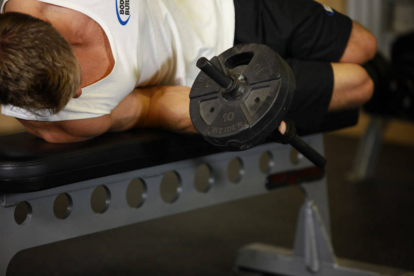

# 哑铃仰卧旋前

**Dumbbell Lying Pronation**

> 部位：手臂　|　器械：哑铃　|　难度：⭐⭐ 进阶　|　类型：力量训练 · 孤立动作 · 拉

## 目标肌群

- **主要**：前臂
- **协同**：—

## 动作示意图

| 起始位 | 结束位 |
|:---:|:---:|
|  |  |

## 动作要点

1. 仰卧调整好起始姿势，用哑铃建立稳定的支撑与握持。
2. 核心收紧、脊柱保持中立，这是所有动作的共同前提。
3. 呼气发力，用前臂主导完成动作，避免其他部位代偿借力。
4. 在肌肉完全收缩的位置停顿一秒，主动感受前臂发力。
5. 吸气用 2–3 秒缓慢还原到起始位，全程保持张力不松掉。

## 常见错误

- ❌ 靠身体摆动借力 → 通常意味着重量选大了
- ❌ 只做半程 → 肌肉没有被充分拉长和收缩
- ❌ 屏气硬撑 → 血压骤升，发力时呼气才对
- ✅ 控制节奏、完整幅度、目标肌群主导

## 训练建议

3–4 组 × 10–15 次，组间休息 45–75 秒；小重量找目标肌群的收缩感。

<b>英文原始步骤 / Original Instructions</b>（点击展开）

1. Lie on a flat bench face down with one arm holding a dumbbell and the other hand on top of the bench folded so that you can rest your head on it.
2. Bend the elbows of the arm holding the dumbbell so that it creates a 90-degree angle between the upper arm and the forearm.
3. Now raise the upper arm so that the forearm is perpendicular to the floor and the upper arm is perpendicular to your torso. Tip: The upper arm should be parallel to the floor and also creating a 90-degree angle with your torso. This will be your starting position.
4. As you breathe out, externally rotate your forearm so that the dumbbell is lifted forward as you maintain the 90 degree angle bend between the upper arms and the forearm. You will continue this external rotation until the forearm is parallel to the floor. At this point you will hold the contraction for a second.
5. As you breathe in, slowly go back to the starting position.
6. Repeat for the recommended amount of repetitions.

---

[← 返回手臂部位索引](README.md)　|　[返回首页](../../README.md)

数据与图片来源：[yuhonas/free-exercise-db](https://github.com/yuhonas/free-exercise-db)（The Unlicense，公有领域）　·　中文名称、动作要点与内容组织：Yue（gengyueworks）
