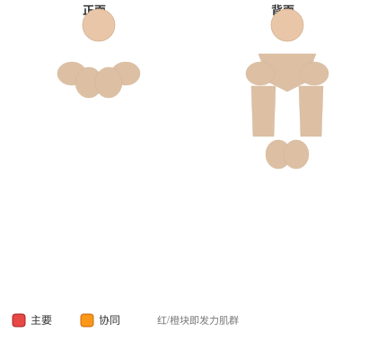

# 哑铃单臂肱三头肌臂屈伸

**Dumbbell One-Arm Triceps Extension**

> 部位：手臂　|　器械：哑铃　|　难度：⭐⭐ 进阶　|　类型：力量训练 · 孤立动作 · 推

## 目标肌群

- **主要**：肱三头肌
- **协同**：—

## 肌肉激活示意

🔴 主要肌群　🟠 协同肌群（红/橙块即发力部位，鼠标悬停看名称）

## 动作示意图

| 起始位 | 结束位 |
|:---:|:---:|
|  |  |

## 动作要点

1. 握住哑铃，大臂贴近躯干或垂直指向天花板，手肘位置全程固定。
2. 起始时前臂弯曲，感受肱三头肌被拉长。
3. 呼气伸展手臂，只用手肘发力，大臂纹丝不动。
4. 伸直时顶峰挤压肱三头肌一秒，但手肘不要暴力锁死。
5. 吸气缓慢回到起始位，保持张力不松掉。

## 常见错误

- ❌ 大臂跟着一起动 → 变成背/胸代偿
- ❌ 耸肩、身体前倾压重量 → 借力
- ❌ 手肘外翻张开 → 力量分散
- ✅ 锁死大臂、只动小臂、顶峰挤压

## 训练建议

3–4 组 × 10–15 次，组间休息 45–75 秒；小重量找目标肌群的收缩感。

<b>英文原始步骤 / Original Instructions</b>（点击展开）

1. Grab a dumbbell and either sit on a military press bench or a utility bench that has a back support on it as you place the dumbbells upright on top of your thighs or stand up straight.
2. Clean the dumbbell up to bring it to shoulder height and then extend the arm over your head so that the whole arm is perpendicular to the floor and next to your head. The dumbbell should be on top of you. The other hand can be kept fully extended to the side, by the waist, supporting the upper arm that has the dumbbell or grabbing a fixed surface.
3. Rotate the wrist so that the palm of your hand is facing forward and the pinkie is facing the ceiling. This will be your starting position.
4. Slowly lower the dumbbell behind your head as you hold the upper arm stationary. Inhale as you perform this movement and pause when your triceps are fully stretched.
5. Return to the starting position by flexing your triceps as you breathe out. Tip: It is imperative that only the forearm moves. The upper arm should remain at all times stationary next to your head.
6. Repeat for the recommended amount of repetitions and switch arms.

---

[← 返回手臂部位索引](README.md)　|　[返回首页](../../README.md)

数据与图片来源：[yuhonas/free-exercise-db](https://github.com/yuhonas/free-exercise-db)（The Unlicense，公有领域）　·　中文名称、动作要点与内容组织：Yue（gengyueworks）