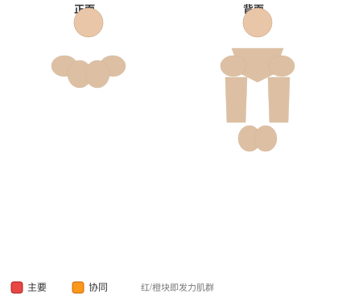
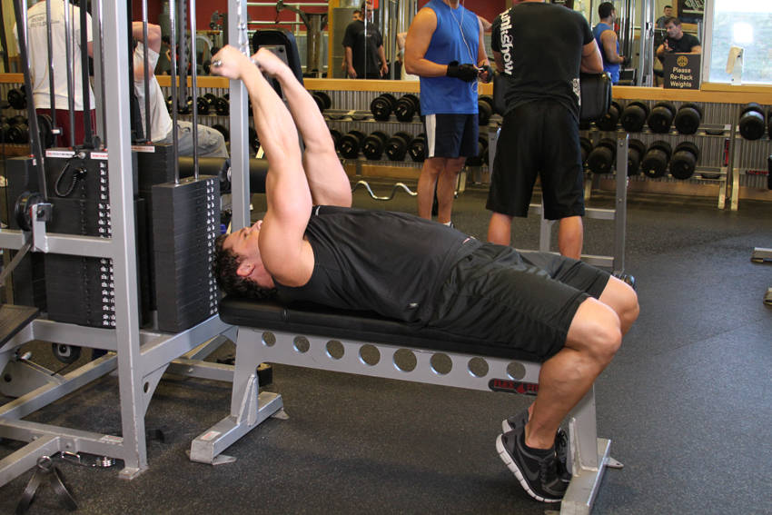

# 高位绳索弯举

**High Cable Curls**

> 部位：手臂　|　器械：绳索　|　难度：⭐⭐ 进阶　|　类型：力量训练 · 复合动作 · 拉

## 目标肌群

- **主要**：肱二头肌
- **协同**：—

## 肌肉激活示意

🔴 主要肌群　🟠 协同肌群（红/橙块即发力部位，鼠标悬停看名称）

## 动作示意图

| 起始位 | 结束位 |
|:---:|:---:|
|  |  |

## 动作要点

1. 握住绳索，大臂夹紧躯干两侧，手肘固定成一个「铰链」。
2. 呼气弯举，只有小臂在动，大臂全程不要前后摆。
3. 举到肱二头肌完全收缩的位置，顶峰主动挤压一秒。
4. 吸气用 2–3 秒缓慢下放，直到手臂接近伸直但保留张力。
5. 全程手腕保持中立，不要靠手腕「勾」重量上来。

## 常见错误

- ❌ 大臂前后摆动、身体后仰借力 → 重量太大
- ❌ 下放时直接松掉 → 丢掉最有价值的离心
- ❌ 手腕过度弯曲 → 前臂代偿、腕关节疼
- ✅ 固定大臂、顶峰挤压、慢速离心

## 训练建议

3–5 组 × 6–12 次，组间休息 90–150 秒；先把动作做标准再加重量。

<b>英文原始步骤 / Original Instructions</b>（点击展开）

1. Stand between a couple of high pulleys and grab a handle in each arm. Position your upper arms in a way that they are parallel to the floor with the palms of your hands facing you. This will be your starting position.
2. Curl the handles towards you until they are next to your ears. Make sure that as you do so you flex your biceps and exhale. The upper arms should remain stationary and only the forearms should move. Hold for a second in the contracted position as you squeeze the biceps.
3. Slowly bring back the arms to the starting position.
4. Repeat for the recommended amount of repetitions.

---

[← 返回手臂部位索引](README.md)　|　[返回首页](../../README.md)

数据与图片来源：[yuhonas/free-exercise-db](https://github.com/yuhonas/free-exercise-db)（The Unlicense，公有领域）　·　中文名称、动作要点与内容组织：Yue（gengyueworks）