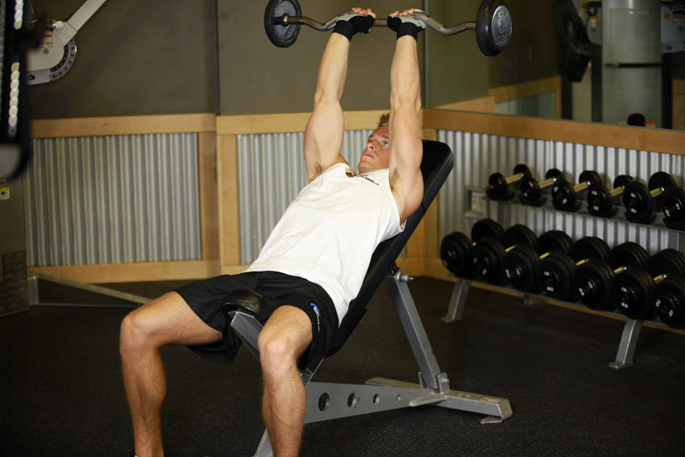

# 上斜杠铃肱三头肌臂屈伸

**Incline Barbell Triceps Extension**

> 部位：手臂　|　器械：杠铃　|　难度：⭐⭐ 进阶　|　类型：力量训练 · 孤立动作 · 推

## 目标肌群

- **主要**：肱三头肌
- **协同**：前臂

## 动作示意图

| 起始位 | 结束位 |
|:---:|:---:|
|  |  |

## 动作要点

1. 上斜握住杠铃，大臂贴近躯干或垂直指向天花板，手肘位置全程固定。
2. 起始时前臂弯曲，感受肱三头肌被拉长。
3. 呼气伸展手臂，只用手肘发力，大臂纹丝不动。
4. 伸直时顶峰挤压肱三头肌一秒，但手肘不要暴力锁死。
5. 吸气缓慢回到起始位，保持张力不松掉。

## 常见错误

- ❌ 大臂跟着一起动 → 变成背/胸代偿
- ❌ 耸肩、身体前倾压重量 → 借力
- ❌ 手肘外翻张开 → 力量分散
- ✅ 锁死大臂、只动小臂、顶峰挤压

## 训练建议

3–4 组 × 10–15 次，组间休息 45–75 秒；小重量找目标肌群的收缩感。

<b>英文原始步骤 / Original Instructions</b>（点击展开）

1. Hold a barbell with an overhand grip (palms down) that is a little closer together than shoulder width.
2. Lie back on an incline bench set at any angle between 45-75-degrees.
3. Bring the bar overhead with your arms extended and elbows in. The arms should be in line with the torso above the head. This will be your starting position.
4. Now lower the bar in a semicircular motion behind your head until your forearms touch your biceps. Inhale as you perform this movement. Tip: Keep your upper arms stationary and close to your head at all times. Only the forearms should move.
5. Return to the starting position as you breathe out and you contract the triceps. Hold the contraction for a second.
6. Repeat for the recommended amount of repetitions.

---

[← 返回手臂部位索引](README.md)　|　[返回首页](../../README.md)

数据与图片来源：[yuhonas/free-exercise-db](https://github.com/yuhonas/free-exercise-db)（The Unlicense，公有领域）　·　中文名称、动作要点与内容组织：Yue（gengyueworks）
