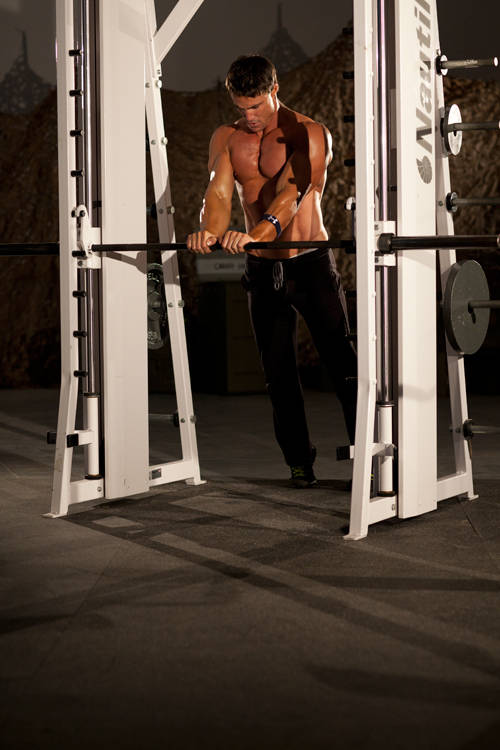
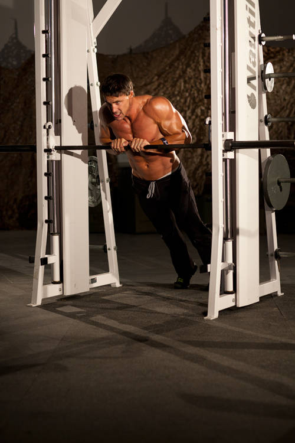

# 上斜俯卧撑窄握

**Incline Push-Up Close-Grip**

> 部位：手臂　|　器械：自重　|　难度：⭐ 新手　|　类型：力量训练 · 复合动作 · 推

## 目标肌群

- **主要**：肱三头肌
- **协同**：胸大肌、三角肌

## 动作示意图

| 起始位 | 结束位 |
|:---:|:---:|
|  |  |

## 动作要点

1. 双手撑地略宽于肩，手指朝前，肩、髋、踝连成一条直线。
2. 核心和臀部收紧，不要塌腰也不要撅屁股。
3. 吸气屈肘下降，肘部向斜后方约 45 度，胸口接近地面。
4. 呼气推起，肩胛自然前伸，顶端不耸肩。
5. 全程颈部中立，眼睛看向身前地面而不是抬头看前方。

## 常见错误

- ❌ 塌腰撅臀 → 腰椎受压且核心不参与
- ❌ 手肘完全向两侧张开 → 肩袖压力大
- ❌ 只做半程、下不去 → 降低难度换全程更有价值
- ✅ 身体一条直线、肘部斜后、全程可控

## 训练建议

3–5 组 × 6–12 次，组间休息 90–150 秒；先把动作做标准再加重量。

<b>英文原始步骤 / Original Instructions</b>（点击展开）

1. Stand facing a Smith machine bar or sturdy elevated platform at an appropriate height.
2. Place your hands next to one another on the bar.
3. Position your feet back from the bar with arms and body straight. This will be your starting position.
4. Keeping your body straight, lower your chest to the bar by bending the arms.
5. Return to the starting position by extending the elbows, pressing yourself back up.

---

[← 返回手臂部位索引](README.md)　|　[返回首页](../../README.md)

数据与图片来源：[yuhonas/free-exercise-db](https://github.com/yuhonas/free-exercise-db)（The Unlicense，公有领域）　·　中文名称、动作要点与内容组织：Yue（gengyueworks）
