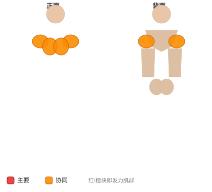
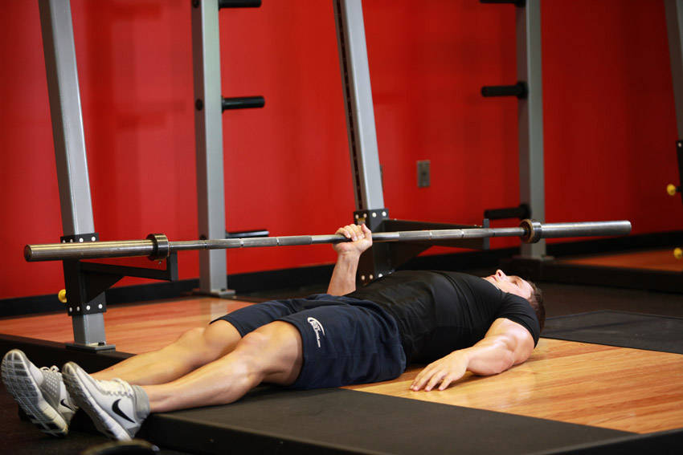

# 单臂地面推举

**One Arm Floor Press**

> 部位：手臂　|　器械：杠铃　|　难度：⭐⭐ 进阶　|　类型：力量训练 · 复合动作 · 推

## 目标肌群

- **主要**：肱三头肌
- **协同**：胸大肌、三角肌

## 肌肉激活示意

🔴 主要肌群　🟠 协同肌群（红/橙块即发力部位，鼠标悬停看名称）

## 动作示意图

| 起始位 | 结束位 |
|:---:|:---:|
|  |  |

## 动作要点

1. 躺上卧凳，双脚踩实地面，肩胛骨向后向下收紧「锁」在凳面上，腰部保留自然生理弯曲。
2. 双手握住杠铃，握距略宽于肩，手腕保持中立、不要后折。
3. 吸气，控制杠铃沿弧线下降到胸部中下沿，肘部与躯干约呈 45–75 度，不要完全外展成一字。
4. 呼气推起，肩胛全程保持收紧，顶端手肘不锁死，保持肱三头肌持续张力。
5. 按计划完成组次，下放时始终「控制着放」，不要靠胸口反弹。

## 常见错误

- ❌ 肩胛松开、肩膀前引 → 力量泄掉，还容易伤肩
- ❌ 手肘完全外展成 90 度 → 肩关节压力剧增
- ❌ 用胸口弹起杠铃 → 借力且有伤肋骨风险
- ✅ 肩胛收紧、肘部内收、全程控制离心

## 训练建议

3–5 组 × 6–12 次，组间休息 90–150 秒；先把动作做标准再加重量。

<b>英文原始步骤 / Original Instructions</b>（点击展开）

1. Lie down on a flat surface with your back pressing against the floor or an exercise mat. Make sure your knees are bent.
2. Have a partner hand you the bar on one hand. When starting, your arm should be just about fully extended, similar to the starting position of a barbell bench press. However, this time your grip will be neutral (palms facing your torso).
3. Make sure the hand you are not using to lift the weight is placed by your side.
4. Begin the exercise by lowering the barbell until your elbow touches the ground. Make sure to breathe in as this is the eccentric (lowering part of the exercise).
5. Then start lifting the barbell back up to the original starting position. Remember to breathe out during the concentric (lifting part of the exercise).
6. Repeat until you have performed your recommended repetitions.
7. Switch arms and repeat the movement.

---

[← 返回手臂部位索引](README.md)　|　[返回首页](../../README.md)

数据与图片来源：[yuhonas/free-exercise-db](https://github.com/yuhonas/free-exercise-db)（The Unlicense，公有领域）　·　中文名称、动作要点与内容组织：Yue（gengyueworks）