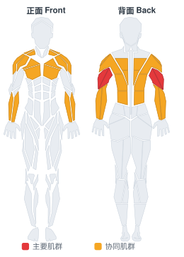

# 保护杠推举

**Pin Presses**

> 部位：手臂　|　器械：杠铃　|　难度：⭐⭐ 进阶　|　类型：力量举 · 复合动作 · 推

## 目标肌群

- **主要**：肱三头肌
- **协同**：胸大肌、前臂、背阔肌、中背（菱形肌/斜方肌中束）、三角肌

## 肌肉激活示意

🔴 主要肌群　🟠 协同肌群（红/橙块即发力部位，鼠标悬停看名称）

## 动作示意图

| 起始位 | 结束位 |
|:---:|:---:|
|  |  |

## 动作要点

1. 握住杠铃，起始位置在锁骨/下巴高度，手腕在手肘正上方。
2. 核心和臀部收紧，肋骨不要外翻，避免用腰代偿。
3. 呼气竖直向上推，过头后手臂位于耳侧或略靠后。
4. 顶端肩胛骨自然上回旋，手肘不完全锁死。
5. 吸气沿原轨迹控制下放到起始位，不要砸下来。

## 常见错误

- ❌ 挺腰后仰把肩推变成上斜卧推 → 腰椎吃力
- ❌ 杠铃走「之」字绕过下巴 → 轨迹低效
- ❌ 手腕后折 → 腕关节疼痛
- ✅ 收紧核心、直上直下、手腕中立

## 训练建议

3–5 组 × 1–5 次，组间休息 3–5 分钟；大重量务必有人保护。

<b>英文原始步骤 / Original Instructions</b>（点击展开）

1. Pin presses remove the eccentric phase of the bench press, developing starting strength. They also allow you to train a desired range of motion.
2. The bench should be set up in a power rack. Set the pins to the desired point in your range of motion, whether it just be lockout or an inch off of your chest. The bar should be moved to the pins and prepared for lifting.
3. Begin by lying on the bench, with the bar directly above the contact point during your regular bench. Tuck your feet underneath you and arch your back. Using the bar to help support your weight, lift your shoulder off the bench and retract them, squeezing the shoulder blades together. Use your feet to drive your traps into the bench. Maintain this tight body position throughout the movement.
4. You can take a standard bench grip, or shoulder width to focus on the triceps. The bar, wrist, and elbow should stay in line at all times. Focus on squeezing the bar and trying to pull it apart.
5. Drive the bar up with as much force as possible. The elbows should be tucked in until lockout.
6. Return the bar to the pins, pausing before beginning the next repetition.

---

[← 返回手臂部位索引](README.md)　|　[返回首页](../../README.md)

数据与图片来源：[yuhonas/free-exercise-db](https://github.com/yuhonas/free-exercise-db)（The Unlicense，公有领域）　·　中文名称、动作要点与内容组织：Yue（gengyueworks）