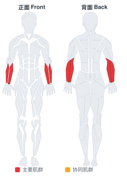

# 杠铃片捏握

**Plate Pinch**

> 部位：手臂　|　器械：其他　|　难度：⭐⭐ 进阶　|　类型：力量训练 · 孤立动作 · 静态支撑

## 目标肌群

- **主要**：前臂
- **协同**：—

## 肌肉激活示意

🔴 主要肌群　🟠 协同肌群（红/橙块即发力部位，鼠标悬停看名称）

## 动作示意图

| 起始位 | 结束位 |
|:---:|:---:|
|  |  |

## 动作要点

1. 把前臂支撑在大腿或凳面上，手腕悬出边缘，握住器械。
2. 掌心向上练屈肌、掌心向下练伸肌，按目标选择。
3. 呼气，只用手腕的力量把重量卷起来，前臂保持不动。
4. 顶峰停顿一秒，吸气缓慢放到最低，让前臂充分拉长。
5. 前臂耐受度高，可以用稍高次数（15–20 次）来练。

## 常见错误

- ❌ 前臂跟着抬起 → 变成弯举
- ❌ 幅度过小 → 前臂没被拉长，效果差
- ❌ 重量过大导致手腕弹动 → 腕关节劳损
- ✅ 固定前臂、只动手腕、大幅度慢速

## 训练建议

3–4 组 × 10–15 次，组间休息 45–75 秒；小重量找目标肌群的收缩感。

<b>英文原始步骤 / Original Instructions</b>（点击展开）

1. Grab two wide-rimmed plates and put them together with the smooth sides facing outward
2. Use your fingers to grip the outside part of the plate and your thumb for the other side thus holding both plates together. This is the starting position.
3. Squeeze the plate with your fingers and thumb. Hold this position for as long as you can.
4. Repeat for the recommended amount of sets prescribed in your program.
5. Switch arms and repeat the movements.

---

[← 返回手臂部位索引](README.md)　|　[返回首页](../../README.md)

数据与图片来源：[yuhonas/free-exercise-db](https://github.com/yuhonas/free-exercise-db)（The Unlicense，公有领域）　·　中文名称、动作要点与内容组织：Yue（gengyueworks）