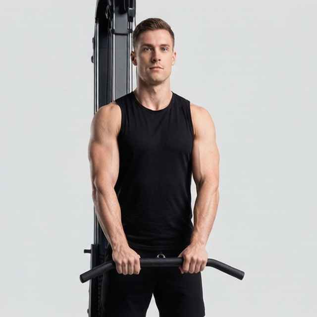
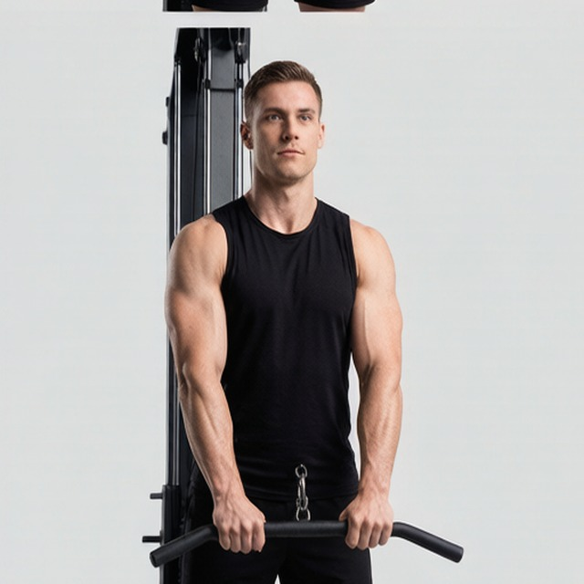
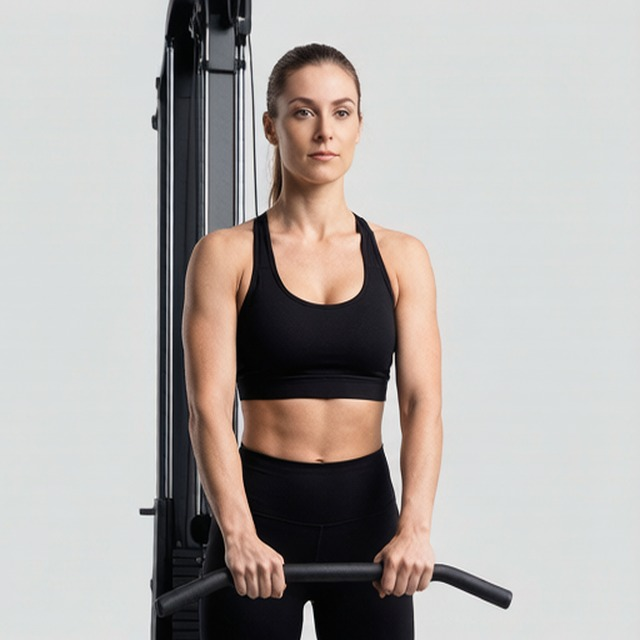
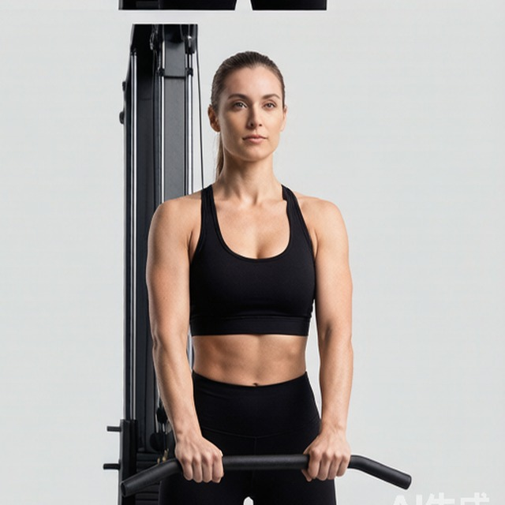

# 反握三头下压

**Reverse Grip Triceps Pushdown**

> 部位：手臂　|　器械：绳索　|　难度：⭐ 新手　|　类型：力量训练 · 孤立动作 · 推

## 目标肌群

- **主要**：肱三头肌
- **协同**：—

## 肌肉激活示意

🔴 主要肌群　🟠 协同肌群（红/橙块即发力部位，鼠标悬停看名称）

## 动作示意图

|  | 起始位 | 结束位 |
|:---:|:---:|:---:|
| **男性** |  |  |
| **女性** |  |  |

## 动作要点

1. 握住绳索，大臂贴近躯干或垂直指向天花板，手肘位置全程固定。
2. 起始时前臂弯曲，感受肱三头肌被拉长。
3. 呼气伸展手臂，只用手肘发力，大臂纹丝不动。
4. 伸直时顶峰挤压肱三头肌一秒，但手肘不要暴力锁死。
5. 吸气缓慢回到起始位，保持张力不松掉。

## 常见错误

- ❌ 大臂跟着一起动 → 变成背/胸代偿
- ❌ 耸肩、身体前倾压重量 → 借力
- ❌ 手肘外翻张开 → 力量分散
- ✅ 锁死大臂、只动小臂、顶峰挤压

## 训练建议

3–4 组 × 10–15 次，组间休息 45–75 秒；小重量找目标肌群的收缩感。

<b>英文原始步骤 / Original Instructions</b>（点击展开）

1. Start by setting a bar attachment (straight or e-z) on a high pulley machine.
2. Facing the bar attachment, grab it with the palms facing up (supinated grip) at shoulder width. Lower the bar by using your lats until your arms are fully extended by your sides. Tip: Elbows should be in by your sides and your feet should be shoulder width apart from each other. This is the starting position.
3. Slowly elevate the bar attachment up as you inhale so it is aligned with your chest. Only the forearms should move and the elbows/upper arms should be stationary by your side at all times.
4. Then begin to lower the cable bar back down to the original staring position while exhaling and contracting the triceps hard.
5. Repeat for the recommended amount of repetitions.

---

[← 返回手臂部位索引](README.md)　|　[返回首页](../../README.md)

数据与图片来源：[yuhonas/free-exercise-db](https://github.com/yuhonas/free-exercise-db)（The Unlicense，公有领域）　·　中文名称、动作要点与内容组织：Yue（gengyueworks）