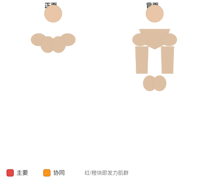
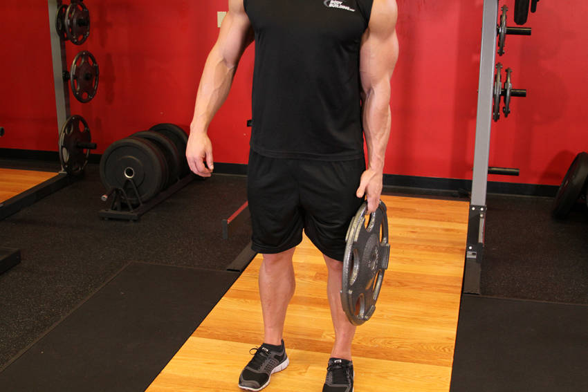
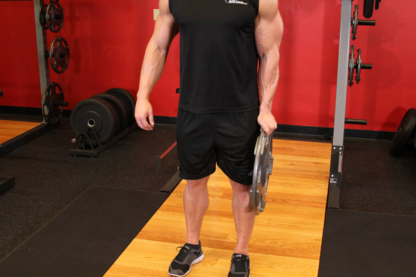

# 站姿奥举杠铃片握力挤压

**Standing Olympic Plate Hand Squeeze**

> 部位：手臂　|　器械：其他　|　难度：⭐ 新手　|　类型：力量训练 · 孤立动作 · 静态支撑

## 目标肌群

- **主要**：前臂
- **协同**：肱二头肌

## 肌肉激活示意

🔴 主要肌群　🟠 协同肌群（红/橙块即发力部位，鼠标悬停看名称）

## 动作示意图

| 起始位 | 结束位 |
|:---:|:---:|
|  |  |

## 动作要点

1. 站姿调整好起始姿势，用器械建立稳定的支撑与握持。
2. 核心收紧、脊柱保持中立，这是所有动作的共同前提。
3. 呼气发力，用前臂主导完成动作，避免其他部位代偿借力。
4. 在肌肉完全收缩的位置停顿一秒，主动感受前臂发力。
5. 吸气用 2–3 秒缓慢还原到起始位，全程保持张力不松掉。

## 常见错误

- ❌ 靠身体摆动借力 → 通常意味着重量选大了
- ❌ 只做半程 → 肌肉没有被充分拉长和收缩
- ❌ 屏气硬撑 → 血压骤升，发力时呼气才对
- ✅ 控制节奏、完整幅度、目标肌群主导

## 训练建议

3–4 组 × 10–15 次，组间休息 45–75 秒；小重量找目标肌群的收缩感。

<b>英文原始步骤 / Original Instructions</b>（点击展开）

1. To begin, stand straight while holding a weight plate by the ridge at arm's length in each hand using a neutral grip (palms facing in). You feet should be shoulder width apart from each other. This will be your starting position.
2. Lower the plates until the fingers are nearly extended but can still hold weights. Inhale as you lower the plates.
3. Now raise the plates back to the starting position as you exhale by closing your hands.
4. Repeat for the recommended amount of repetitions prescribed in your program.

---

[← 返回手臂部位索引](README.md)　|　[返回首页](../../README.md)

数据与图片来源：[yuhonas/free-exercise-db](https://github.com/yuhonas/free-exercise-db)（The Unlicense，公有领域）　·　中文名称、动作要点与内容组织：Yue（gengyueworks）