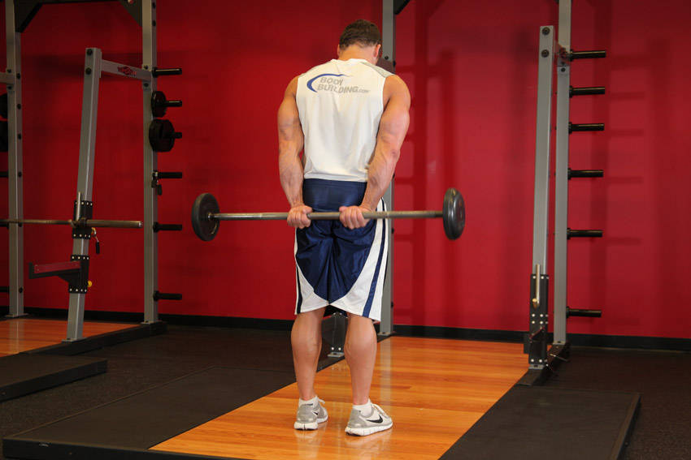

# 站姿掌心向上杠铃背后腕弯举

**Standing Palms-Up Barbell Behind The Back Wrist Curl**

> 部位：手臂　|　器械：杠铃　|　难度：⭐ 新手　|　类型：力量训练 · 孤立动作 · 拉

## 目标肌群

- **主要**：前臂
- **协同**：—

## 动作示意图

| 起始位 | 结束位 |
|:---:|:---:|
|  |  |

## 动作要点

1. 站姿把前臂支撑在大腿或凳面上，手腕悬出边缘，握住杠铃。
2. 掌心向上练屈肌、掌心向下练伸肌，按目标选择。
3. 呼气，只用手腕的力量把重量卷起来，前臂保持不动。
4. 顶峰停顿一秒，吸气缓慢放到最低，让前臂充分拉长。
5. 前臂耐受度高，可以用稍高次数（15–20 次）来练。

## 常见错误

- ❌ 前臂跟着抬起 → 变成弯举
- ❌ 幅度过小 → 前臂没被拉长，效果差
- ❌ 重量过大导致手腕弹动 → 腕关节劳损
- ✅ 固定前臂、只动手腕、大幅度慢速

## 训练建议

3–4 组 × 10–15 次，组间休息 45–75 秒；小重量找目标肌群的收缩感。

<b>英文原始步骤 / Original Instructions</b>（点击展开）

1. Start by standing straight and holding a barbell behind your glutes at arm's length while using a pronated grip (palms will be facing back away from the glutes) and having your hands shoulder width apart from each other.
2. You should be looking straight forward while your feet are shoulder width apart from each other. This is the starting position.
3. While exhaling, slowly elevate the barbell up by curling your wrist in a semi-circular motion towards the ceiling. Note: Your wrist should be the only body part moving for this exercise.
4. Hold the contraction for a second and lower the barbell back down to the starting position while inhaling.
5. Repeat for the recommended amount of repetitions.
6. When finished, lower the barbell down to the squat rack or the floor by bending the knees. Tip: It is easiest to either pick it up from a squat rack or have a partner hand it to you.

---

[← 返回手臂部位索引](README.md)　|　[返回首页](../../README.md)

数据与图片来源：[yuhonas/free-exercise-db](https://github.com/yuhonas/free-exercise-db)（The Unlicense，公有领域）　·　中文名称、动作要点与内容组织：Yue（gengyueworks）
