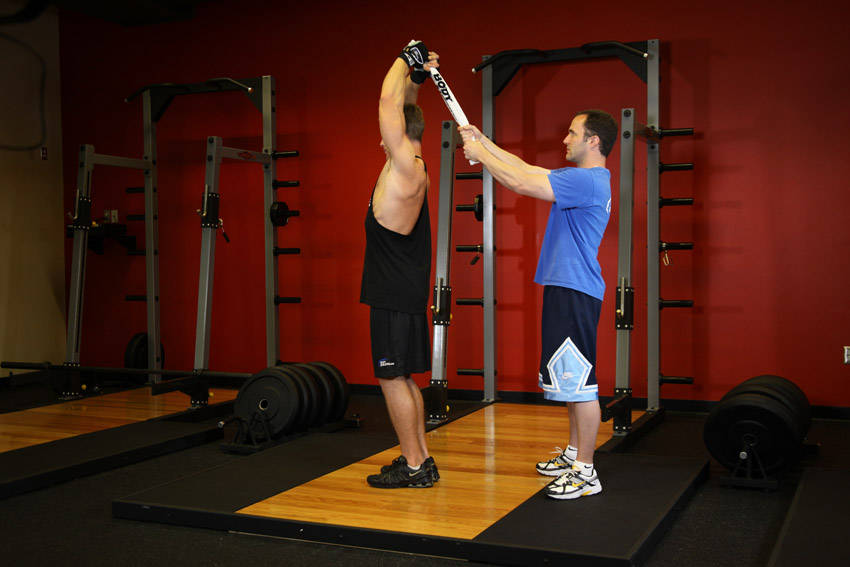

# 站姿毛巾肱三头肌臂屈伸

**Standing Towel Triceps Extension**

> 部位：手臂　|　器械：自重　|　难度：⭐ 新手　|　类型：力量训练 · 孤立动作 · 推

## 目标肌群

- **主要**：肱三头肌
- **协同**：—

## 动作示意图

| 起始位 | 结束位 |
|:---:|:---:|
|  |  |

## 动作要点

1. 站姿握住自身体重，大臂贴近躯干或垂直指向天花板，手肘位置全程固定。
2. 起始时前臂弯曲，感受肱三头肌被拉长。
3. 呼气伸展手臂，只用手肘发力，大臂纹丝不动。
4. 伸直时顶峰挤压肱三头肌一秒，但手肘不要暴力锁死。
5. 吸气缓慢回到起始位，保持张力不松掉。

## 常见错误

- ❌ 大臂跟着一起动 → 变成背/胸代偿
- ❌ 耸肩、身体前倾压重量 → 借力
- ❌ 手肘外翻张开 → 力量分散
- ✅ 锁死大臂、只动小臂、顶峰挤压

## 训练建议

3–4 组 × 10–15 次，组间休息 45–75 秒；小重量找目标肌群的收缩感。

<b>英文原始步骤 / Original Instructions</b>（点击展开）

1. To begin, stand up with both arms fully extended above the head holding one end of a towel with both hands. Your elbows should be in and the arms perpendicular to the floor with the palms facing each other while your feet should be shoulder width apart from each other. This is the starting position.
2. Now communicate with your partner so that he/she can grip the other side of the towel to apply resistance. Keeping your upper arms close to your head (elbows in) and perpendicular to the floor, lower the resistance in a semicircular motion behind your head until your forearms touch your biceps. Tip: The upper arms should remain stationary and only the forearms should move. Breathe in as you perform this step.
3. Go back to the starting position by using the triceps to raise the towel. Breathe out as you perform this step.
4. Repeat for the recommended amount of repetitions.

---

[← 返回手臂部位索引](README.md)　|　[返回首页](../../README.md)

数据与图片来源：[yuhonas/free-exercise-db](https://github.com/yuhonas/free-exercise-db)（The Unlicense，公有领域）　·　中文名称、动作要点与内容组织：Yue（gengyueworks）
