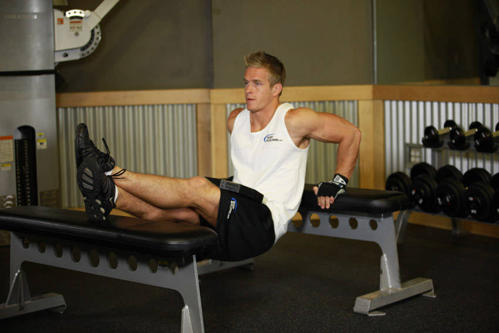

# 负重卧凳臂屈伸

**Weighted Bench Dip**

> 部位：手臂　|　器械：其他　|　难度：⭐⭐ 进阶　|　类型：力量训练 · 复合动作 · 推

## 目标肌群

- **主要**：肱三头肌
- **协同**：胸大肌、三角肌

## 动作示意图

| 起始位 | 结束位 |
|:---:|:---:|
|  |  |

## 动作要点

1. 双手撑住双杠/凳面，手臂撑直，肩膀主动下沉远离耳朵。
2. 身体略前倾练胸、保持竖直练三头，按目标选择躯干角度。
3. 吸气屈肘下降，降到大臂与地面平行即可，不要过深。
4. 呼气撑起，顶端保持肩胛稳定，手肘不锁死。
5. 新手可先用弹力带或辅助器减重，把动作轨迹练稳再加难度。

## 常见错误

- ❌ 耸肩、肩膀顶到耳朵 → 肩锁关节压力大
- ❌ 下得过深 → 肩关节前侧拉伤高发
- ❌ 靠晃动惯性上下 → 目标肌群不受力
- ✅ 沉肩、控制深度、匀速起落

## 训练建议

3–5 组 × 6–12 次，组间休息 90–150 秒；先把动作做标准再加重量。

<b>英文原始步骤 / Original Instructions</b>（点击展开）

1. For this exercise you will need to place a bench behind your back and another one in front of you. With the benches perpendicular to your body, hold on to one bench on its edge with the hands close to your body, separated at shoulder width. Your arms should be fully extended.
2. The legs will be extended forward on top of the other bench. Your legs should be parallel to the floor while your torso is to be perpendicular to the floor. Have your partner place the dumbbell on your lap. Note: This exercise is best performed with a partner as placing the weight on your lap can be challenging and cause injury without assistance. This will be your starting position.
3. Slowly lower your body as you inhale by bending at the elbows until you lower yourself far enough to where there is an angle slightly smaller than 90 degrees between the upper arm and the forearm. Tip: Keep the elbows as close as possible throughout the movement. Forearms should always be pointing down.
4. Using your triceps to bring your torso up again, lift yourself back to the starting position while exhaling.
5. Repeat for the recommended amount of repetitions.

---

[← 返回手臂部位索引](README.md)　|　[返回首页](../../README.md)

数据与图片来源：[yuhonas/free-exercise-db](https://github.com/yuhonas/free-exercise-db)（The Unlicense，公有领域）　·　中文名称、动作要点与内容组织：Yue（gengyueworks）
