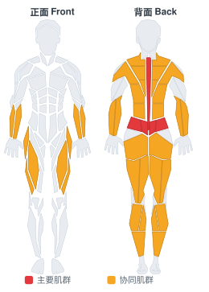

# 杠铃硬拉

**Barbell Deadlift**

> 部位：背　|　器械：杠铃　|　难度：⭐⭐ 进阶　|　类型：力量训练 · 复合动作 · 拉

## 目标肌群

- **主要**：下背（竖脊肌）
- **协同**：小腿（腓肠肌/比目鱼肌）、前臂、臀大肌、腘绳肌（大腿后侧）、背阔肌、中背（菱形肌/斜方肌中束）、股四头肌（大腿前侧）、斜方肌

## 肌肉激活示意

🔴 主要肌群　🟠 协同肌群（红/橙块即发力部位，鼠标悬停看名称）

## 动作示意图

| 起始位 | 结束位 |
|:---:|:---:|
|  |  |

## 动作要点

1. 双脚约与髋同宽，杠铃贴近小腿，杠位于脚掌中部正上方。
2. 屈髋屈膝下去握杠，挺胸收肩胛，背部保持中立——这一步最关键。
3. 吸气憋住核心，先用腿把地面「蹬开」，杠贴着腿向上走。
4. 髋膝同步伸展，过膝后髋部前顶站直，顶端夹紧臀部但不要后仰。
5. 下放时先屈髋把杠沿腿送下去，过膝再屈膝，保持背部中立。

## 常见错误

- ❌ 弓背起杠 → 腰椎间盘压力剧增，最危险的错误
- ❌ 杠离小腿太远 → 力臂变长，腰部代偿
- ❌ 顶端过度后仰 → 腰椎超伸，没有额外收益
- ✅ 杠贴腿走、背部中立、髋膝同步、顶端只需站直

## 训练建议

3–5 组 × 6–12 次，组间休息 90–150 秒；先把动作做标准再加重量。

<b>英文原始步骤 / Original Instructions</b>（点击展开）

1. Stand in front of a loaded barbell.
2. While keeping the back as straight as possible, bend your knees, bend forward and grasp the bar using a medium (shoulder width) overhand grip. This will be the starting position of the exercise. Tip: If it is difficult to hold on to the bar with this grip, alternate your grip or use wrist straps.
3. While holding the bar, start the lift by pushing with your legs while simultaneously getting your torso to the upright position as you breathe out. In the upright position, stick your chest out and contract the back by bringing the shoulder blades back. Think of how the soldiers in the military look when they are in standing in attention.
4. Go back to the starting position by bending at the knees while simultaneously leaning the torso forward at the waist while keeping the back straight. When the weights on the bar touch the floor you are back at the starting position and ready to perform another repetition.
5. Perform the amount of repetitions prescribed in the program.

---

[← 返回背部位索引](README.md)　|　[返回首页](../../README.md)

数据与图片来源：[yuhonas/free-exercise-db](https://github.com/yuhonas/free-exercise-db)（The Unlicense，公有领域）　·　中文名称、动作要点与内容组织：Yue（gengyueworks）