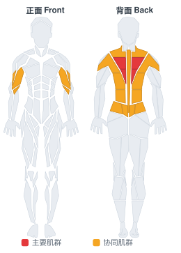

# 俯身单臂长杠铃杆划船

**Bent Over One-Arm Long Bar Row**

> 部位：背　|　器械：杠铃　|　难度：⭐ 新手　|　类型：力量训练 · 复合动作 · 拉

## 目标肌群

- **主要**：中背（菱形肌/斜方肌中束）
- **协同**：肱二头肌、背阔肌、下背（竖脊肌）、斜方肌

## 肌肉激活示意

🔴 主要肌群　🟠 协同肌群（红/橙块即发力部位，鼠标悬停看名称）

## 动作示意图

| 起始位 | 结束位 |
|:---:|:---:|
|  |  |

## 动作要点

1. 俯身握住杠铃，脊柱保持中立，核心收紧，避免弓背。
2. 起始时让肩胛骨自然前伸，背阔肌被拉长。
3. 呼气，先收肩胛再用手肘向后拉，把杠铃带向腹部或下肋位置。
4. 顶峰挤压背部一秒，两侧肩胛向中间夹紧。
5. 吸气缓慢还原，全程躯干稳定不摇摆。

## 常见错误

- ❌ 弓背拉重量 → 腰椎受伤风险最高的错误
- ❌ 靠躯干起伏甩上来 → 背部没吃上力
- ❌ 手肘外展太多 → 变成练后束而非背阔肌
- ✅ 中立脊柱、先收肩胛、肘贴身后拉

## 训练建议

3–5 组 × 6–12 次，组间休息 90–150 秒；先把动作做标准再加重量。

<b>英文原始步骤 / Original Instructions</b>（点击展开）

1. Put weight on one of the ends of an Olympic barbell. Make sure that you either place the other end of the barbell in the corner of two walls; or put a heavy object on the ground so the barbell cannot slide backward.
2. Bend forward until your torso is as close to parallel with the floor as you can and keep your knees slightly bent.
3. Now grab the bar with one arm just behind the plates on the side where the weight was placed and put your other hand on your knee. This will be your starting position.
4. Pull the bar straight up with your elbow in (to maximize back stimulation) until the plates touch your lower chest. Squeeze the back muscles as you lift the weight up and hold for a second at the top of the movement. Breathe out as you lift the weight. Tip: Do not allow for any swinging of the torso. Only the arm should move.
5. Slowly lower the bar to the starting position getting a nice stretch on the lats. Tip: Do not let the plates touch the floor. To ensure the best range of motion, I recommend using small plates (25-lb ones) as opposed to larger plates (like 35-45lb ones).
6. Repeat for the recommended amount of repetitions and switch arms.

---

[← 返回背部位索引](README.md)　|　[返回首页](../../README.md)

数据与图片来源：[yuhonas/free-exercise-db](https://github.com/yuhonas/free-exercise-db)（The Unlicense，公有领域）　·　中文名称、动作要点与内容组织：Yue（gengyueworks）