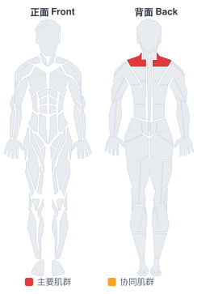

# 绳索耸肩

**Cable Shrugs**

> 部位：背　|　器械：绳索　|　难度：⭐ 新手　|　类型：力量训练 · 孤立动作 · 拉

## 目标肌群

- **主要**：斜方肌
- **协同**：—

## 肌肉激活示意

🔴 主要肌群　🟠 协同肌群（红/橙块即发力部位，鼠标悬停看名称）

## 动作示意图

| 起始位 | 结束位 |
|:---:|:---:|
|  |  |

## 动作要点

1. 握住绳索自然垂于身体两侧或身前，手臂全程伸直放松。
2. 呼气，肩膀垂直向上「耸」向耳朵，想象用斜方肌提重量。
3. 顶端停顿一秒，主动挤压斜方肌。
4. 吸气缓慢下放，让肩膀沉到最低，充分拉长。
5. 全程不要用手臂弯举，也不要转圈绕肩。

## 常见错误

- ❌ 绕肩画圈 → 对肩关节没好处，也不增加刺激
- ❌ 手臂跟着弯举 → 变成划船
- ❌ 幅度太小 → 斜方肌几乎没被拉长
- ✅ 直上直下、顶峰停顿、充分下沉

## 训练建议

3–4 组 × 10–15 次，组间休息 45–75 秒；小重量找目标肌群的收缩感。

<b>英文原始步骤 / Original Instructions</b>（点击展开）

1. Grasp a cable bar attachment that is attached to a low pulley with a shoulder width or slightly wider overhand (palms facing down) grip.
2. Stand erect close to the pulley with your arms extended in front of you holding the bar. This will be your starting position.
3. Lift the bar by elevating the shoulders as high as possible as you exhale. Hold the contraction at the top for a second. Tip: The arms should remain extended at all times. Refrain from using the biceps to help lift the bar. Only the shoulders should be moving up and down.
4. Lower the bar back to the original position.
5. Repeat for the recommended amount of repetitions.

---

[← 返回背部位索引](README.md)　|　[返回首页](../../README.md)

数据与图片来源：[yuhonas/free-exercise-db](https://github.com/yuhonas/free-exercise-db)（The Unlicense，公有领域）　·　中文名称、动作要点与内容组织：Yue（gengyueworks）