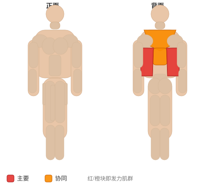
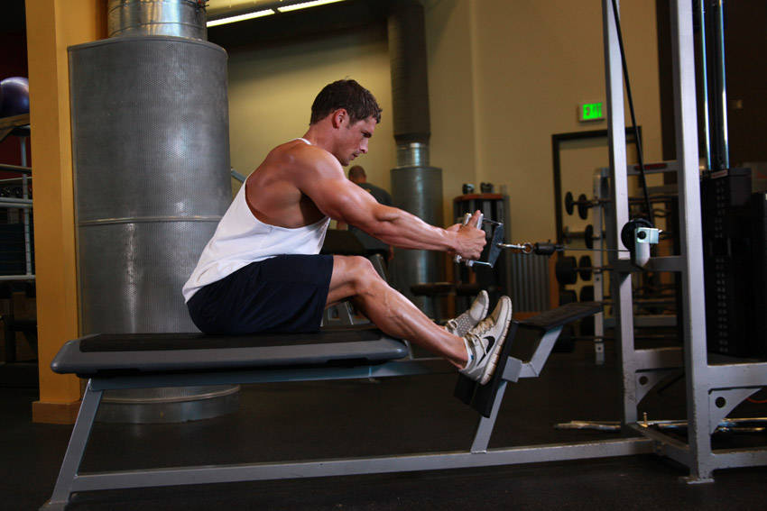
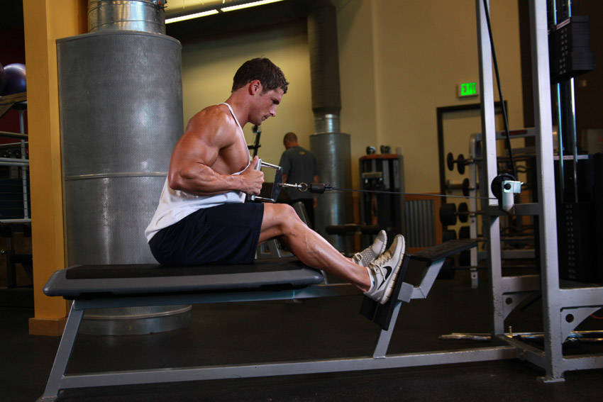

# 垫高绳索划船

**Elevated Cable Rows**

> 部位：背　|　器械：绳索　|　难度：⭐⭐ 进阶　|　类型：力量训练 · 复合动作 · 拉

## 目标肌群

- **主要**：背阔肌
- **协同**：中背（菱形肌/斜方肌中束）、斜方肌

## 肌肉激活示意

🔴 主要肌群　🟠 协同肌群（红/橙块即发力部位，鼠标悬停看名称）

## 动作示意图

| 起始位 | 结束位 |
|:---:|:---:|
|  |  |

## 动作要点

1. 握住绳索，脊柱保持中立，核心收紧，避免弓背。
2. 起始时让肩胛骨自然前伸，背阔肌被拉长。
3. 呼气，先收肩胛再用手肘向后拉，把绳索带向腹部或下肋位置。
4. 顶峰挤压背部一秒，两侧肩胛向中间夹紧。
5. 吸气缓慢还原，全程躯干稳定不摇摆。

## 常见错误

- ❌ 弓背拉重量 → 腰椎受伤风险最高的错误
- ❌ 靠躯干起伏甩上来 → 背部没吃上力
- ❌ 手肘外展太多 → 变成练后束而非背阔肌
- ✅ 中立脊柱、先收肩胛、肘贴身后拉

## 训练建议

3–5 组 × 6–12 次，组间休息 90–150 秒；先把动作做标准再加重量。

<b>英文原始步骤 / Original Instructions</b>（点击展开）

1. Get a platform of some sort (it can be an aerobics or calf raise platform) that is around 4-6 inches in height.
2. Place it on the seat of the cable row machine.
3. Sit down on the machine and place your feet on the front platform or crossbar provided making sure that your knees are slightly bent and not locked.
4. Lean over as you keep the natural alignment of your back and grab the V-bar handles.
5. With your arms extended pull back until your torso is at a 90-degree angle from your legs. Your back should be slightly arched and your chest should be sticking out. You should be feeling a nice stretch on your lats as you hold the bar in front of you. This is the starting position of the exercise.
6. Keeping the torso stationary, pull the handles back towards your torso while keeping the arms close to it until you touch the abdominals. Breathe out as you perform that movement. At that point you should be squeezing your back muscles hard. Hold that contraction for a second and slowly go back to the original position while breathing in.
7. Repeat for the recommended amount of repetitions.

---

[← 返回背部位索引](README.md)　|　[返回首页](../../README.md)

数据与图片来源：[yuhonas/free-exercise-db](https://github.com/yuhonas/free-exercise-db)（The Unlicense，公有领域）　·　中文名称、动作要点与内容组织：Yue（gengyueworks）