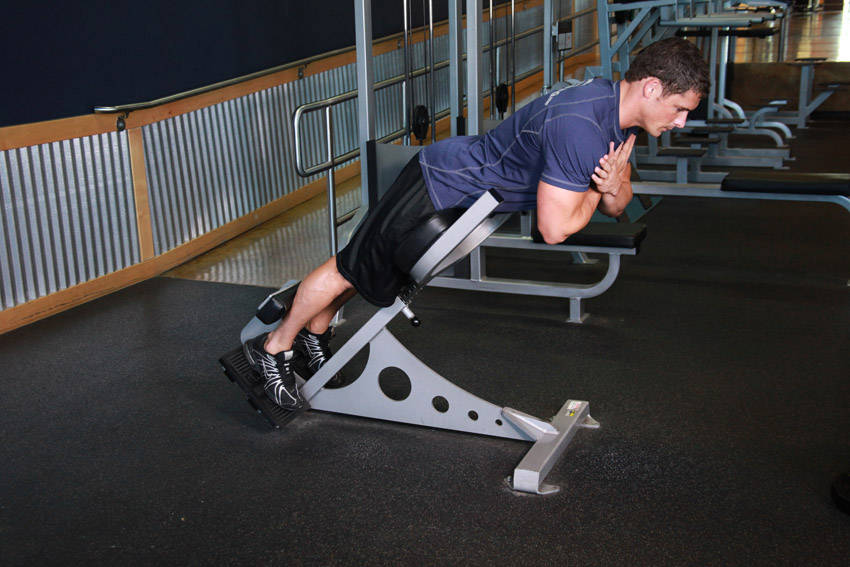
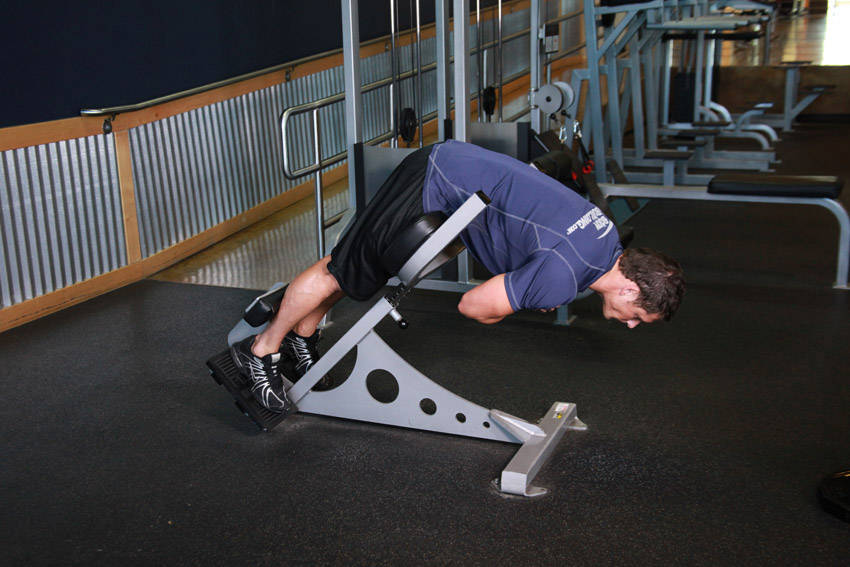

# 山羊挺身（背伸展）

**Hyperextensions (Back Extensions)**

> 部位：背　|　器械：其他　|　难度：⭐ 新手　|　类型：力量训练 · 孤立动作 · 拉

## 目标肌群

- **主要**：下背（竖脊肌）
- **协同**：臀大肌、腘绳肌（大腿后侧）

## 动作示意图

| 起始位 | 结束位 |
|:---:|:---:|
|  |  |

## 动作要点

1. 握住器械，大臂贴近躯干或垂直指向天花板，手肘位置全程固定。
2. 起始时前臂弯曲，感受下背被拉长。
3. 呼气伸展手臂，只用手肘发力，大臂纹丝不动。
4. 伸直时顶峰挤压下背一秒，但手肘不要暴力锁死。
5. 吸气缓慢回到起始位，保持张力不松掉。

## 常见错误

- ❌ 大臂跟着一起动 → 变成背/胸代偿
- ❌ 耸肩、身体前倾压重量 → 借力
- ❌ 手肘外翻张开 → 力量分散
- ✅ 锁死大臂、只动小臂、顶峰挤压

## 训练建议

3–4 组 × 10–15 次，组间休息 45–75 秒；小重量找目标肌群的收缩感。

<b>英文原始步骤 / Original Instructions</b>（点击展开）

1. Lie face down on a hyperextension bench, tucking your ankles securely under the footpads.
2. Adjust the upper pad if possible so your upper thighs lie flat across the wide pad, leaving enough room for you to bend at the waist without any restriction.
3. With your body straight, cross your arms in front of you (my preference) or behind your head. This will be your starting position. Tip: You can also hold a weight plate for extra resistance in front of you under your crossed arms.
4. Start bending forward slowly at the waist as far as you can while keeping your back flat. Inhale as you perform this movement. Keep moving forward until you feel a nice stretch on the hamstrings and you can no longer keep going without a rounding of the back. Tip: Never round the back as you perform this exercise. Also, some people can go farther than others. The key thing is that you go as far as your body allows you to without rounding the back.
5. Slowly raise your torso back to the initial position as you inhale. Tip: Avoid the temptation to arch your back past a straight line. Also, do not swing the torso at any time in order to protect the back from injury.
6. Repeat for the recommended amount of repetitions.

---

[← 返回背部位索引](README.md)　|　[返回首页](../../README.md)

数据与图片来源：[yuhonas/free-exercise-db](https://github.com/yuhonas/free-exercise-db)（The Unlicense，公有领域）　·　中文名称、动作要点与内容组织：Yue（gengyueworks）
