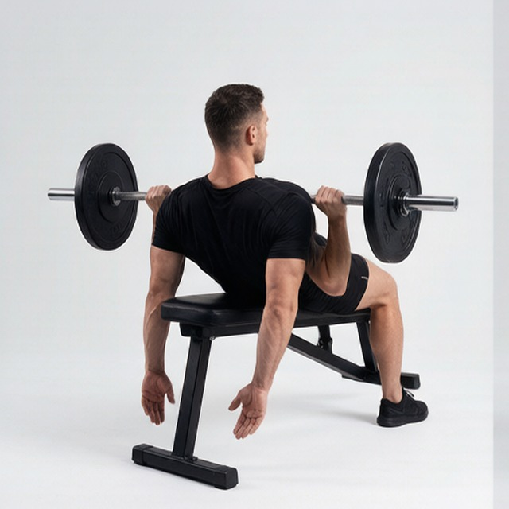
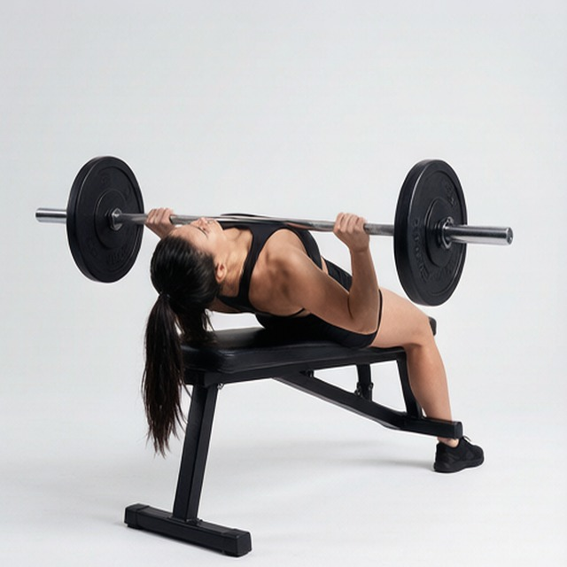

# 上斜卧凳拉

**Incline Bench Pull**

> 部位：背　|　器械：杠铃　|　难度：⭐ 新手　|　类型：力量训练 · 孤立动作 · 拉

## 目标肌群

- **主要**：中背（菱形肌/斜方肌中束）
- **协同**：背阔肌、三角肌

## 动作示意图

| 起始位 | 结束位 |
|:---:|:---:|
|  |  |

## 动作要点

1. 上斜调整好起始姿势，用杠铃建立稳定的支撑与握持。
2. 核心收紧、脊柱保持中立，这是所有动作的共同前提。
3. 呼气发力，用中背主导完成动作，避免其他部位代偿借力。
4. 在肌肉完全收缩的位置停顿一秒，主动感受中背发力。
5. 吸气用 2–3 秒缓慢还原到起始位，全程保持张力不松掉。

## 常见错误

- ❌ 靠身体摆动借力 → 通常意味着重量选大了
- ❌ 只做半程 → 肌肉没有被充分拉长和收缩
- ❌ 屏气硬撑 → 血压骤升，发力时呼气才对
- ✅ 控制节奏、完整幅度、目标肌群主导

## 训练建议

3–4 组 × 10–15 次，组间休息 45–75 秒；小重量找目标肌群的收缩感。

<b>英文原始步骤 / Original Instructions</b>（点击展开）

1. Grab a dumbbell in each hand and lie face down on an incline bench that is set to an incline that is approximately 30 degrees.
2. Let the arms hang to your sides fully extended as they point to the floor.
3. Turn the wrists until your hands have a pronated (palms down) grip.
4. Now flare the elbows out. This will be your starting position.
5. As you breathe out, start to pull the dumbbells up as if you are doing a reverse bench press. You will do this by bending at the elbows and bringing the upper arms up as you let the forearms hang. Continue this motion until the upper arms are at the same level as your back. Tip: The elbows will come out to the side and your upper arms and torso should make the letter "T" at the top of the movement. Hold the contraction at the top for a second.
6. Slowly go back down to the starting position as you breathe in.
7. Repeat for the recommended amount of repetitions.

---

[← 返回背部位索引](README.md)　|　[返回首页](../../README.md)

数据与图片来源：[yuhonas/free-exercise-db](https://github.com/yuhonas/free-exercise-db)（The Unlicense，公有领域）　·　中文名称、动作要点与内容组织：Yue（gengyueworks）
