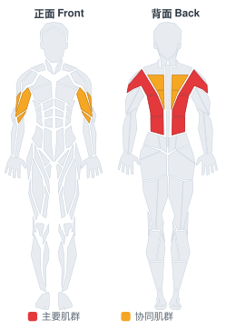

# 跪姿高位滑轮划船

**Kneeling High Pulley Row**

> 部位：背　|　器械：绳索　|　难度：⭐ 新手　|　类型：力量训练 · 复合动作 · 拉

## 目标肌群

- **主要**：背阔肌
- **协同**：肱二头肌、中背（菱形肌/斜方肌中束）

## 肌肉激活示意

🔴 主要肌群　🟠 协同肌群（红/橙块即发力部位，鼠标悬停看名称）

## 动作示意图

| 起始位 | 结束位 |
|:---:|:---:|
|  |  |

## 动作要点

1. 跪姿握住绳索，脊柱保持中立，核心收紧，避免弓背。
2. 起始时让肩胛骨自然前伸，背阔肌被拉长。
3. 呼气，先收肩胛再用手肘向后拉，把绳索带向腹部或下肋位置。
4. 顶峰挤压背部一秒，两侧肩胛向中间夹紧。
5. 吸气缓慢还原，全程躯干稳定不摇摆。

## 常见错误

- ❌ 弓背拉重量 → 腰椎受伤风险最高的错误
- ❌ 靠躯干起伏甩上来 → 背部没吃上力
- ❌ 手肘外展太多 → 变成练后束而非背阔肌
- ✅ 中立脊柱、先收肩胛、肘贴身后拉

## 训练建议

3–5 组 × 6–12 次，组间休息 90–150 秒；先把动作做标准再加重量。

<b>英文原始步骤 / Original Instructions</b>（点击展开）

1. Select the appropriate weight using a pulley that is above your head. Attach a rope to the cable and kneel a couple of feet away, holding the rope out in front of you with both arms extended. This will be your starting position.
2. Initiate the movement by flexing the elbows and fully retracting your shoulders, pulling the rope toward your upper chest with your elbows out.
3. After pausing briefly, slowly return to the starting position.

---

[← 返回背部位索引](README.md)　|　[返回首页](../../README.md)

数据与图片来源：[yuhonas/free-exercise-db](https://github.com/yuhonas/free-exercise-db)（The Unlicense，公有领域）　·　中文名称、动作要点与内容组织：Yue（gengyueworks）