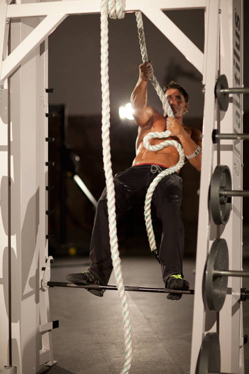
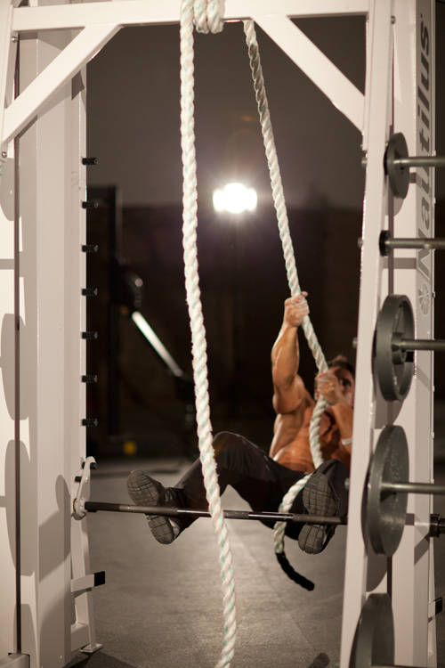

# 伦敦桥式

**London Bridges**

> 部位：背　|　器械：其他　|　难度：⭐⭐ 进阶　|　类型：力量训练 · 复合动作 · 拉

## 目标肌群

- **主要**：背阔肌
- **协同**：肱二头肌、前臂、中背（菱形肌/斜方肌中束）

## 动作示意图

| 起始位 | 结束位 |
|:---:|:---:|
|  |  |

## 动作要点

1. 肩胛骨下缘卡在凳面边缘，双脚踩实地面，小腿在顶端应接近垂直。
2. 器械置于髋部（垫好软垫），下巴微收，视线看向前下方。
3. 呼气，用臀部发力顶髋向上，直到肩、髋、膝成一条直线。
4. 顶峰主动夹紧臀部 1–2 秒，这一秒是这个动作的全部价值。
5. 吸气缓慢下放，臀部接近地面但不完全放松。

## 常见错误

- ❌ 用腰顶而不是髋顶 → 练完腰酸而不是臀酸
- ❌ 顶端过度伸展腰椎 → 腰椎超伸
- ❌ 下巴抬高、视线朝天 → 颈椎紧张、骨盆前倾
- ✅ 收下巴、髋部发力、顶峰夹紧

## 训练建议

3–5 组 × 6–12 次，组间休息 90–150 秒；先把动作做标准再加重量。

<b>英文原始步骤 / Original Instructions</b>（点击展开）

1. Attach a climbing rope to a high beam or cross member. Below it, ensure that the smith machine bar is locked in place with the safeties and cannot move. Alternatively, a secure box could also be utilized.
2. Stand on the bar, using the rope to balance yourself. This will be your starting position.
3. Keeping your body straight, lean back and lower your body by slowly going hand over hand with the rope. Continue until you are perpendicular to the ground.
4. Keeping your body straight, reverse the motion, going hand over hand back to the starting position.

---

[← 返回背部位索引](README.md)　|　[返回首页](../../README.md)

数据与图片来源：[yuhonas/free-exercise-db](https://github.com/yuhonas/free-exercise-db)（The Unlicense，公有领域）　·　中文名称、动作要点与内容组织：Yue（gengyueworks）
