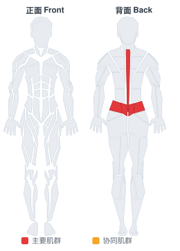

# 下部背泡沫轴放松

**Lower Back-SMR**

> 部位：背　|　器械：泡沫轴　|　难度：⭐ 新手　|　类型：拉伸放松 · — · 静态支撑

## 目标肌群

- **主要**：下背（竖脊肌）
- **协同**：—

## 肌肉激活示意

🔴 主要肌群　🟠 协同肌群（红/橙块即发力部位，鼠标悬停看名称）

## 动作示意图

| 起始位 | 结束位 |
|:---:|:---:|
|  |  |

## 动作要点

1. 把泡沫轴放在目标区域下方，用身体重量控制压力大小。
2. 缓慢滚动，速度约每秒 2–3 厘米，不要来回快搓。
3. 找到明显酸痛的「激痛点」时停下来，在该点静压 20–30 秒。
4. 静压时保持深呼吸，感受肌肉逐渐放松下来。
5. 每个部位 1–2 分钟即可，训练前后都可以做。

## 常见错误

- ❌ 快速来回滚 → 肌肉来不及放松
- ❌ 直接压在关节或骨突上 → 疼痛且无效
- ❌ 疼到憋气咬牙 → 压力过大，应减轻体重占比
- ✅ 慢速滚动、痛点静压、配合深呼吸

## 训练建议

每侧 2–3 组，每组静态保持 20–30 秒；训练后做效果最好。

<b>英文原始步骤 / Original Instructions</b>（点击展开）

1. In a seated position, place a foam roll under your lower back. Cross your arms in front of you and protract your shoulders. This will be your starting position.
2. Raise your hips off of the floor and lean back, keeping your weight on your lower back. Now shift your weight slightly to one side, keeping your weight off of the spine and on the muscles to the side of it. Roll over your lower back, holding points of tension for 10-30 seconds. Repeat on the other side.

---

[← 返回背部位索引](README.md)　|　[返回首页](../../README.md)

数据与图片来源：[yuhonas/free-exercise-db](https://github.com/yuhonas/free-exercise-db)（The Unlicense，公有领域）　·　中文名称、动作要点与内容组织：Yue（gengyueworks）