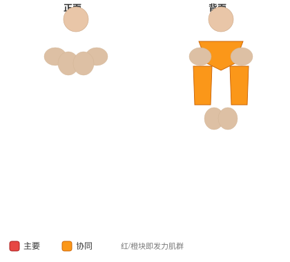

# 仰卧曲杆杠铃划船

**Lying Cambered Barbell Row**

> 部位：背　|　器械：杠铃　|　难度：⭐ 新手　|　类型：力量训练 · 孤立动作 · 拉

## 目标肌群

- **主要**：中背（菱形肌/斜方肌中束）
- **协同**：肱二头肌、背阔肌、斜方肌

## 肌肉激活示意

🔴 主要肌群　🟠 协同肌群（红/橙块即发力部位，鼠标悬停看名称）

## 动作示意图

| 起始位 | 结束位 |
|:---:|:---:|
|  |  |

## 动作要点

1. 仰卧握住杠铃，脊柱保持中立，核心收紧，避免弓背。
2. 起始时让肩胛骨自然前伸，背阔肌被拉长。
3. 呼气，先收肩胛再用手肘向后拉，把杠铃带向腹部或下肋位置。
4. 顶峰挤压背部一秒，两侧肩胛向中间夹紧。
5. 吸气缓慢还原，全程躯干稳定不摇摆。

## 常见错误

- ❌ 弓背拉重量 → 腰椎受伤风险最高的错误
- ❌ 靠躯干起伏甩上来 → 背部没吃上力
- ❌ 手肘外展太多 → 变成练后束而非背阔肌
- ✅ 中立脊柱、先收肩胛、肘贴身后拉

## 训练建议

3–4 组 × 10–15 次，组间休息 45–75 秒；小重量找目标肌群的收缩感。

<b>英文原始步骤 / Original Instructions</b>（点击展开）

1. Place a cambered bar underneath an exercise bench.
2. Lie face down on the exercise bench and grab the bar using a palms down (pronated grip) that is wider than shoulder width. This will be your starting position.
3. As you exhale row the bar up as you keep the elbows close to your body to either your chest, in order to target the upper mid back, or to your stomach if targeting the lats is your goal.
4. After a second hold at the top, lower back down to the starting position slowly as you inhale.

---

[← 返回背部位索引](README.md)　|　[返回首页](../../README.md)

数据与图片来源：[yuhonas/free-exercise-db](https://github.com/yuhonas/free-exercise-db)（The Unlicense，公有领域）　·　中文名称、动作要点与内容组织：Yue（gengyueworks）