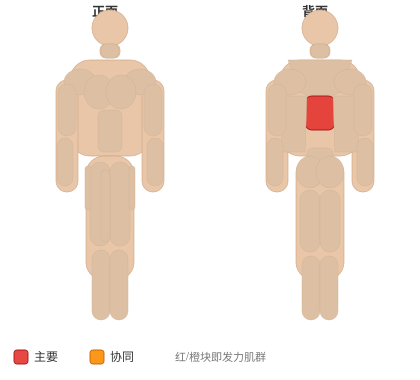
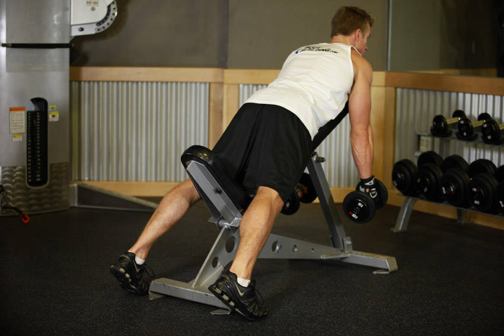

# 中部背耸肩

**Middle Back Shrug**

> 部位：背　|　器械：哑铃　|　难度：⭐⭐ 进阶　|　类型：力量训练 · 孤立动作 · 拉

## 目标肌群

- **主要**：中背（菱形肌/斜方肌中束）
- **协同**：—

## 肌肉激活示意

🔴 主要肌群　🟠 协同肌群（红/橙块即发力部位，鼠标悬停看名称）

## 动作示意图

| 起始位 | 结束位 |
|:---:|:---:|
|  |  |

## 动作要点

1. 握住哑铃自然垂于身体两侧或身前，手臂全程伸直放松。
2. 呼气，肩膀垂直向上「耸」向耳朵，想象用斜方肌提重量。
3. 顶端停顿一秒，主动挤压斜方肌。
4. 吸气缓慢下放，让肩膀沉到最低，充分拉长。
5. 全程不要用手臂弯举，也不要转圈绕肩。

## 常见错误

- ❌ 绕肩画圈 → 对肩关节没好处，也不增加刺激
- ❌ 手臂跟着弯举 → 变成划船
- ❌ 幅度太小 → 斜方肌几乎没被拉长
- ✅ 直上直下、顶峰停顿、充分下沉

## 训练建议

3–4 组 × 10–15 次，组间休息 45–75 秒；小重量找目标肌群的收缩感。

<b>英文原始步骤 / Original Instructions</b>（点击展开）

1. Lie facedown on an incline bench while holding a dumbbell in each hand. Your arms should be fully extended hanging down and pointing towards the floor. The palms of your hands should be facing each other. This will be your starting position.
2. As you exhale, squeeze your shoulder blades together and hold the contraction for a full second. Tip: This movement is just like the reverse action of a hug, or trying to perform rear laterals as if you had no arms.
3. As you inhale go back to the starting position.
4. Repeat for the recommended amount of repetitions.

---

[← 返回背部位索引](README.md)　|　[返回首页](../../README.md)

数据与图片来源：[yuhonas/free-exercise-db](https://github.com/yuhonas/free-exercise-db)（The Unlicense，公有领域）　·　中文名称、动作要点与内容组织：Yue（gengyueworks）