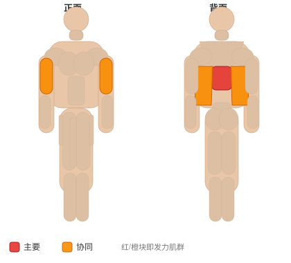

# 正反握引体

**Mixed Grip Chin**

> 部位：背　|　器械：其他　|　难度：⭐⭐⭐ 高手　|　类型：力量训练 · 复合动作 · 拉

## 目标肌群

- **主要**：中背（菱形肌/斜方肌中束）
- **协同**：肱二头肌、背阔肌

## 肌肉激活示意

🔴 主要肌群　🟠 协同肌群（红/橙块即发力部位，鼠标悬停看名称）

## 动作示意图

| 起始位 | 结束位 |
|:---:|:---:|
|  |  |

## 动作要点

1. 把前臂支撑在大腿或凳面上，手腕悬出边缘，握住器械。
2. 掌心向上练屈肌、掌心向下练伸肌，按目标选择。
3. 呼气，只用手腕的力量把重量卷起来，前臂保持不动。
4. 顶峰停顿一秒，吸气缓慢放到最低，让前臂充分拉长。
5. 前臂耐受度高，可以用稍高次数（15–20 次）来练。

## 常见错误

- ❌ 前臂跟着抬起 → 变成弯举
- ❌ 幅度过小 → 前臂没被拉长，效果差
- ❌ 重量过大导致手腕弹动 → 腕关节劳损
- ✅ 固定前臂、只动手腕、大幅度慢速

## 训练建议

3–5 组 × 6–12 次，组间休息 90–150 秒；先把动作做标准再加重量。

<b>英文原始步骤 / Original Instructions</b>（点击展开）

1. Using a spacing that is just about 1 inch wider than shoulder width, grab a pull-up bar with the palms of one hand facing forward and the palms of the other hand facing towards you. This will be your starting position.
2. Now start to pull yourself up as you exhale. Tip: With the arm that has the palms facing up concentrate on using the back muscles in order to perform the movement. The elbow of that arm should remain close to the torso. With the other arm that has the palms facing forward, the elbows will be away but in line with the torso. You will concentrate on using the lats to pull your body up.
3. After a second contraction at the top, start to slowly come down as you inhale.
4. Repeat for the recommended amount of repetitions.
5. On the following set, switch grips; so if you had the right hand with the palms facing you and the left one with the palms facing forward, on the next set you will have the palms facing forward for the right hand and facing you for the left.

---

[← 返回背部位索引](README.md)　|　[返回首页](../../README.md)

数据与图片来源：[yuhonas/free-exercise-db](https://github.com/yuhonas/free-exercise-db)（The Unlicense，公有领域）　·　中文名称、动作要点与内容组织：Yue（gengyueworks）