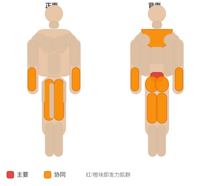

# 弹力带架上拉

**Rack Pull with Bands**

> 部位：背　|　器械：杠铃　|　难度：⭐⭐ 进阶　|　类型：力量举 · 复合动作 · 拉

## 目标肌群

- **主要**：下背（竖脊肌）
- **协同**：前臂、臀大肌、腘绳肌（大腿后侧）、股四头肌（大腿前侧）、斜方肌

## 肌肉激活示意

🔴 主要肌群　🟠 协同肌群（红/橙块即发力部位，鼠标悬停看名称）

## 动作示意图

| 起始位 | 结束位 |
|:---:|:---:|
|  |  |

## 动作要点

1. 双脚约与髋同宽，杠铃贴近小腿，杠位于脚掌中部正上方。
2. 屈髋屈膝下去握杠，挺胸收肩胛，背部保持中立——这一步最关键。
3. 吸气憋住核心，先用腿把地面「蹬开」，杠贴着腿向上走。
4. 髋膝同步伸展，过膝后髋部前顶站直，顶端夹紧臀部但不要后仰。
5. 下放时先屈髋把杠沿腿送下去，过膝再屈膝，保持背部中立。

## 常见错误

- ❌ 弓背起杠 → 腰椎间盘压力剧增，最危险的错误
- ❌ 杠离小腿太远 → 力臂变长，腰部代偿
- ❌ 顶端过度后仰 → 腰椎超伸，没有额外收益
- ✅ 杠贴腿走、背部中立、髋膝同步、顶端只需站直

## 训练建议

3–5 组 × 1–5 次，组间休息 3–5 分钟；大重量务必有人保护。

<b>英文原始步骤 / Original Instructions</b>（点击展开）

1. Set up in a power rack with the bar on the pins. The pins should be set to the desired point; just below the knees, just above, or in the mid thigh position. Attach bands to the base of the rack, or secure them with dumbbells. Attach the other end to the bar. You may need to choke the bands to provide tension.
2. Position yourself against the bar in proper deadlifting position. Your feet should be under your hips, your grip shoulder width, back arched, and hips back to engage the hamstrings. Since the weight is typically heavy, you may use a mixed grip, a hook grip, or use straps to aid in holding the weight.
3. With your head looking forward, extend through the hips and knees, pulling the weight up and back until lockout. Be sure to pull your shoulders back as you complete the movement. Return the weight to the pins and repeat.

---

[← 返回背部位索引](README.md)　|　[返回首页](../../README.md)

数据与图片来源：[yuhonas/free-exercise-db](https://github.com/yuhonas/free-exercise-db)（The Unlicense，公有领域）　·　中文名称、动作要点与内容组织：Yue（gengyueworks）