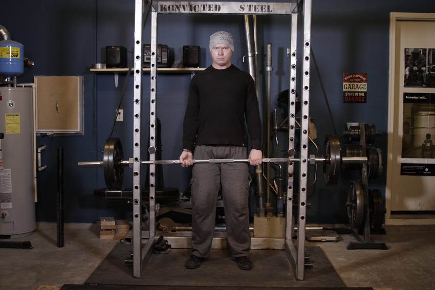

# 反向弹力带硬拉

**Reverse Band Deadlift**

> 部位：背　|　器械：杠铃　|　难度：⭐⭐⭐ 高手　|　类型：力量举 · 复合动作 · 拉

## 目标肌群

- **主要**：下背（竖脊肌）
- **协同**：髋外展肌、髋内收肌（大腿内侧）、小腿（腓肠肌/比目鱼肌）、臀大肌、腘绳肌（大腿后侧）、股四头肌（大腿前侧）

## 动作示意图

| 起始位 | 结束位 |
|:---:|:---:|
|  |  |

## 动作要点

1. 双脚约与髋同宽，杠铃贴近小腿，杠位于脚掌中部正上方。
2. 屈髋屈膝下去握杠，挺胸收肩胛，背部保持中立——这一步最关键。
3. 吸气憋住核心，先用腿把地面「蹬开」，杠贴着腿向上走。
4. 髋膝同步伸展，过膝后髋部前顶站直，顶端夹紧臀部但不要后仰。
5. 下放时先屈髋把杠沿腿送下去，过膝再屈膝，保持背部中立。

## 常见错误

- ❌ 弓背起杠 → 腰椎间盘压力剧增，最危险的错误
- ❌ 杠离小腿太远 → 力臂变长，腰部代偿
- ❌ 顶端过度后仰 → 腰椎超伸，没有额外收益
- ✅ 杠贴腿走、背部中立、髋膝同步、顶端只需站直

## 训练建议

3–5 组 × 1–5 次，组间休息 3–5 分钟；大重量务必有人保护。

<b>英文原始步骤 / Original Instructions</b>（点击展开）

1. Set the bar up in a power rack. Attach bands to the top of the rack, using either bands pegs or the frame itself. Attach the other end of the bands to the bar.
2. Approach the bar so that it is centered over your feet. You feet should be about hip width apart. Bend at the hip to grip the bar at shoulder width, allowing your shoulder blades to protract. Typically, you would use an overhand grip or an over/under grip on heavier sets.
3. With your feet, and your grip set, take a big breath and then lower your hips and bend the knees until your shins contact the bar. Look forward with your head, keep your chest up and your back arched, and begin driving through the heels to move the weight upward.
4. After the bar passes the knees, aggressively pull the bar back, pulling your shoulder blades together as you drive your hips forward into the bar.
5. Lower the bar by bending at the hips and guiding it to the floor.

---

[← 返回背部位索引](README.md)　|　[返回首页](../../README.md)

数据与图片来源：[yuhonas/free-exercise-db](https://github.com/yuhonas/free-exercise-db)（The Unlicense，公有领域）　·　中文名称、动作要点与内容组织：Yue（gengyueworks）
