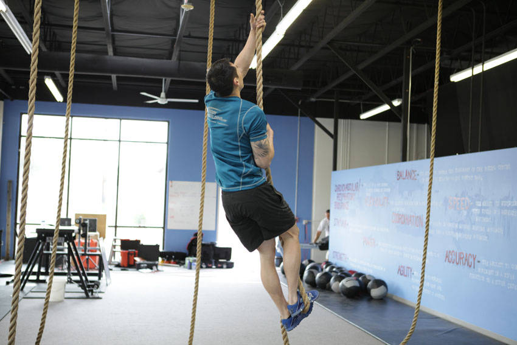

# 爬绳

**Rope Climb**

> 部位：背　|　器械：其他　|　难度：⭐⭐ 进阶　|　类型：力量训练 · 复合动作 · 拉

## 目标肌群

- **主要**：背阔肌
- **协同**：肱二头肌、前臂、中背（菱形肌/斜方肌中束）、三角肌

## 动作示意图

| 起始位 | 结束位 |
|:---:|:---:|
|  |  |

## 动作要点

1. 调整好起始姿势，用器械建立稳定的支撑与握持。
2. 核心收紧、脊柱保持中立，这是所有动作的共同前提。
3. 呼气发力，用背阔肌主导完成动作，避免其他部位代偿借力。
4. 在肌肉完全收缩的位置停顿一秒，主动感受背阔肌发力。
5. 吸气用 2–3 秒缓慢还原到起始位，全程保持张力不松掉。

## 常见错误

- ❌ 靠身体摆动借力 → 通常意味着重量选大了
- ❌ 只做半程 → 肌肉没有被充分拉长和收缩
- ❌ 屏气硬撑 → 血压骤升，发力时呼气才对
- ✅ 控制节奏、完整幅度、目标肌群主导

## 训练建议

3–5 组 × 6–12 次，组间休息 90–150 秒；先把动作做标准再加重量。

<b>英文原始步骤 / Original Instructions</b>（点击展开）

1. Grab the rope with both hands above your head. Pull down on the rope as you take a small jump.
2. Wrap the rope around one leg, using your feet to pinch the rope. Reach up as high as possible with your arms, gripping the rope tightly.
3. Release the rope from your feet as you pull yourself up with your arms, bringing your knees towards your chest.
4. Resecure your feet on the rope, and then stand up to take another high hold on the rope. Continue until you reach the top of the rope.
5. To lower yourself, loosen the grip of your feet on the rope as you slide down using a hand over hand motion.

---

[← 返回背部位索引](README.md)　|　[返回首页](../../README.md)

数据与图片来源：[yuhonas/free-exercise-db](https://github.com/yuhonas/free-exercise-db)（The Unlicense，公有领域）　·　中文名称、动作要点与内容组织：Yue（gengyueworks）
