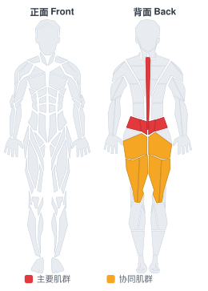

# 直腿杠铃早安式体前屈

**Stiff Leg Barbell Good Morning**

> 部位：背　|　器械：杠铃　|　难度：⭐ 新手　|　类型：力量训练 · 复合动作 · 推

## 目标肌群

- **主要**：下背（竖脊肌）
- **协同**：臀大肌、腘绳肌（大腿后侧）

## 肌肉激活示意

🔴 主要肌群　🟠 协同肌群（红/橙块即发力部位，鼠标悬停看名称）

## 动作示意图

| 起始位 | 结束位 |
|:---:|:---:|
|  |  |

## 动作要点

1. 双脚约与髋同宽，杠铃贴近小腿，杠位于脚掌中部正上方。
2. 屈髋屈膝下去握杠，挺胸收肩胛，背部保持中立——这一步最关键。
3. 吸气憋住核心，先用腿把地面「蹬开」，杠贴着腿向上走。
4. 髋膝同步伸展，过膝后髋部前顶站直，顶端夹紧臀部但不要后仰。
5. 下放时先屈髋把杠沿腿送下去，过膝再屈膝，保持背部中立。

## 常见错误

- ❌ 弓背起杠 → 腰椎间盘压力剧增，最危险的错误
- ❌ 杠离小腿太远 → 力臂变长，腰部代偿
- ❌ 顶端过度后仰 → 腰椎超伸，没有额外收益
- ✅ 杠贴腿走、背部中立、髋膝同步、顶端只需站直

## 训练建议

3–5 组 × 6–12 次，组间休息 90–150 秒；先把动作做标准再加重量。

<b>英文原始步骤 / Original Instructions</b>（点击展开）

1. This exercise is best performed inside a squat rack for safety purposes. To begin, first set the bar on a rack that best matches your height. Once the correct height is chosen and the bar is loaded, step under the bar and place the back of your shoulders (slightly below the neck) across it.
2. Hold on to the bar using both arms at each side and lift it off the rack by first pushing with your legs and at the same time straightening your torso.
3. Step away from the rack and position your legs using a shoulder width medium stance. Keep your head up at all times as looking down will get you off balance and also maintain a straight back. This will be your starting position.
4. Keeping your legs stationary, move your torso forward by bending at the hips while inhaling. Lower your torso until it is parallel with the floor.
5. Begin to raise the bar as you exhale by elevating your torso back to the starting position.
6. Repeat for the recommended amount of repetitions.

---

[← 返回背部位索引](README.md)　|　[返回首页](../../README.md)

数据与图片来源：[yuhonas/free-exercise-db](https://github.com/yuhonas/free-exercise-db)（The Unlicense，公有领域）　·　中文名称、动作要点与内容组织：Yue（gengyueworks）