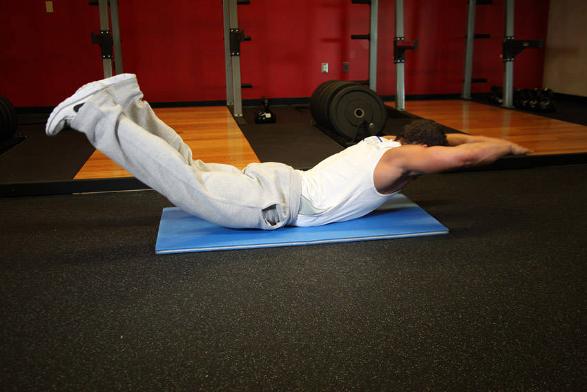

# 超人式

**Superman**

> 部位：背　|　器械：自重　|　难度：⭐ 新手　|　类型：拉伸放松 · 复合动作 · 静态支撑

## 目标肌群

- **主要**：下背（竖脊肌）
- **协同**：臀大肌、腘绳肌（大腿后侧）

## 动作示意图

| 起始位 | 结束位 |
|:---:|:---:|
|  |  |

## 动作要点

1. 先做几分钟低强度活动让身体热起来，冷身状态别做大幅度静态拉伸。
2. 进入拉伸位置时缓慢推进，到下背有明显牵拉感但不疼痛为止。
3. 保持 20–30 秒，全程自然呼吸，不要憋气。
4. 呼气时可以再稍微加深一点幅度，吸气时保持不动。
5. 两侧各做 2–3 组，训练后做静态拉伸效果最好。

## 常见错误

- ❌ 弹震式反复拉扯 → 触发牵张反射，反而更紧
- ❌ 拉到疼痛 → 可能造成肌肉或肌腱损伤
- ❌ 憋气硬撑 → 肌肉难以放松
- ✅ 热身后再拉、缓慢进入、呼吸放松

## 训练建议

每侧 2–3 组，每组静态保持 20–30 秒；训练后做效果最好。

<b>英文原始步骤 / Original Instructions</b>（点击展开）

1. To begin, lie straight and face down on the floor or exercise mat. Your arms should be fully extended in front of you. This is the starting position.
2. Simultaneously raise your arms, legs, and chest off of the floor and hold this contraction for 2 seconds. Tip: Squeeze your lower back to get the best results from this exercise. Remember to exhale during this movement. Note: When holding the contracted position, you should look like superman when he is flying.
3. Slowly begin to lower your arms, legs and chest back down to the starting position while inhaling.
4. Repeat for the recommended amount of repetitions prescribed in your program.

---

[← 返回背部位索引](README.md)　|　[返回首页](../../README.md)

数据与图片来源：[yuhonas/free-exercise-db](https://github.com/yuhonas/free-exercise-db)（The Unlicense，公有领域）　·　中文名称、动作要点与内容组织：Yue（gengyueworks）
