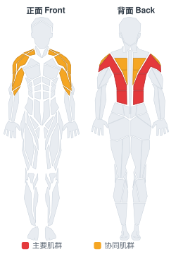

# 反握绳索下拉

**Underhand Cable Pulldowns**

> 部位：背　|　器械：绳索　|　难度：⭐ 新手　|　类型：力量训练 · 复合动作 · 拉

## 目标肌群

- **主要**：背阔肌
- **协同**：肱二头肌、中背（菱形肌/斜方肌中束）、三角肌

## 肌肉激活示意

🔴 主要肌群　🟠 协同肌群（红/橙块即发力部位，鼠标悬停看名称）

## 动作示意图

| 起始位 | 结束位 |
|:---:|:---:|
|  |  |

## 动作要点

1. 坐好把大腿卡在垫子下方固定住，双手握住横杆，握距略宽于肩。
2. 挺胸，上身可略向后倾 10–20 度，肩胛骨先下沉。
3. 呼气，用手肘向下向后拉，把横杆带到锁骨/上胸位置。
4. 顶峰挤压背阔肌一秒，感受两侧肩胛向脊柱靠拢。
5. 吸气缓慢还原，让手臂充分伸直、背阔肌被拉长，但不要耸肩。

## 常见错误

- ❌ 用身体大幅后仰荡出来 → 变成划船，背阔肌卸力
- ❌ 手臂主导硬拽 → 二头先力竭，背没练到
- ❌ 颈后下拉 → 肩关节风险高，不推荐
- ✅ 沉肩、肘领先、拉到上胸、慢放到位

## 训练建议

3–5 组 × 6–12 次，组间休息 90–150 秒；先把动作做标准再加重量。

<b>英文原始步骤 / Original Instructions</b>（点击展开）

1. Sit down on a pull-down machine with a wide bar attached to the top pulley. Adjust the knee pad of the machine to fit your height. These pads will prevent your body from being raised by the resistance attached to the bar.
2. Grab the pull-down bar with the palms facing your torso (a supinated grip). Make sure that the hands are placed closer than the shoulder width.
3. As you have both arms extended in front of you holding the bar at the chosen grip width, bring your torso back around 30 degrees or so while creating a curvature on your lower back and sticking your chest out. This is your starting position.
4. As you breathe out, pull the bar down until it touches your upper chest by drawing the shoulders and the upper arms down and back. Tip: Concentrate on squeezing the back muscles once you reach the fully contracted position and keep the elbows close to your body. The upper torso should remain stationary as your bring the bar to you and only the arms should move. The forearms should do no other work other than hold the bar.
5. After a second on the contracted position, while breathing in, slowly bring the bar back to the starting position when your arms are fully extended and the lats are fully stretched.
6. Repeat this motion for the prescribed amount of repetitions.

---

[← 返回背部位索引](README.md)　|　[返回首页](../../README.md)

数据与图片来源：[yuhonas/free-exercise-db](https://github.com/yuhonas/free-exercise-db)（The Unlicense，公有领域）　·　中文名称、动作要点与内容组织：Yue（gengyueworks）