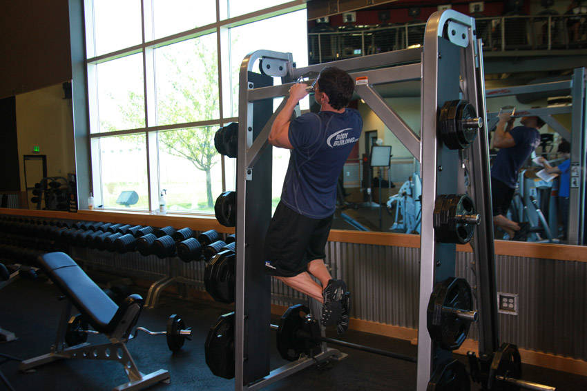
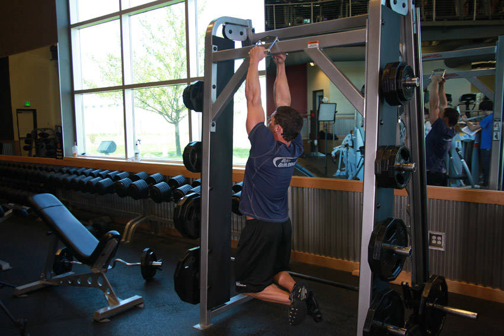

# V 型把手引体向上

**V-Bar Pullup**

> 部位：背　|　器械：自重　|　难度：⭐ 新手　|　类型：力量训练 · 复合动作 · 拉

## 目标肌群

- **主要**：背阔肌
- **协同**：肱二头肌、中背（菱形肌/斜方肌中束）、三角肌

## 肌肉激活示意

🔴 主要肌群　🟠 协同肌群（红/橙块即发力部位，鼠标悬停看名称）

## 动作示意图

| 起始位 | 结束位 |
|:---:|:---:|
|  |  |

## 动作要点

1. 双手握住单杠，宽握更练背阔肌外侧，窄握/反握更多二头参与。
2. 起始悬垂时肩膀主动下沉，先「沉肩」再拉，避免全程挂在关节上。
3. 呼气，想象用手肘往身体两侧口袋方向拉，而不是用手臂拽。
4. 拉到下巴过杠或胸口贴杠，顶峰挤压背阔肌一秒。
5. 吸气用 2–3 秒缓慢下放到手臂接近伸直，保持肩胛控制。

## 常见错误

- ❌ 摆动身体荡上去 → 背部几乎不发力
- ❌ 只做上半程、下不到底 → 背阔肌没被拉长
- ❌ 耸肩起拉 → 斜方肌代偿、肩关节受压
- ✅ 沉肩起拉、肘领先、全程幅度

## 训练建议

3–5 组 × 6–12 次，组间休息 90–150 秒；先把动作做标准再加重量。

<b>英文原始步骤 / Original Instructions</b>（点击展开）

1. Start by placing the middle of the V-bar in the middle of the pull-up bar (assuming that the pull-up station you are using does not have neutral grip handles). The V-Bar handles will be facing down so that you can hang from the pull-up bar through the use of the handles.
2. Once you securely place the V-bar, take a hold of the bar from each side and hang from it. Stick your chest out and lean yourself back slightly in order to better engage the lats. This will be your starting position.
3. Using your lats, pull your torso up while leaning your head back slightly so that you do not hit yourself with the chin-up bar. Continue until your chest nearly touches the V-bar. Exhale as you execute this motion.
4. After a second hold on the contracted position, slowly lower your body back to the starting position as you breathe in.
5. Repeat for the prescribed number of repetitions.

---

[← 返回背部位索引](README.md)　|　[返回首页](../../README.md)

数据与图片来源：[yuhonas/free-exercise-db](https://github.com/yuhonas/free-exercise-db)（The Unlicense，公有领域）　·　中文名称、动作要点与内容组织：Yue（gengyueworks）