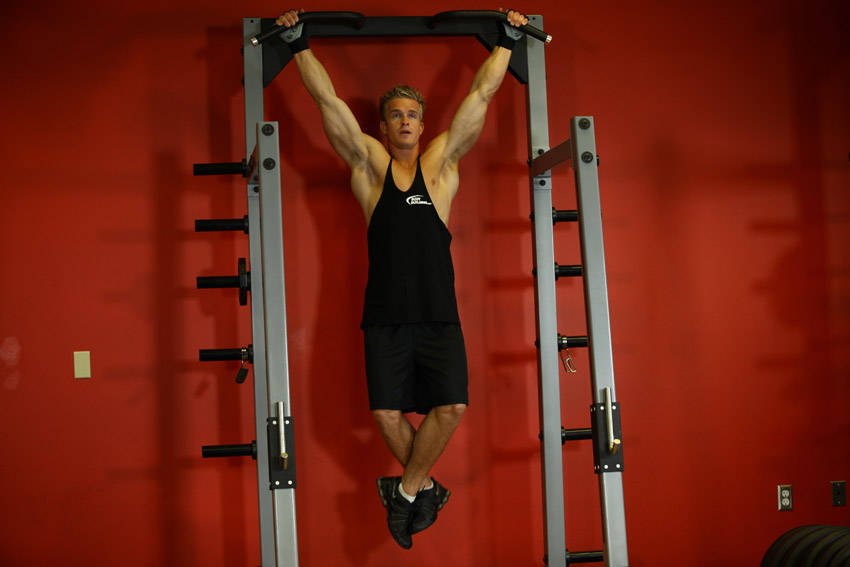

# 宽握后侧引体向上

**Wide-Grip Rear Pull-Up**

> 部位：背　|　器械：自重　|　难度：⭐⭐ 进阶　|　类型：力量训练 · 复合动作 · 拉

## 目标肌群

- **主要**：背阔肌
- **协同**：肱二头肌、中背（菱形肌/斜方肌中束）、三角肌

## 动作示意图

| 起始位 | 结束位 |
|:---:|:---:|
|  |  |

## 动作要点

1. 双手握住单杠，宽握更练背阔肌外侧，窄握/反握更多二头参与。
2. 起始悬垂时肩膀主动下沉，先「沉肩」再拉，避免全程挂在关节上。
3. 呼气，想象用手肘往身体两侧口袋方向拉，而不是用手臂拽。
4. 拉到下巴过杠或胸口贴杠，顶峰挤压背阔肌一秒。
5. 吸气用 2–3 秒缓慢下放到手臂接近伸直，保持肩胛控制。

## 常见错误

- ❌ 摆动身体荡上去 → 背部几乎不发力
- ❌ 只做上半程、下不到底 → 背阔肌没被拉长
- ❌ 耸肩起拉 → 斜方肌代偿、肩关节受压
- ✅ 沉肩起拉、肘领先、全程幅度

## 训练建议

3–5 组 × 6–12 次，组间休息 90–150 秒；先把动作做标准再加重量。

<b>英文原始步骤 / Original Instructions</b>（点击展开）

1. Grab the pull-up bar with the palms facing forward using a wide grip.
2. As you have both arms extended in front of you holding the bar, bring your torso forward and head so that there is an imaginary line from the pull-up bar to the back of your neck. This is your starting position.
3. Pull your torso up until the bar is near the back of your neck. To do this, draw the shoulders and upper arms down and back while slightly leaning your head forward. Exhale as you perform this portion of the movement. Tip: Concentrate on squeezing the back muscles once you reach the full contracted position. The upper torso should remain stationary as it moves through space and only the arms should move. The forearms should do no other work other than hold the bar.
4. After a second on the contracted position, start to inhale and slowly lower your torso back to the starting position when your arms are fully extended and the lats are fully stretched.
5. Repeat this motion for the prescribed amount of repetitions.

---

[← 返回背部位索引](README.md)　|　[返回首页](../../README.md)

数据与图片来源：[yuhonas/free-exercise-db](https://github.com/yuhonas/free-exercise-db)（The Unlicense，公有领域）　·　中文名称、动作要点与内容组织：Yue（gengyueworks）
