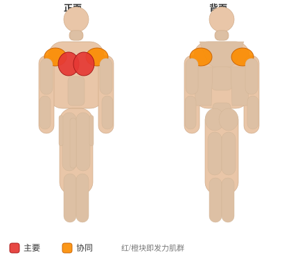

# 绕环飞鸟

**Around The Worlds**

> 部位：胸　|　器械：哑铃　|　难度：⭐⭐ 进阶　|　类型：力量训练 · 复合动作 · 推

## 目标肌群

- **主要**：胸大肌
- **协同**：三角肌

## 肌肉激活示意

🔴 主要肌群　🟠 协同肌群（红/橙块即发力部位，鼠标悬停看名称）

## 动作示意图

| 起始位 | 结束位 |
|:---:|:---:|
|  |  |

## 动作要点

1. 调整好起始姿势，用哑铃建立稳定的支撑与握持。
2. 核心收紧、脊柱保持中立，这是所有动作的共同前提。
3. 呼气发力，用胸大肌主导完成动作，避免其他部位代偿借力。
4. 在肌肉完全收缩的位置停顿一秒，主动感受胸大肌发力。
5. 吸气用 2–3 秒缓慢还原到起始位，全程保持张力不松掉。

## 常见错误

- ❌ 靠身体摆动借力 → 通常意味着重量选大了
- ❌ 只做半程 → 肌肉没有被充分拉长和收缩
- ❌ 屏气硬撑 → 血压骤升，发力时呼气才对
- ✅ 控制节奏、完整幅度、目标肌群主导

## 训练建议

3–5 组 × 6–12 次，组间休息 90–150 秒；先把动作做标准再加重量。

<b>英文原始步骤 / Original Instructions</b>（点击展开）

1. Lay down on a flat bench holding a dumbbell in each hand with the palms of the hands facing towards the ceiling. Tip: Your arms should be parallel to the floor and next to your thighs. To avoid injury, make sure that you keep your elbows slightly bent. This will be your starting position.
2. Now move the dumbbells by creating a semi-circle as you displace them from the initial position to over the head. All of the movement should happen with the arms parallel to the floor at all times. Breathe in as you perform this portion of the movement.
3. Reverse the movement to return the weight to the starting position as you exhale.

---

[← 返回胸部位索引](README.md)　|　[返回首页](../../README.md)

数据与图片来源：[yuhonas/free-exercise-db](https://github.com/yuhonas/free-exercise-db)（The Unlicense，公有领域）　·　中文名称、动作要点与内容组织：Yue（gengyueworks）