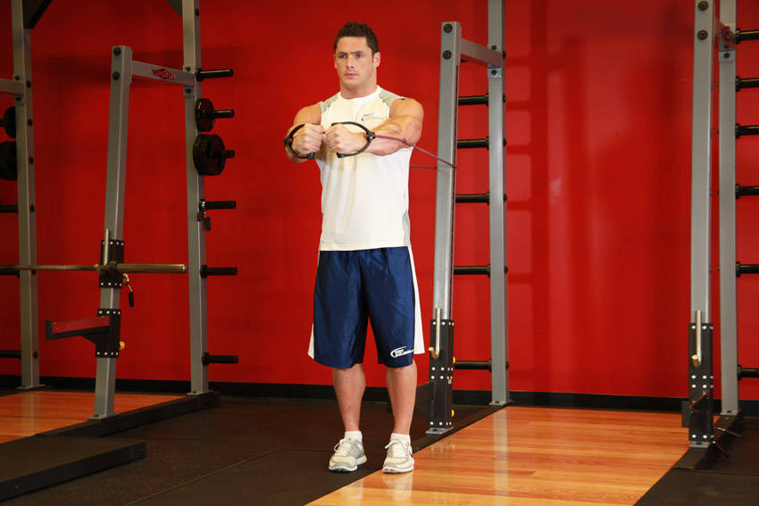

# 交叉（弹力带）

**Cross Over - With Bands**

> 部位：胸　|　器械：弹力带　|　难度：⭐ 新手　|　类型：力量训练 · 复合动作 · 推

## 目标肌群

- **主要**：胸大肌
- **协同**：肱二头肌、三角肌

## 动作示意图

| 起始位 | 结束位 |
|:---:|:---:|
|  |  |

## 动作要点

1. 调整好起始姿势，用弹力带建立稳定的支撑与握持。
2. 核心收紧、脊柱保持中立，这是所有动作的共同前提。
3. 呼气发力，用胸大肌主导完成动作，避免其他部位代偿借力。
4. 在肌肉完全收缩的位置停顿一秒，主动感受胸大肌发力。
5. 吸气用 2–3 秒缓慢还原到起始位，全程保持张力不松掉。

## 常见错误

- ❌ 靠身体摆动借力 → 通常意味着重量选大了
- ❌ 只做半程 → 肌肉没有被充分拉长和收缩
- ❌ 屏气硬撑 → 血压骤升，发力时呼气才对
- ✅ 控制节奏、完整幅度、目标肌群主导

## 训练建议

3–5 组 × 6–12 次，组间休息 90–150 秒；先把动作做标准再加重量。

<b>英文原始步骤 / Original Instructions</b>（点击展开）

1. Secure an exercise band around a stationary post.
2. While facing away from the post, grab the handles on both ends of the band and step forward enough to create tension on the band.
3. Raise your arms to the sides, parallel to the floor, perpendicular to your torso (your torso and the arms should resemble the letter "T") and with the palms facing forward. Have them extended with a slight bend at the elbows. This will be your starting position.
4. While keeping your arms straight, bring them across your chest in a semicircular motion to the front as you exhale and flex your pecs. Hold the contraction for a second.
5. Slowly return to the starting position as you inhale.
6. Perform for the recommended amount of repetitions.

---

[← 返回胸部位索引](README.md)　|　[返回首页](../../README.md)

数据与图片来源：[yuhonas/free-exercise-db](https://github.com/yuhonas/free-exercise-db)（The Unlicense，公有领域）　·　中文名称、动作要点与内容组织：Yue（gengyueworks）
