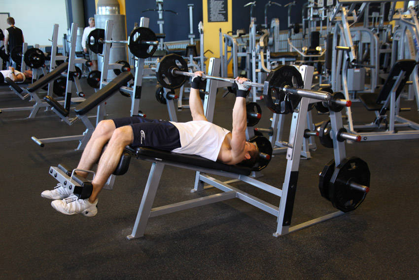

# 下斜杠铃卧推

**Decline Barbell Bench Press**

> 部位：胸　|　器械：杠铃　|　难度：⭐ 新手　|　类型：力量训练 · 复合动作 · 推

## 目标肌群

- **主要**：胸大肌
- **协同**：三角肌、肱三头肌

## 肌肉激活示意

🔴 主要肌群　🟠 协同肌群（红/橙块即发力部位，鼠标悬停看名称）

## 动作示意图

| 起始位 | 结束位 |
|:---:|:---:|
|  |  |

## 动作要点

1. 躺上下斜卧凳，双脚踩实地面，肩胛骨向后向下收紧「锁」在凳面上，腰部保留自然生理弯曲。
2. 双手握住杠铃，握距略宽于肩，手腕保持中立、不要后折。
3. 吸气，控制杠铃沿弧线下降到胸部中下沿，肘部与躯干约呈 45–75 度，不要完全外展成一字。
4. 呼气推起，肩胛全程保持收紧，顶端手肘不锁死，保持胸大肌持续张力。
5. 按计划完成组次，下放时始终「控制着放」，不要靠胸口反弹。

## 常见错误

- ❌ 肩胛松开、肩膀前引 → 力量泄掉，还容易伤肩
- ❌ 手肘完全外展成 90 度 → 肩关节压力剧增
- ❌ 用胸口弹起杠铃 → 借力且有伤肋骨风险
- ✅ 肩胛收紧、肘部内收、全程控制离心

## 训练建议

3–5 组 × 6–12 次，组间休息 90–150 秒；先把动作做标准再加重量。

<b>英文原始步骤 / Original Instructions</b>（点击展开）

1. Secure your legs at the end of the decline bench and slowly lay down on the bench.
2. Using a medium width grip (a grip that creates a 90-degree angle in the middle of the movement between the forearms and the upper arms), lift the bar from the rack and hold it straight over you with your arms locked. The arms should be perpendicular to the floor. This will be your starting position. Tip: In order to protect your rotator cuff, it is best if you have a spotter help you lift the barbell off the rack.
3. As you breathe in, come down slowly until you feel the bar on your lower chest.
4. After a second pause, bring the bar back to the starting position as you breathe out and push the bar using your chest muscles. Lock your arms and squeeze your chest in the contracted position, hold for a second and then start coming down slowly again. Tip: It should take at least twice as long to go down than to come up).
5. Repeat the movement for the prescribed amount of repetitions.
6. When you are done, place the bar back in the rack.

---

[← 返回胸部位索引](README.md)　|　[返回首页](../../README.md)

数据与图片来源：[yuhonas/free-exercise-db](https://github.com/yuhonas/free-exercise-db)（The Unlicense，公有领域）　·　中文名称、动作要点与内容组织：Yue（gengyueworks）