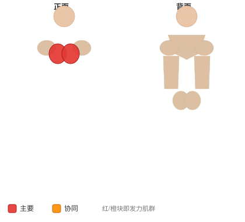

# 哑铃飞鸟

**Dumbbell Flyes**

> 部位：胸　|　器械：哑铃　|　难度：⭐ 新手　|　类型：力量训练 · 孤立动作 · 推

## 目标肌群

- **主要**：胸大肌
- **协同**：—

## 肌肉激活示意

🔴 主要肌群　🟠 协同肌群（红/橙块即发力部位，鼠标悬停看名称）

## 动作示意图

| 起始位 | 结束位 |
|:---:|:---:|
|  |  |

## 动作要点

1. 调整好位置，双手持哑铃，手肘保持一个固定的微屈角度——整组都不要改变这个角度。
2. 肩胛骨收紧下沉，胸腔打开，这是发力的起点。
3. 吸气，双臂沿弧线向两侧缓慢打开，感受胸大肌被拉长，到略低于肩的位置即可。
4. 呼气，想象「用胸把两只手挤到一起」，沿同样的弧线合拢。
5. 顶峰主动挤压胸大肌一秒再放，飞鸟练的是张力不是重量。

## 常见错误

- ❌ 手肘一屈一伸变成了卧推 → 胸肌刺激大打折扣
- ❌ 打开幅度过大越过身体平面 → 肩关节前侧受伤
- ❌ 重量过大靠甩 → 全程失去控制
- ✅ 固定肘角、小重量、找挤压感

## 训练建议

3–4 组 × 10–15 次，组间休息 45–75 秒；小重量找目标肌群的收缩感。

<b>英文原始步骤 / Original Instructions</b>（点击展开）

1. Lie down on a flat bench with a dumbbell on each hand resting on top of your thighs. The palms of your hand will be facing each other.
2. Then using your thighs to help raise the dumbbells, lift the dumbbells one at a time so you can hold them in front of you at shoulder width with the palms of your hands facing each other. Raise the dumbbells up like you're pressing them, but stop and hold just before you lock out. This will be your starting position.
3. With a slight bend on your elbows in order to prevent stress at the biceps tendon, lower your arms out at both sides in a wide arc until you feel a stretch on your chest. Breathe in as you perform this portion of the movement. Tip: Keep in mind that throughout the movement, the arms should remain stationary; the movement should only occur at the shoulder joint.
4. Return your arms back to the starting position as you squeeze your chest muscles and breathe out. Tip: Make sure to use the same arc of motion used to lower the weights.
5. Hold for a second at the contracted position and repeat the movement for the prescribed amount of repetitions.

---

[← 返回胸部位索引](README.md)　|　[返回首页](../../README.md)

数据与图片来源：[yuhonas/free-exercise-db](https://github.com/yuhonas/free-exercise-db)（The Unlicense，公有领域）　·　中文名称、动作要点与内容组织：Yue（gengyueworks）