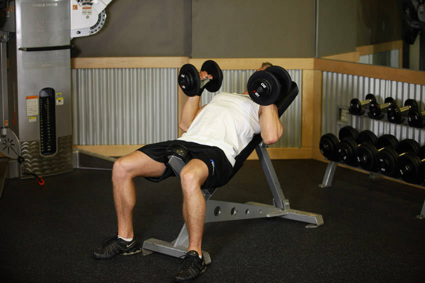

# 上斜哑铃卧凳（掌心相对）

**Incline Dumbbell Bench With Palms Facing In**

> 部位：胸　|　器械：哑铃　|　难度：⭐ 新手　|　类型：力量训练 · 复合动作 · 推

## 目标肌群

- **主要**：胸大肌
- **协同**：三角肌、肱三头肌

## 动作示意图

| 起始位 | 结束位 |
|:---:|:---:|
|  |  |

## 动作要点

1. 上斜调整好起始姿势，用哑铃建立稳定的支撑与握持。
2. 核心收紧、脊柱保持中立，这是所有动作的共同前提。
3. 呼气发力，用胸大肌主导完成动作，避免其他部位代偿借力。
4. 在肌肉完全收缩的位置停顿一秒，主动感受胸大肌发力。
5. 吸气用 2–3 秒缓慢还原到起始位，全程保持张力不松掉。

## 常见错误

- ❌ 靠身体摆动借力 → 通常意味着重量选大了
- ❌ 只做半程 → 肌肉没有被充分拉长和收缩
- ❌ 屏气硬撑 → 血压骤升，发力时呼气才对
- ✅ 控制节奏、完整幅度、目标肌群主导

## 训练建议

3–5 组 × 6–12 次，组间休息 90–150 秒；先把动作做标准再加重量。

<b>英文原始步骤 / Original Instructions</b>（点击展开）

1. Lie back on an incline bench with a dumbbell on each hand on top of your thighs. The palms of your hand will be facing each other.
2. By using your thighs to help you get the dumbbells up, clean the dumbbells one arm at a time so that you can hold them at shoulder width.
3. Once at shoulder width, keep the palms of your hands with a neutral grip (palms facing each other). Keep your elbows flared out with the upper arms in line with the shoulders (perpendicular to the torso) and the elbows bent creating a 90-degree angle between the upper arm and the forearm. This will be your starting position.
4. Now bring down the weights slowly to your side as you breathe in. Keep full control of the dumbbells at all times.
5. As you breathe out, push the dumbbells up using your pectoral muscles. Lock your arms in the contracted position, hold for a second and then start coming down slowly. Tip: It should take at least twice as long to go down than to come up.
6. Repeat the movement for the prescribed amount of repetitions.
7. When you are done, place the dumbbells back in your thighs and then on the floor. This is the safest manner to dispose of the dumbbells.

---

[← 返回胸部位索引](README.md)　|　[返回首页](../../README.md)

数据与图片来源：[yuhonas/free-exercise-db](https://github.com/yuhonas/free-exercise-db)（The Unlicense，公有领域）　·　中文名称、动作要点与内容组织：Yue（gengyueworks）
