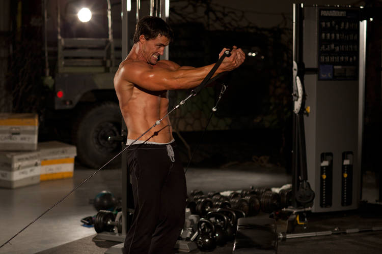

# 低位绳索夹胸

**Low Cable Crossover**

> 部位：胸　|　器械：绳索　|　难度：⭐ 新手　|　类型：力量训练 · 孤立动作 · 推

## 目标肌群

- **主要**：胸大肌
- **协同**：三角肌

## 动作示意图

| 起始位 | 结束位 |
|:---:|:---:|
|  |  |

## 动作要点

1. 调整好位置，双手持绳索，手肘保持一个固定的微屈角度——整组都不要改变这个角度。
2. 肩胛骨收紧下沉，胸腔打开，这是发力的起点。
3. 吸气，双臂沿弧线向两侧缓慢打开，感受胸大肌被拉长，到略低于肩的位置即可。
4. 呼气，想象「用胸把两只手挤到一起」，沿同样的弧线合拢。
5. 顶峰主动挤压胸大肌一秒再放，飞鸟练的是张力不是重量。

## 常见错误

- ❌ 手肘一屈一伸变成了卧推 → 胸肌刺激大打折扣
- ❌ 打开幅度过大越过身体平面 → 肩关节前侧受伤
- ❌ 重量过大靠甩 → 全程失去控制
- ✅ 固定肘角、小重量、找挤压感

## 训练建议

3–4 组 × 10–15 次，组间休息 45–75 秒；小重量找目标肌群的收缩感。

<b>英文原始步骤 / Original Instructions</b>（点击展开）

1. To move into the starting position, place the pulleys at the low position, select the resistance to be used and grasp a handle in each hand.
2. Step forward, gaining tension in the pulleys. Your palms should be facing forward, hands below the waist, and your arms straight. This will be your starting position.
3. With a slight bend in your arms, draw your hands upward and toward the midline of your body. Your hands should come together in front of your chest, palms facing up.
4. Return your arms back to the starting position after a brief pause.

---

[← 返回胸部位索引](README.md)　|　[返回首页](../../README.md)

数据与图片来源：[yuhonas/free-exercise-db](https://github.com/yuhonas/free-exercise-db)（The Unlicense，公有领域）　·　中文名称、动作要点与内容组织：Yue（gengyueworks）
