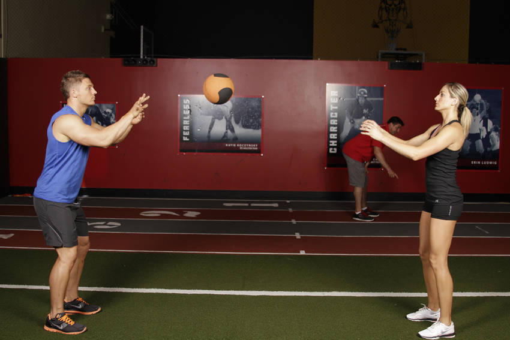

# 药球胸传递

**Medicine Ball Chest Pass**

> 部位：胸　|　器械：药球　|　难度：⭐ 新手　|　类型：爆发力/弹跳 · 复合动作 · 推

## 目标肌群

- **主要**：胸大肌
- **协同**：三角肌、肱三头肌

## 肌肉激活示意

🔴 主要肌群　🟠 协同肌群（红/橙块即发力部位，鼠标悬停看名称）

## 动作示意图

| 起始位 | 结束位 |
|:---:|:---:|
|  |  |

## 动作要点

1. 充分热身后再做——爆发类动作对关节和肌腱要求高。
2. 起跳前屈髋屈膝下蹲蓄力，手臂自然后摆，核心收紧。
3. 快速有力地伸髋伸膝蹬地，手臂同时向上摆动带动身体。
4. 落地时前脚掌先着地，随即屈髋屈膝缓冲，像「轻轻落下」而不是砸下去。
5. 组间充分休息，质量优先于次数——动作变形就该停了。

## 常见错误

- ❌ 落地膝盖内扣 → 韧带损伤风险最高
- ❌ 落地直腿硬砸 → 冲击全给膝踝关节
- ❌ 疲劳状态下继续冲次数 → 爆发力训练最忌讳
- ✅ 充分热身、软着陆、宁少勿滥

## 训练建议

3–5 组 × 3–6 次，组间充分休息 2–3 分钟；追求每一次的质量，疲劳后立即停止。

<b>英文原始步骤 / Original Instructions</b>（点击展开）

1. You will need a partner for this exercise. Lacking one, this movement can be performed against a wall.
2. Begin facing your partner holding the medicine ball at your torso with both hands.
3. Pull the ball to your chest, and reverse the motion by extending through the elbows. For sports applications, you can take a step as you throw.
4. Your partner should catch the ball, and throw it back to you.
5. Receive the throw with both hands at chest height.

---

[← 返回胸部位索引](README.md)　|　[返回首页](../../README.md)

数据与图片来源：[yuhonas/free-exercise-db](https://github.com/yuhonas/free-exercise-db)（The Unlicense，公有领域）　·　中文名称、动作要点与内容组织：Yue（gengyueworks）