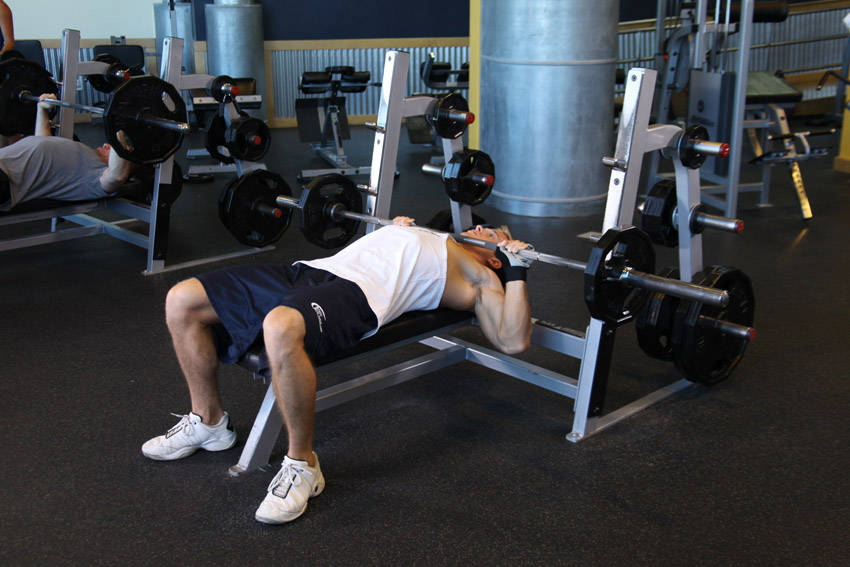
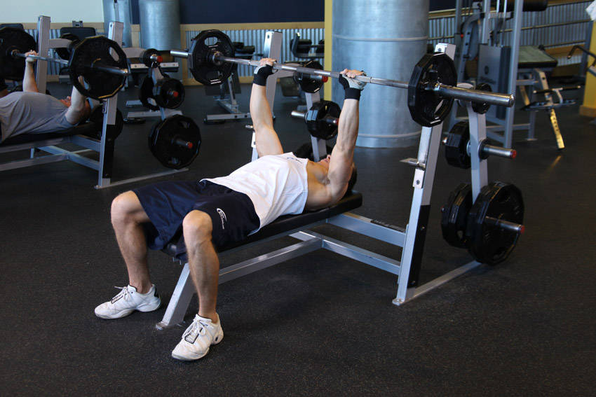

# 颈推举

**Neck Press**

> 部位：胸　|　器械：杠铃　|　难度：⭐⭐ 进阶　|　类型：力量训练 · 复合动作 · 推

## 目标肌群

- **主要**：胸大肌
- **协同**：三角肌、肱三头肌

## 动作示意图

| 起始位 | 结束位 |
|:---:|:---:|
|  |  |

## 动作要点

1. 握住杠铃，起始位置在锁骨/下巴高度，手腕在手肘正上方。
2. 核心和臀部收紧，肋骨不要外翻，避免用腰代偿。
3. 呼气竖直向上推，过头后手臂位于耳侧或略靠后。
4. 顶端肩胛骨自然上回旋，手肘不完全锁死。
5. 吸气沿原轨迹控制下放到起始位，不要砸下来。

## 常见错误

- ❌ 挺腰后仰把肩推变成上斜卧推 → 腰椎吃力
- ❌ 杠铃走「之」字绕过下巴 → 轨迹低效
- ❌ 手腕后折 → 腕关节疼痛
- ✅ 收紧核心、直上直下、手腕中立

## 训练建议

3–5 组 × 6–12 次，组间休息 90–150 秒；先把动作做标准再加重量。

<b>英文原始步骤 / Original Instructions</b>（点击展开）

1. Lie back on a flat bench. Using a medium-width grip (a grip that creates a 90-degree angle in the middle of the movement between the forearms and the upper arms), lift the bar from the rack and hold it straight over your neck with your arms locked. This will be your starting position.
2. As you breathe in, come down slowly until you feel the bar on your neck.
3. After a second pause, bring the bar back to the starting position as you breathe out and push the bar using your chest muscles. Lock your arms and squeeze your chest in the contracted position, hold for a second and then start coming down slowly again. Tip: It should take at least twice as long to go down than to come up).
4. Repeat the movement for the prescribed amount of repetitions.
5. When you are done, place the bar back in the rack.

---

[← 返回胸部位索引](README.md)　|　[返回首页](../../README.md)

数据与图片来源：[yuhonas/free-exercise-db](https://github.com/yuhonas/free-exercise-db)（The Unlicense，公有领域）　·　中文名称、动作要点与内容组织：Yue（gengyueworks）
