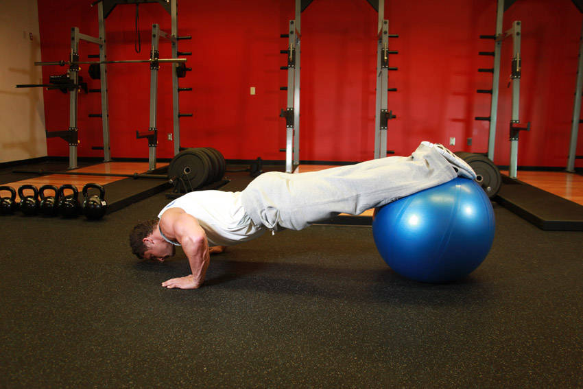

# 双脚瑜伽球俯卧撑

**Push-Ups With Feet On An Exercise Ball**

> 部位：胸　|　器械：瑜伽球　|　难度：⭐⭐ 进阶　|　类型：力量训练 · 复合动作 · 推

## 目标肌群

- **主要**：胸大肌
- **协同**：三角肌、肱三头肌

## 动作示意图

| 起始位 | 结束位 |
|:---:|:---:|
|  |  |

## 动作要点

1. 双手撑地略宽于肩，手指朝前，肩、髋、踝连成一条直线。
2. 核心和臀部收紧，不要塌腰也不要撅屁股。
3. 吸气屈肘下降，肘部向斜后方约 45 度，胸口接近地面。
4. 呼气推起，肩胛自然前伸，顶端不耸肩。
5. 全程颈部中立，眼睛看向身前地面而不是抬头看前方。

## 常见错误

- ❌ 塌腰撅臀 → 腰椎受压且核心不参与
- ❌ 手肘完全向两侧张开 → 肩袖压力大
- ❌ 只做半程、下不去 → 降低难度换全程更有价值
- ✅ 身体一条直线、肘部斜后、全程可控

## 训练建议

3–5 组 × 6–12 次，组间休息 90–150 秒；先把动作做标准再加重量。

<b>英文原始步骤 / Original Instructions</b>（点击展开）

1. Lie on the floor face down and place your hands about 36 inches apart from each other holding your torso up at arms length.
2. Place your toes on top of an exercise ball. This will allow your body to be elevated.
3. Lower yourself until your chest almost touches the floor as you inhale.
4. Using your pectoral muscles, press your upper body back up to the starting position and squeeze your chest. Breathe out as you perform this step.
5. After a second pause at the contracted position, repeat the movement for the prescribed amount of repetitions.

---

[← 返回胸部位索引](README.md)　|　[返回首页](../../README.md)

数据与图片来源：[yuhonas/free-exercise-db](https://github.com/yuhonas/free-exercise-db)（The Unlicense，公有领域）　·　中文名称、动作要点与内容组织：Yue（gengyueworks）
