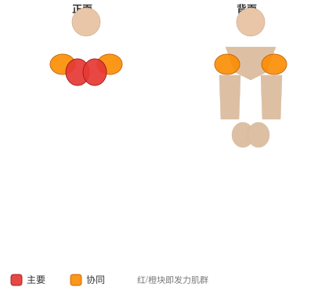
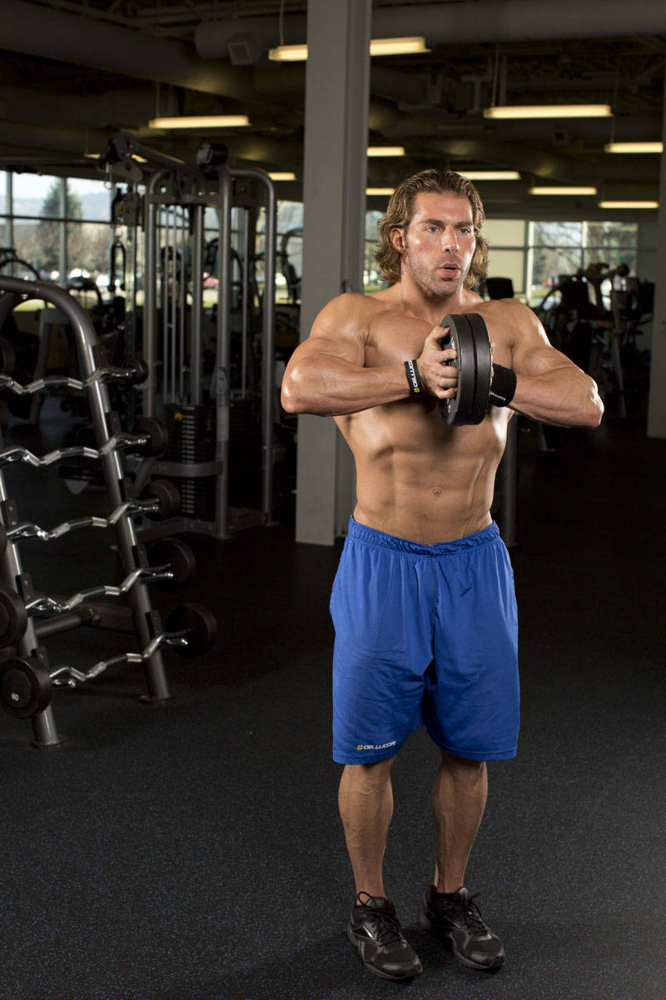
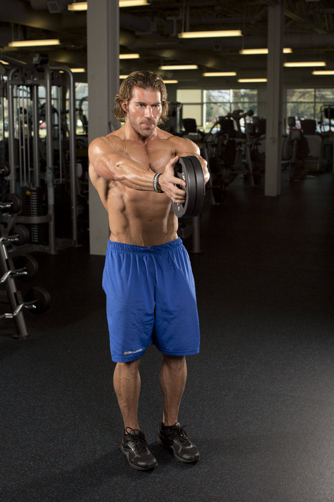

# 斯文德夹胸推

**Svend Press**

> 部位：胸　|　器械：其他　|　难度：⭐ 新手　|　类型：力量训练 · 复合动作 · 推

## 目标肌群

- **主要**：胸大肌
- **协同**：前臂、三角肌、肱三头肌

## 肌肉激活示意

🔴 主要肌群　🟠 协同肌群（红/橙块即发力部位，鼠标悬停看名称）

## 动作示意图

| 起始位 | 结束位 |
|:---:|:---:|
|  |  |

## 动作要点

1. 躺上卧凳，双脚踩实地面，肩胛骨向后向下收紧「锁」在凳面上，腰部保留自然生理弯曲。
2. 双手握住器械，握距略宽于肩，手腕保持中立、不要后折。
3. 吸气，控制器械沿弧线下降到胸部中下沿，肘部与躯干约呈 45–75 度，不要完全外展成一字。
4. 呼气推起，肩胛全程保持收紧，顶端手肘不锁死，保持胸大肌持续张力。
5. 按计划完成组次，下放时始终「控制着放」，不要靠胸口反弹。

## 常见错误

- ❌ 肩胛松开、肩膀前引 → 力量泄掉，还容易伤肩
- ❌ 手肘完全外展成 90 度 → 肩关节压力剧增
- ❌ 用胸口弹起杠铃 → 借力且有伤肋骨风险
- ✅ 肩胛收紧、肘部内收、全程控制离心

## 训练建议

3–5 组 × 6–12 次，组间休息 90–150 秒；先把动作做标准再加重量。

<b>英文原始步骤 / Original Instructions</b>（点击展开）

1. Begin in a standing position.
2. Press two lightweight plates together with your hands. Hold the plates together close to your chest to create an isometric contraction in your chest muscles. Your fingers should be pointed forward. This is your starting position.
3. Squeeze the plates between your palms and extend your arms directly out in front of you in a controlled motion.
4. Pause at the top of the motion, and then slowly return to the starting position.

---

[← 返回胸部位索引](README.md)　|　[返回首页](../../README.md)

数据与图片来源：[yuhonas/free-exercise-db](https://github.com/yuhonas/free-exercise-db)（The Unlicense，公有领域）　·　中文名称、动作要点与内容组织：Yue（gengyueworks）