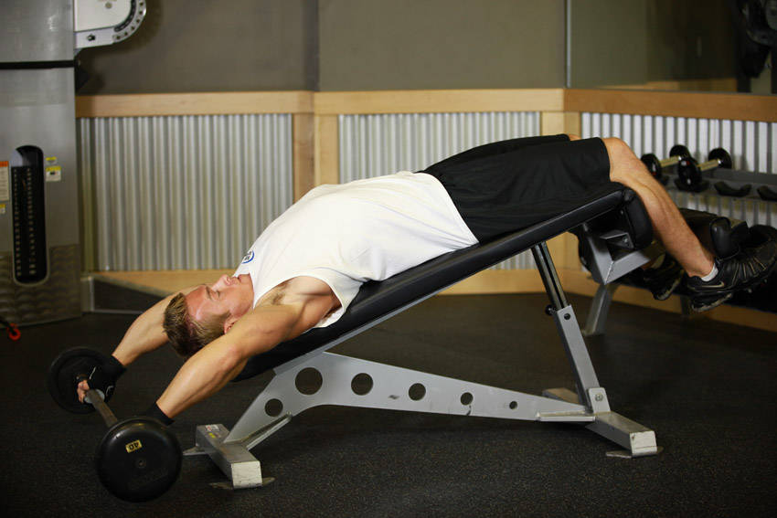

# 宽握下斜杠铃直臂下拉（卧姿上拉）

**Wide-Grip Decline Barbell Pullover**

> 部位：胸　|　器械：杠铃　|　难度：⭐⭐ 进阶　|　类型：力量训练 · 复合动作 · 拉

## 目标肌群

- **主要**：胸大肌
- **协同**：三角肌、肱三头肌

## 肌肉激活示意

🔴 主要肌群　🟠 协同肌群（红/橙块即发力部位，鼠标悬停看名称）

## 动作示意图

| 起始位 | 结束位 |
|:---:|:---:|
|  |  |

## 动作要点

1. 坐好把大腿卡在垫子下方固定住，双手握住横杆，握距略宽于肩。
2. 挺胸，上身可略向后倾 10–20 度，肩胛骨先下沉。
3. 呼气，用手肘向下向后拉，把横杆带到锁骨/上胸位置。
4. 顶峰挤压背阔肌一秒，感受两侧肩胛向脊柱靠拢。
5. 吸气缓慢还原，让手臂充分伸直、背阔肌被拉长，但不要耸肩。

## 常见错误

- ❌ 用身体大幅后仰荡出来 → 变成划船，背阔肌卸力
- ❌ 手臂主导硬拽 → 二头先力竭，背没练到
- ❌ 颈后下拉 → 肩关节风险高，不推荐
- ✅ 沉肩、肘领先、拉到上胸、慢放到位

## 训练建议

3–5 组 × 6–12 次，组间休息 90–150 秒；先把动作做标准再加重量。

<b>英文原始步骤 / Original Instructions</b>（点击展开）

1. Lie down on a decline bench with both legs securely locked in position. Reach for the barbell behind the head using a pronated grip (palms facing out). Make sure to grab the barbell wider than shoulder width apart for this exercise. Slowly lift the barbell up from the floor by using your arms.
2. When positioned properly, your arms should be fully extended and perpendicular to the floor. This is the starting position.
3. Begin by moving the barbell back down in a semicircular motion as if you were going to place it on the floor, but instead, stop when the arms are parallel to the floor. Tip: Keep the arms fully extended at all times. The movement should only happen at the shoulder joint. Inhale as you perform this portion of the movement.
4. Now bring the barbell up while exhaling until you are back at the starting position. Remember to keep full control of the barbell at all times.
5. Repeat the movement for the prescribed amount of repetitions of your training program.
6. When finished with your set, slowly lower the barbell back down until it is level with your head and release it.

---

[← 返回胸部位索引](README.md)　|　[返回首页](../../README.md)

数据与图片来源：[yuhonas/free-exercise-db](https://github.com/yuhonas/free-exercise-db)（The Unlicense，公有领域）　·　中文名称、动作要点与内容组织：Yue（gengyueworks）